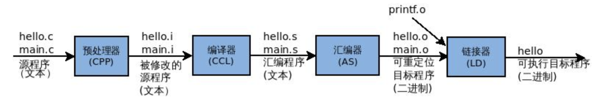
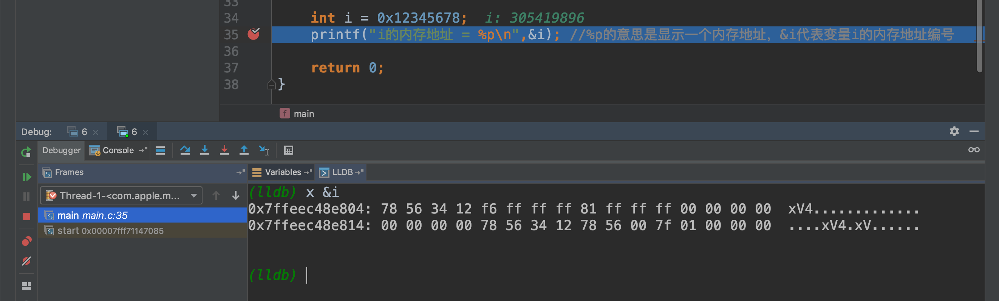

# C语言笔记


## 一、简介

1.面向对象、面向过程，是一种编程思想。

2.机器码---汇编语言---高级语言

3.ALGOL--CPL--BCPL--B--C--K&R C--C89-C99-C11 

4.unix的第一个版本是用B语言开发的，后来才是C语言开发的。linux是C语言开发的。macos基于unix，ios基于unix。

## 二、开发环境

### 2.1、IDE

Visual Studio

Xcode

Eclipse+DCT

IntelliJ IDEA

CLion

### 2.2、 编译器

gcc ：  GNU开发的编译器

cl：微软开发的编译器

clang：苹果公司开发的编译器


## 三、C语言基础知识

CPU的最小单元是寄存器

内存以字节(BYTE)为单位，不是以比特(bit)为单位

32位的操作系统，最大能保存的整数为 `2^32 - 1`

64位的操作系统，最大能保存的整数为 `2^64 - 1`


### 3.1、初识C

#### 3.1.1、include

- 告诉编译器，包含一个头文件
- 在 `C语言 `中，任何 `库函数` 调用都需要提前包含头文件
- <头文件>，代表让C语言编译器去系统目录下寻找相关的头文件
- ''头文件''，代表让C语言编译器去用户当前目录下寻找相关头文件


#### 3.1.2、main函数

- `main()` 函数是 C 语言中的主函数
- 一个 C 语言程序必须有一个主函数，也只能有一个主函数
- C 语言中，所有的函数的代码都是在`{}`里包着的


#### 3.1.3、注释

- 单行注释：`//` ，C++语言的注释
- 多行注释：`/**/` ，标准 C 语言的注释


#### 3.1.4、声明

- `变量名` 可以自定义，变量名的第一个字符必须是 `字母 ` 或 `下划线`
- `变量名` 区分大小写
- 不能用 C 语言的 `关键字` 作为 `变量名`
- `变量名` 长度 尽量不要超过 256个字符 

```c
int i; //声明了一个变量，名字叫i，类型是int
```


#### 3.1.5、printf

- 向标准输出设备，输出字符串

```c
#include <stdio.h>  // 使用printf库函数，要导入这个头文件

int main() {

    printf("hello world!");
    return 0;
}
```


#### 3.1.6、return

- 一个函数遇到 `return` 语句就终止了，return 是 C语言 的关键字
- 主函数 `return 0` 一般代表成功的意思，`return -1` 代表失败的意思


#### 3.1.7、System系统调用

- System库函数的功能是执行操作系统的命令或者运行指定的程序

```c
#include <stdio.h>
#include <stdlib.h>  //system库函数要导入这个头文件

int main() {
    system("ls -lha");
    return 0;
}
```

#### 3.1.8、POSIX

- 一种标准

### 3.2、C语言编译过程

`.c 文件` → `预编译` → `编译` → `连接` → `可执行程序`



#### 3.2.1、gcc

##### 3.2.1.1、预编译（-E）

`gcc -E -o a.i a.c`

- 预编译 a.c 文件，生成的目标文件名为 a.i
- 预编译把 #include 头文件添加到代码中 
- 预编译去掉代码中的 注释


##### 3.2.1.2、编译（-S）

`gcc -S -o a.s a.i` 

- 得到汇编语言的文本文件


##### 3.2.1.3、汇编（-c）

 `gcc -c -o -a.o a.s`

- 将代码便以为二进制的机器指令，得到二进制文件


##### 3.2.1.4、连接（没有参数）

`gcc -o a a.o`

- 把库函数和其他目标代码，连接到代码中，得到二进制文件


### 3.3、数据类型
#### 3.1.1、整形数据

- int 就是32位的一个二进制整数，在内存中占据4个字节的空间
- 只有 `十进制` 的数字才有正负之分
- %d ：有符号输出 `十进制` 整数 
- %u ：无符号输出 `十进制` 整数
- %x ：输出 `十六进制`（小写字母）
- %X ：输出 `十六进制`（大写字母）
- %o ：输出 `八进制` 


```c
int 一般是 4个字节

const int MY_AGE1 = 10000; // 推荐使用(定义一个常量)

#define MAX 10  //定义一个宏常量，值为0

const 常量 与 宏常量是有区别的(c++中区别很大，后续讨论)
    
 
 //#define 类型的常量，c语言的习惯是，用大写
 
 //const类型的常量、变量，c语言的习惯是，用小写结合大写
 
    
long 类型
如果系统是32位的，那么lang是4个字节
如果系统是64位的，那么long是8个字节

long long 
不管在多少位的系统下，都是8个字节，64位

int b = 10;
int c = -200;
long long d = 9999999999;
printf("b=%d,c=%d,d=%ld\n", b, c, d);
```

##### 3.1.1.1、在代码中写不同进制的 整形数字

```c
int e = 0b100; // 二进制 --> 4
printf("e=%d \n", e);

int f = 0xB; // 十六进制  --> 11
printf("f=%d \n", f);

int g = 010; // 八进制 --> 8
printf("g=%d \n", g);
```


##### 3.1.1.2、定义无符号类型的 整形数字

```c
unsigned int h = 12;  // 无符号整形
printf("h=%d \n",h );

unsigned long long i = 999999999999999999;  // 无符号长整形
printf("i=%ld \n",i);
```


##### 3.1.1.3、#include <stdint.h> 中的整形数据（各个平台通用）

```c
    int32_t j = 10;
    int8_t k = 127;  // 取值范围  [-128,127]
    uint8_t l = 255;  // 无符号整形
    int64_t m = 999999999999999999;  // #include <stdint.h> 中的对应的 long long类型

    printf("k=%d \n", k);
    printf("l=%d \n", l);
    printf("m=%ld \n", m);
```

##### 3.1.1.4、整数溢出

- 计算一个整数的时候超过整数能够容纳的最大单位后，整数会溢出，语出的结果是高位舍弃。

```c
#include <stdio.h>

int main() {

    unsigned short int c = 0xffff;
    c = c + 1;
    printf("c=%d\n", c); //整数溢出，  -->  0

    return 0;
}
```


##### 3.1.1.5、大端对齐与小端对齐

- 内存都是以字节为最小单位

- 对于 Intel 这种 x86 架构的复杂指令CPU，整数在内存中是倒着存放的，内存的低地址 存放数据的低位，内存的高地址 存放 数据的高位。这种叫做 `小端对齐`

- `arm`也是小端对齐

- 但对于unix服务器的CPU，更多是采用 `大端对齐` 的方式存放整数





#### 3.1.2、二进制，八进制，十六进制

##### 3.1.2.1、二进制

1. 一个 `位` 只能表示0，或者1两种状态，简称`bit`，一个 `位` 是一个bit

2. 一个 `字节` 为8个二进制位，称为8位，简称`BYTE`，8个比特是一个 `字节` 

3. 一个字为2个字节，简称`WORD`，16位

4. 两个字为双字，简称`DWORD`，32位


- `二进制` 转 `八进制` ，从右边开始分组，每3位一组来切分二进制数，最左边的一组不足3位时，在其左侧补0
- `二进制` 转 `十六进制 `，从右边开始分组，每4位一组来切分二进制数，最左边的一组不足4位时，在其左侧补0


##### 3.1.2.2、 八进制

- C语言中，0开头表示八进制，例如：0666

- `十进制` 转化为 `八进制` ，用 十进制数 作为被除数，8作为除数，取商数和余数，直到商数为0的时候，将余数倒过来就是转化后的结果


##### 3.1.2.3、十六进制

- C语言中，0x开头表示十六进制，例如：0x19f

- `十进制` 转化为 `十六进制` ，用 十进制数 作为被除数，16作为除数，取商数和余数，直到商数为0的时候，将余数倒过来就是转化后的结果


#### 3.1.3、原码反码补码与无符号数

电脑里保存的都是 `二进制` ，电脑中保存的是 `补码`

##### 3.1.3.1、原码

- 将最高位作为符号位(0代表正，1代表负)，其余各位代表数值本身的绝对值
  - `+7` 的原码是    00000111
  - `-7` 的原码是    10000111
  - `+0` 的原码是    00000000
  - `-0` 的原码是    10000000


##### 3.1.3.2、反码

- 如果一个数为正，那么他的反码和原码相同
  - `+7` 的反码是    00000111
- 如果一个数为负，那么符号位为1，其他各位与原码相反
  - `-7` 的反码是    11111000
  - `-0` 的反码是    11111111


##### 3.1.3.3、补码

原码和反码都不利于计算机的运算，如：原码表示的 7 和 -7 相加，还需要判断符号位。

- 正数：原码、反码、补码都相同
  - `+7` 的补码是    00000111
- 负数；最高位为1，其余各位原码取反，最后对整个数 +1
  - `-7` 的原码是    10000111
  - `-7` 的反码是    11111000
  - `-7` 的补码是    11111001


#### 3.1.3、实数型数据（浮点型）

浮点型数据在计算的时候会有误差。

银行存款不能用浮点型，只能用整形数据。1元要存成100分（即存成整形）

```c
#include <stdio.h>

// 实数数据类型
int main() {
    float a = 3.1; // 单精度,4字节，32位
    double b = 3.2; //双精度,8字节，64位
    long double c = 3.1; //长双精度,16字节，128位
    printf("a=%f, b=%f, c=%Lf", a, b, c);

    return 0;
}
```


#### 3.1.4、字符数据类型

```c
#include <stdio.h>
// 字符数据类型

int main() {
    printf("Hello,\nWorld!\n"); //换行符

    printf("nihao\nHello\rWorld\r123"); //回车符,会把指针指到 \r 所在行的行首，并输出其后面的内容

    printf("Hello你\bWorld"); //退格符,删除其前面的一个字符

    printf("Hello\tWorld\nHaha\tbupt"); //制表符

    printf("Hello\fWorld\n"); //换页符

    printf("\\"); //输出反斜杠

    printf("\"dragon\"\n"); //输出双引号

    printf("\'dragon\'\n"); //输出双引号

    printf("length of char : %d\n", sizeof(char)); //char占一个字节（即8位）

    char ch = 'a';
    printf("%d\n", ch); //输出字符的askii编码
    printf("%c\n", ch - 32); //输出字符

    return 0;
}
```


#### 3.1.5、自定义数据类型

```c
#include <stdio.h>
#include <stdint.h>
// 自定义数据类型

typedef int64_t mt_long; //自定义一个新的数据类型mt_long，该类型为 int64_t
typedef char mt_char;
typedef uint8_t mt_char1; //char是占一个字节，可以用uint8_t 来自定义一个char类型
int main() {
    mt_long a = 20;
    printf("%lld\n", a);

    mt_char b = 'A';
    printf("%c\n", b);

    mt_char1 c = 'C';
    printf("%c\n", c);

    return 0;
}
```

### 3.2、流程控制与循环

#### 3.2.1、if - else if - else

```c
#include <stdio.h>

int main() {

    int32_t score = 90;
    if (score > 80) {
        printf("Fine\n");
    } else if (score > 60) {
        printf("OK\n");
    } else {
        printf("Fail\n");
    }

    return 0;
}
```


#### 3.2.2、switch-case语句

```c
#include <stdio.h>

//判断枚举类型的条件比较方便

#define UP 1
#define DOWN 2
#define LEFT 3
#define RIGHT 4

int main() {
//    int32_t dir = UP;
    int32_t dir = DOWN;

    switch (dir) {
        case UP:
            printf("Go UP\n");
            break;
        case DOWN:
            printf("Go DOWN\n");
            break; //如果没有break那么后面的case语句会继续执行
        case LEFT:
            printf("Go LEFT\n");
            break;
        case RIGHT:
            printf("Go RIGHT\n");
            break;
        default:  //dir没有符合上述条件的情况
            printf("dir unknown\n");
    }

    return 0;
}
```


#### 3.2.3、 goto语句

```c
#include <stdio.h>

int main() {

    int i = 0;

    label:
    printf("i=%d\n", i);
    printf("100\n");
    printf("101\n");
    printf("102\n");

    i++;

    if (i <= 100) {
        goto label;
    }

    return 0;
}
```


#### 3.2.4、 for语句、break、continue

```c
#include <stdio.h>

int main() {

//    for (int i = 0; i < 100; i++) {
//
//        printf("Number : %d\n", i);
//
//        for (int j = 0; j < 10; j++) {
//            printf("%d,", j);
//        }
//
//        printf("\n");
//
//        if (i > 50) {
//            break;
//        }
//    }

// -------------------

//    // 乘法表
//    for (int i = 1; i <= 9; i++) {
//        for (int j = 1; j <= i; j++) {
//            printf("%d*%d=%d\t", j, i, i * j);
//
//            if (j >= 5) {  //控制每行最多有5列输出
//                break; //break 跳出当前这个循环
//            }
//
//            if (i * j >= 24) {
//                printf("\n- - - - - - - - - -");
//                printf("\ni=%d,j=%d,i*j=%d", i, j, i * j);
//                goto end;
//            }
//        }
//        printf("\n");
//    }
//
//    end:
//    printf("\nend");

// -------------------
    for (int i = 0; i < 100; i++) {
        printf("Iter %d\n", i);

        if (i == 50) {
            continue; //Iter 50会输出；Number 50不会输出
        }

        printf("Number %d\n", i);
    }

    return 0;
}
```


#### 3.2.5、while循环，do - while循环

```c
#include <stdio.h>

int main() {
// while ------ 先判断，再执行
//    int i = 0;
//    while (i < 100) {
//        if (i % 2) {  // %取余数
//            printf("%d\n", i);
//        }
//
//        i++;
//    }


// do-while ------ 先执行，再判断
    int i = 1;

    do {
        printf("%d\n", i);
        i++;
    } while (i < 100);

    return 0;
}
```


### 3.3、运算符

#### 3.3.1、数学运算符

```c
#include <stdio.h>
#include <math.h>

int main() {
    int32_t a = (10 + 2 - 8) * 9;

    printf("%d\n", a);

    printf("%f\n", sin(M_PI)); //M_PI 是弧度，不是角度
    return 0;
}
```


#### 3.3.2、逻辑运算符

```c
#include <stdio.h>
#include <stdint.h>

#define MALE 1
#define FMALE 2

int main() {

    //&& || !
    //与 或 非

    int32_t score = 80;
    if (score >= 60 && score <= 100) {
        printf("OK\n");
    } else {
        printf("Fail or invalid score\n");
    }

    score = 70;
    if (score < 60 || score > 100) {
        printf("Fail or invalid score\n");
    } else {
        printf("OK\n");
    }

    int sex = 1;
    if (sex != MALE) {
        printf("The person is famle\n");
    } else {
        printf("The person is male\n");
    }


    return 0;
}
```


#### 3.3.3、位运算


##### 3.3.3.1、基础

```c
#include <stdio.h>
#include <stdint.h>

int main() {

    /**
     * & 位与  只有都是1才是1，否则是0
     * | 位或  只有都是0才是0，否则是1
     * ~ 位非  无符号数字（1变0，0变1）； 有符号数字（以该数据的取值范围的中间为中轴，镜像取反。）
     * ^ 异或  相同则0，不同则1
     * >> 右移位  替换掉最大权值位(最大权值位的位数为1)右侧的位数，并将原先的最大权值位的位数变为零
     * << 左移位  末尾补0
     */

    int a = 0b10; //二进制
    int b = 0b01; //二进制

    printf("%d\n", a & b); //或
    printf("%d\n", a | b); //非
    printf("%d\n", a ^ b); //非

    uint8_t c = 1; //1在内存中保存的是 0b00000001, 求反之后变成 0b11111110
    uint8_t d = 0b11111110;
    c = ~c;
    printf("%d\n", c); // 位非 --> 254
    printf("%d\n", d); // --> 254

    // 无符号数字的 位非
    int8_t e = 1;
    e = ~e;
    printf("%d\n", e); // --> -2

    // 移位运算
    int f = 8; //0b1000
    printf("f=%d\n", f >> 1); //0b100    --> 4
    printf("f=%d\n", f << 1); //0b10000  --> 16
    //位运算速度最快

    int8_t g = 127; //0b111 1111
    printf("g=%d\n", g >> 1); //0b11 1111    --> 63
    printf("g=%d\n", g << 2); //0b1 1111 1100  --> 508

    return 0;
}
```


##### 3.3.3.2、位运算实例-提取颜色通道

```c

```

### 3.4、输入与输出

#### 3.4.1、输出字符和字符串

```c

```


#### 3.4.2、格式化输出

```c

```


#### 3.4.3、输入字符

```c

```


#### 3.4.4、格式化输入

```c

```


### 3.5、数组


#### 3.5.1、一维数组

```c

```


#### 3.5.2、二维数组

```c

```


#### 3.5.3、字符数组

```c

```

### 3.6、字符串操作

#### 3.6.1、字符串连接

```c

```


#### 3.6.2、格式化字符串

```c

```


#### 3.6.3、字符串与基础数据类型转换

```c

```


#### 3.6.4、字符串比较

```c

```


#### 3.6.5、字符串的截取

```c

```

### 3.7、函数

#### 3.7.1、声明函数

```c

```


#### 3.7.1、main函数及返回值

```c

```


#### 3.7.1、可变参数

```c

```


#### 3.7.1、多文件程序

```c

```


### 3.8、关键字

#### 3.8.1、int

- 整形
- int不管是在32位系统下，还是64位系统下，不论是windows还是unix都是4个字节


#### 3.8.2、sizeof

- 功能：求指定数据类型在内存中的大小，返回值即为该数据所占的字节数
- 单位：字节
- 返回的字节数，跟操作系统的位数有关。同一个数据在不同的操作系统中，`sizeof()` 返回的字节数可能不同
- （size_t 类型，后续讨论）


#### 3.8.3、short

- 短整型，在32位系统下是2个字节，16个比特


#### 3.8.4、long

##### 3.8.4.1、long

- 整形（***尽量少用long，其所占字节数在不同的系统有差异，代码移植麻烦***）
- 在32位的系统下，long都是4个字节
- 在unix系统下，long是8个字节

##### 3.8.4.2、long long

- 长整型

- 不管在什么操作系统下，都是8个字节，64位
- 对于32位的操作系统，CPU寄存器是32位，所以计算long long 类型的数据，效率很低


#### 3.8.5、unsigned

- 无符号数字

##### 3.8.5.1、unsigned int

- 无符号整数
- 永远是正数

##### 3.8.5.2、unsigned short

- 无符号短整型

##### 3.8.5.3、unsigned long

- 无符号整型

##### 3.8.5.4、unsigned long long

- 无符号长整形


#### 3.8.6、return

- 一个函数遇到 `return` 语句就终止了


## 四、C语言进阶

### 4.1、常用的预处理

#### 4.1.1、预设常量

```c

```

#### 4.1.2、条件预处理

```c

```


#### 4.1.3、防止偷文件重复引入

```c

```


#### 4.1.4、宏函数

```c

```


#### 4.1.5、宏函数参数连接

```c

```


#### 4.1.1、宏函数可变参数

```c

```

### 4.2、指针

#### 4.2.1、指针基本介绍

```c

```


#### 4.2.2、函数指针

```c

```


#### 4.2.3、无类型指针

```c

```

### 4.3、结构体和共同体

#### 4.3.1、结构体

```c

```


#### 4.3.2、结构体指针

```c

```


#### 4.3.3、共同体

```c

```

### 4.4、文件操作

#### 4.4.1、写出文件

```c

```


#### 4.4.2、读取文件

```c

```


#### 4.4.3、格式化写出和读取文件

```c

```

