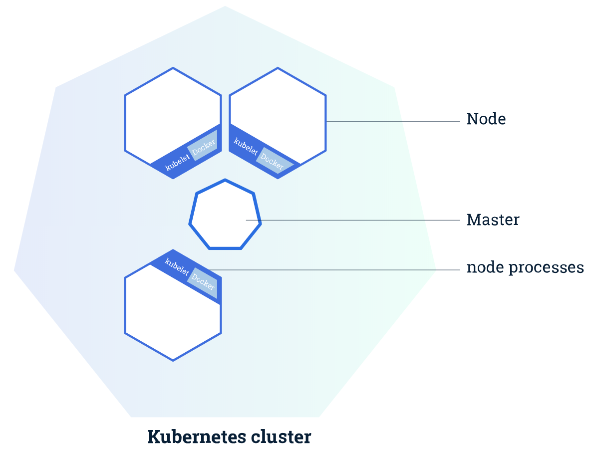
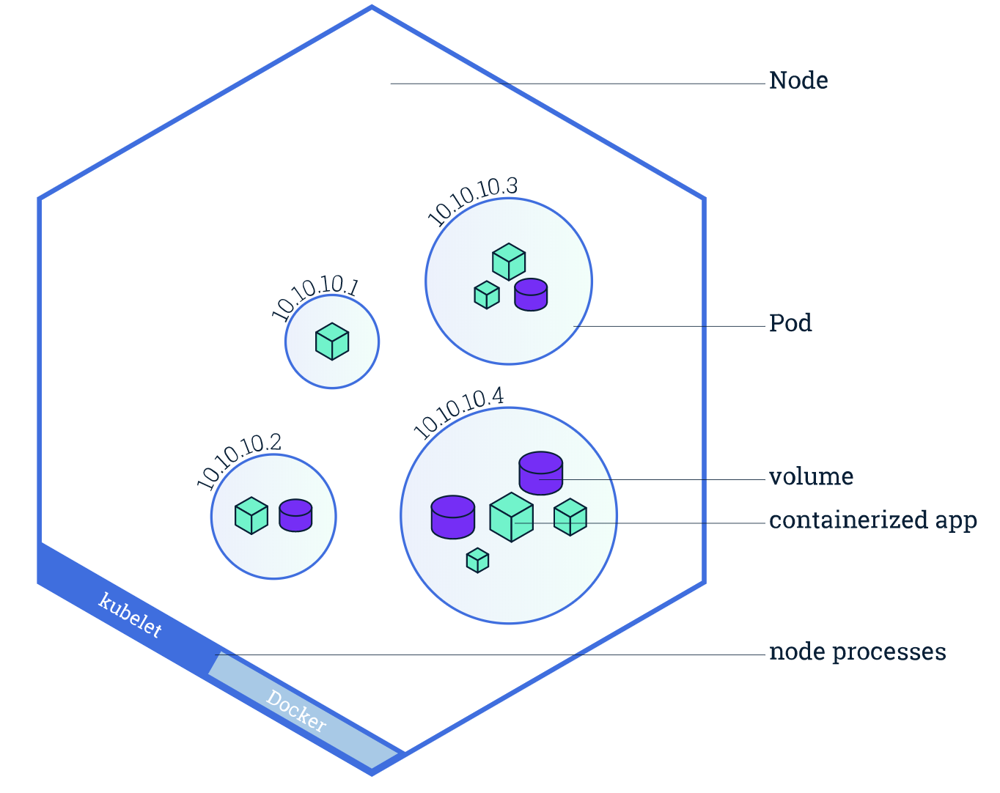
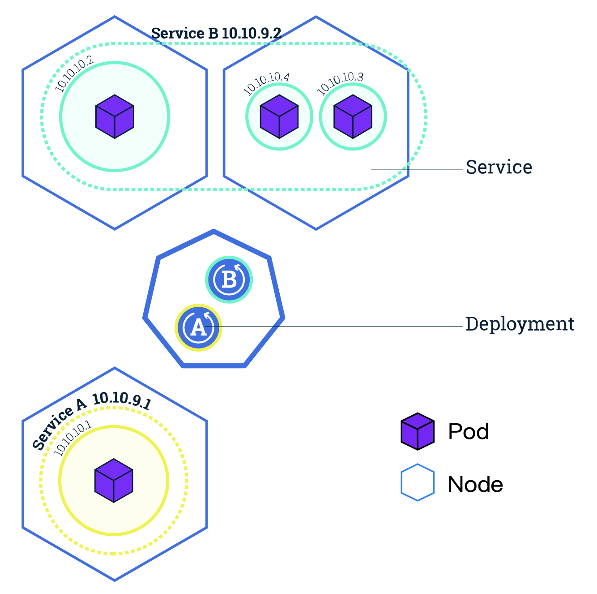
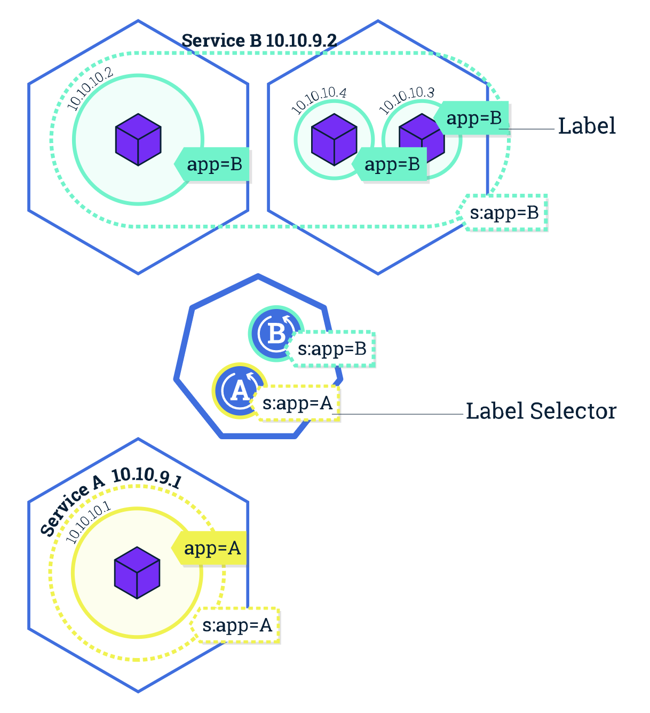

# K8s笔记

> author：dragon
>
> 

# 一、简介

## 1.1、Kubernetes Clusters（k8s集群）

### 1.1.1、master 

- mater主机用来调度应用程序、维持应用程序状态、扩展程序、更新程序等。

### 1.1.2、nodes 节点

- 每个节点都有一个Kubelet，它是一个代理，用来与master主机进行通讯。

- k8s集群最少要有3个node节点。

- 节点和master之间的通讯使用master暴露的**Kubernetes API**

#### 1.1.2.1、node必须拥有的部分

- Kubelet：
  1. 进行node与master之间的通信；
  2. 管理 Pods 和 containers的运行；
- A container runtime (like Docker, rkt) responsible：
  1. 从远程仓库拉去containers的image；
  2. 拆包container；
  3. 运行application；

### 1.1.3、Minikube

- Minikube是一个轻量级的k8s实现（只有一个node节点）

### 1.1.4、kubectl

- kubectl是k8s的命令行接口，使用Kubernetes API与集群交互

- kubectl命令可以查看：applications是何时被部署的、applications当前的状态、applications运行在哪、applications的配置等等。

### 1.1.5、Kubernetes Deployments

- 指到k8s如何创建和更新你的应用程序。

- 你的应用程序必须打包放在一个k8s支持的容器中 (比如 Docker or rkt)，这样该容器才能被k8s管理。

### 1.1.6、Kubernetes Pods

- Kubernetes Pods是个k8s的抽象概念，是由一个容器或多个容器组成的一个组。这个组中的容器共享着一些资源（如ip、port等）。
- Pod有自己唯一的IP地址（unique IP address）
- 当创建一个Deployment，该Deployment会创建Pod和Pod中的containers。
- 当一个node1出现错误无法使用后，该node1上的Pod会在cluster中其他可用的node2中重新建立一个。
- 一个Node可以有一个或多个Pod

### 1.1.7、Kubernetes Services

- Kubernetes中的服务是一个抽象，它定义了一组逻辑Pods和访问它们的策略。
- Services可以用不同的方式暴露：*ClusterIP*、*NodePort*、*NodePort*、*NodePort*。

- Services可以让Pods结束或自我复制，而不去触碰applications。
- Services match a set of Pods using [labels and selectors](https://kubernetes.io/docs/concepts/overview/working-with-objects/labels)

#### 1.1.7.1、标签（labels）和选择器（selectors）

- 选择器（selectors）是一种分组原语，允许对Kubernetes中的对象进行逻辑操作。
- 标签（labels）是附加在对象上的键/值对，可以以多种方式使用。
  - 为开发、测试和生产指定对象；
  - 嵌入版本标记；
  - 使用标签对对象进行分类；
- 可以在创建对象时或创建后给对象添加标签（labels），也可以在任何时候修改标签（labels）。

