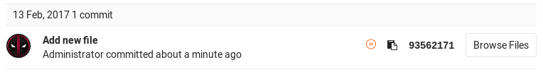
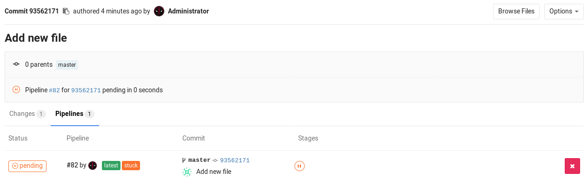
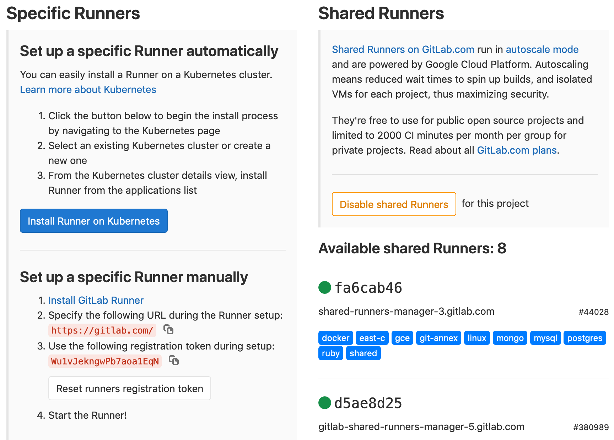
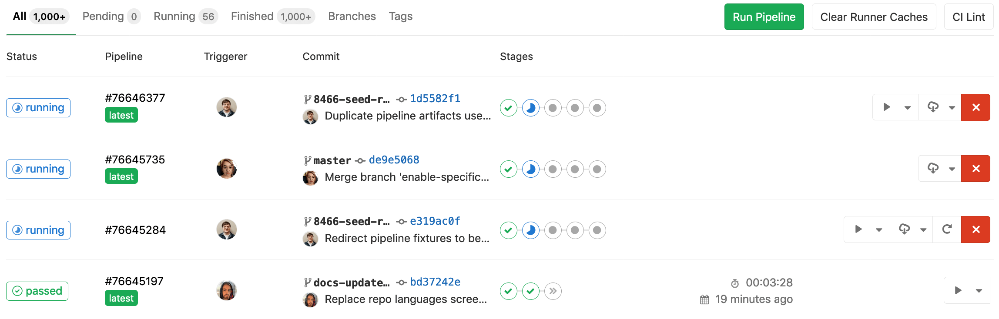
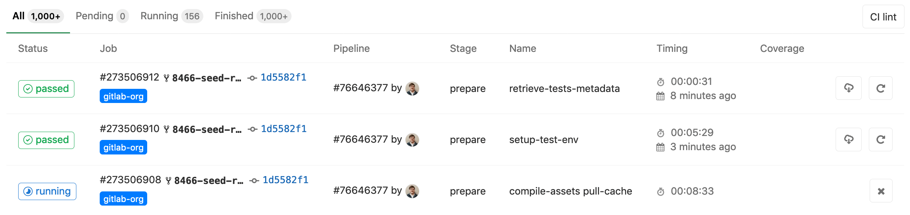

# Gitlab CI/CD 官方文档译文


# 一、CI/CD简介

[CI/CD-->Introduction](https://docs.gitlab.com/ee/ci/introduction/)

## 1.1、CI/CD方法简介

软件开发的连续方法基于脚本的自动化执行，以最小化在开发应用程序时引入错误的机会。从新代码的开发到部署，它们需要的人工干预更少，甚至根本不需要干预。它包括在每次小的迭代中不断地构建、测试和部署已经修改了的代码，从而减少了基于有bug的或失败的历史版本来开发新代码的机会。

这个方法论中有三种主要的方法，使用哪些方法可根据您的项目来选择。

### 1.1.1、持续集成

设想这样一个情况，一个存储在GitLab的Git存储库的应用程序的代码。开发人员每天都要通过push命令来更新代码，一天要进行多次。对于每一次向存储库的推送，您都可以创建一系列脚本来自动构建和测试应用程序，从而减少向应用程序引入错误的机会。

这种实践被称为持续集成，对于提交给应用程序的每一个更改——甚至是提交给开发分支——都是自动地、持续地构建和测试的，以确保引入的更改通过您为应用程序建立的所有测试、指导方针（guidelines）和代码遵从性标准（code compliance standards ）。

GitLab本身就是使用持续集成作为软件开发方法的一个例子。对于项目的每一次推送，都有一系列检查代码的脚本

### 1.1.2、持续交付

持续交付是在持续集成的之后一步。您的应用程序不仅在每次将代码更改提交到代码库时构建和测试，而且作为附加步骤，它还将连续部署，尽管部署是手动触发的。

此方法确保自动检查代码，但需要人工干预，手动地并有策略地部署更改的代码。

### 1.1.3、持续部署

持续部署也是持续集成之后的一步，类似于持续交付。不同之处在于，您将应用程序设置为自动部署，而不是手动部署。部署应用程序根本不需要人工干预。


## 1.2、GitLab CI/CD

### 1.2.1、简介

GitLab CI/CD是一个内置在GitLab中的强大工具，它允许您将所有的持续方法(持续集成、交付和部署)应用到您的软件中，而不需要第三方应用程序或集成。

### 1.2.2、Gitlab CICD 的工作方式

要使用GitLab CI/CD，您所需要的只是一个保存在Git中的应用程序代码仓库，以及一个名为 [`.gitlab-ci.yml`](https://docs.gitlab.com/ee/ci/yaml/README.html) 的文件中指定的构建、测试和部署脚本。该 yml文件 保存在代码仓库的根路径中。

在这个文件中，您可以定义您想要运行的脚本，定义包括和缓存的依赖关系，选择你想要运行的命令序列和那些你想要并行运行的命令，定义您想要部署应用程序，指定您想要自动运行的脚本以及想要手动运行的脚本。一旦您熟悉GitLab CI/CD，您就可以向配置文件中添加更多的高级步骤。

要将脚本添加到该文件中，您需要按照适合您的应用程序的顺序组织它们，并与您希望执行的测试相一致。为了可视化这个过程，假设您添加到配置文件中的所有脚本都与您在计算机终端上运行的命令相同。

一旦你添加了 `.gitlab-ci.yml` 将yml配置文件发送到您的存储库中，GitLab将检测它并使用名为 [GitLab Runner](https://docs.gitlab.com/runner/) 的工具运行脚本，该工具的工作原理与您的终端类似。


这些脚本被分组到 **jobs** 中，并一起组成一个 **pipeline**。下面是 `.gitlab-ci.yml` 文件的一个非常简单的例子。

```yml
before_script:
  - apt-get install rubygems ruby-dev -y

run-test:
  script:
    - ruby --version
```

`before_script` 属性将在运行任何程序之前安装应用程序的依赖项，而一个名为 `run-test` 的 **job** 将打印当前系统的Ruby版本。它们组成了一个在每次推送到存储库的任何分支时都会触发的 **pipeline**。

GitLab CI/CD不仅会执行您设置的任务，还会显示执行过程中发生的事情，就像您在终端中看到的那样（如图1-1）:


您为您的应用程序创建策略，GitLab根据您定义的内容为您运行管道。你的 `pipeline` 状态也显示在GitLab中:




最后，如果出现问题，您可以轻松地回滚所有更改:


### 1.2.3、基本的CI / CD工作流

考虑下面的示例，看看GitLab CI/CD如何配合一个通用的开发工作流。

假设您已经修改了某个有问题的代码实现，并在本地执行成功。一旦 push 你的 commits 到 GitLab的远程存储库的特性分支（feature分支），就会触发该项目设置的CI/CD管道。GitLab CI/CD将会这样做:

- 运行自动化脚本(顺序或并行):
    - 构建和测试您的应用程序。
    - 使用预览应用程，序预览每个合并请求的更改，就像您在本地主机中看到的那样。

一旦你对你的实现满意:

- 让您的代码得到审查和批准。
    - 将特性分支（feature分支）合并到默认分支中。
    - GitLab CI/CD将您的更改自动部署到生产环境中。
    - 最后，如果出现问题，您和您的团队可以轻松地进行回滚。


GitLab CI/CD能够做更多的事情，但是这个工作流证明了GitLab跟踪整个过程的能力，而不需要外部工具来交付您的软件。最有用的是，您可以通过GitLab UI可视化所有步骤。

### 1.2.4、深入了解CI/CD基本工作流程

如果我们更深入地研究基本工作流，我们可以看到GitLab中在DevOps生命周期的每个阶段可用的特性，如下图所示。


如果您从左到右查看图像，您将看到GitLab中根据每个阶段(验证、打包、发布)提供的一些特性。

1. Verify:
    - 使用持续集成，自动构建和测试您的应用程序。
    - 使用 [GitLab Code Quality](https://docs.gitlab.com/ee/user/project/merge_requests/code_quality.html) 分析你的源代码质量。
    - 通过 [Browser Performance Testing](https://docs.gitlab.com/ee/user/project/merge_requests/browser_performance_testing.html) 确定代码更改对性能的影响。
    - 执行一系列测试，如 [Container Scanning](https://docs.gitlab.com/ee/user/application_security/container_scanning/index.html) , [Dependency Scanning](https://docs.gitlab.com/ee/user/application_security/dependency_scanning/index.html) , 和 [JUnit tests](https://docs.gitlab.com/ee/ci/junit_test_reports.html) 。
    - 使用 [Review Apps](https://docs.gitlab.com/ee/ci/review_apps/index.html) 部署您对app的修改，以便在每个分支上预览对app的修改。
2. Package:
    - Store Docker images with [Container Registry](https://docs.gitlab.com/ee/user/packages/container_registry/index.html).
    - Store NPM packages with [NPM Registry](https://docs.gitlab.com/ee/user/packages/npm_registry/index.html). 
    - Store Maven artifacts with [Maven Repository](https://docs.gitlab.com/ee/user/packages/maven_repository/index.html). 
    - Store Conan packages with [Conan Repository](https://docs.gitlab.com/ee/user/packages/conan_repository/index.html). 
3. Release:
    - 持续部署，自动部署您的应用程序到生产。
    - 持续交付，手动点击部署您的应用程序到生产。
    - 使用 [GitLab Pages](https://docs.gitlab.com/ee/user/project/pages/index.html) 部署静态网站。
    - Ship features to only a portion of your pods and let a percentage of your user base to visit the temporarily deployed feature with [Canary Deployments](https://docs.gitlab.com/ee/user/project/canary_deployments.html). 
    - Deploy your features behind [Feature Flags](https://docs.gitlab.com/ee/user/project/operations/feature_flags.html). 
    - 使用 [GitLab Releases](https://docs.gitlab.com/ee/user/project/releases/index.html) 添加发布说明到任何GitLab版本。
    - 使用 [Deploy Boards](https://docs.gitlab.com/ee/user/project/deploy_boards.html) 查看运行在Kubernetes上的每个CI环境的当前健康状况和状态的视图。
    - 使用 [Auto Deploy](https://docs.gitlab.com/ee/topics/autodevops/index.html#auto-deploy) 将您的应用程序部署到Kubernetes集群中的生产环境。


使用GitLab CI/CD，您还可以:

- 使用 [Auto DevOps](https://docs.gitlab.com/ee/topics/autodevops/index.html) 轻松设置您的应用程序的整个生命周期
- 将应用程序部署到不同的 [environments](https://docs.gitlab.com/ee/ci/environments.html).
- 安装您自己的 [GitLab Runner](https://docs.gitlab.com/runner/).
- [Schedule pipelines](https://docs.gitlab.com/ee/user/project/pipelines/schedules.html).
- 使用 [Security Test reports](https://docs.gitlab.com/ee/user/application_security/index.html) 检查应用程序漏洞。


要查看所有CI/CD特性，请导航到 [CI/CD index](https://docs.gitlab.com/ee/ci/README.html) 。

观看视频 [GitLab CI Live Demo](https://www.youtube.com/watch?v=pBe4t1CD8Fc) 来GitLab CI/CD更深入的概述。


### 1.2.5、首次建立GitLab CI/CD

要开始使用GitLab CI/CD，您需要熟悉 [`.gitlab-ci.yml`](https://docs.gitlab.com/ee/ci/yaml/README.html) 配置文件语法及其属性。

This document [introduces the concepts of GitLab CI/CD in the scope of GitLab Pages](https://docs.gitlab.com/ee/user/project/pages/getting_started_part_four.html), for deploying static websites. （翻译：本文档在GitLab页面的范围内介绍了GitLab CI/CD的概念，用于部署静态网站）。虽然它是为那些希望从头开始编写自己的页面脚本的用户准备的，但是它也可以作为GitLab CI/CD设置过程的介绍。它涵盖了编写CI/CD配置文件的基本步骤，因此我们建议您通读它以理解GitLab的CI/CD逻辑，并学习如何为任何应用程序编写自己的脚本(或调整现有的脚本)。

要深入了解GitLab的CI/CD配置文件的选项，请检查 [`.gitlab-ci.yml` full reference](https://docs.gitlab.com/ee/ci/yaml/README.html) 。


## 1.3、开始使用GitLab CI/CD

> 注意：从8.0版开始，GitLab持续集成(CI)完全集成到GitLab本身，并且在所有项目上默认启用。
> 注意：请记住，只有项目维护者和管理员用户才有访问项目设置的权限。
> 注意：从Jenkins来到GitLab，请查看我们的 [reference](https://docs.gitlab.com/ee/ci/jenkins/index.html) ，将您已经存在的管道转换为我们的格式。
> 注意：您可以考虑在项目中使用一些不同的基本管道体系结构。在开始之前，您可能需要熟悉这些内容。


GitLab提供持续集成服务。使每次commit或push触发CI [pipeline](https://docs.gitlab.com/ee/ci/pipelines.html) ，您必须:

- 添加一个 [`.gitlab-ci.yml`](https://docs.gitlab.com/ee/ci/quick_start/README.html#creating-a-gitlab-ciyml-file) 文件到存储库根目录。
- 为了使用一个 [Runner](https://docs.gitlab.com/ee/ci/quick_start/README.html#configuring-a-runner) ，请确定您的项目已经配置好。


`.gitlab-ci.yml` 文件告诉 GitLab **Runner** 该做什么。一个简单的 **pipeline** 通常有三个阶段:

- `build`
- `test`
- `deploy`

你不需要使用所有三个阶段，没有 **jobs** 的阶段被忽略。

管道的内容在官方文档的 **CI/CD > Pipelines** 页面下。如果一切正常(没有非零的返回值)，就会得到一个与提交相关的绿色✅的标记。这使得在查看 job(测试)日志之前就很容易看出是否提交导致了任何测试失败。许多项目使用GitLab的CI服务来运行测试套件，因此如果开发人员破坏了什么，他们会得到即时的反馈。

使用 pipelines 自动将测试代码部署到暂存(staging)和生产(production)环境也是很常见的。


本入门指南假设您已经拥有以下内容:

- 一个工作的GitLab实例，版本8.0+或使用GitLab.com。
- 在GitLab的一个项目，你想使用CI来维护的。
- 项目的维护者或所有者访问权

让我们把它分解成几个部分，来解决GitLab CI难题。

### 1.3.1、创建一个 `.gitlab-ci.yml` 文件

在你创建 `.gitlab-ci.yml` 之前。让我们首先简要地解释一下这是怎么回事。

#### 1.3.1.1、什么是 `.gitlab-ci.yml` 文件

`.gitlab-ci.yml` 是用来您配置CI对您的项目需要做什么的 文件。它位于存储库的根目录中。

在任何push到存储库的操作中，GitLab都会查找`.gitlab-ci.yml` 文件并根据该文件的内容，为commit的代码 在 ***Runners*** 上启动 **jobs**。

因为 `.gitlab-ci.yml` 在存储库中，受版本控制，旧版本仍然可以成功地构建，fork可以轻松地使用CI，分支可以有不同的 pipelines 和 jobs，CI的真实性只有一个来源。您可以阅读更多关于我们使用 `.gitlab-ci.yml` 的原因。在我们的博客中介绍了它（[in our blog about it](https://about.gitlab.com/blog/2015/05/06/why-were-replacing-gitlab-ci-jobs-with-gitlab-ci-dot-yml/)）。

#### 1.3.1.2、创建一个简单的 `.gitlab-ci.yml` 文件

> 注意:`.gitlab-ci.yml` 是一个YAML文件，因此必须格外注意缩进。总是使用空格，而不是制表符。

您需要在项目仓库的根目录中创建一个名为 `.gitlab-ci.yml` 的文件 。下面是一个Ruby on Rails项目的例子。

```yml
image: "ruby:2.5"

before_script:
  - apt-get update -qq && apt-get install -y -qq sqlite3 libsqlite3-dev nodejs
  - ruby -v
  - which ruby
  - gem install bundler --no-document
  - bundle install --jobs $(nproc)  "${FLAGS[@]}"

rspec:
  script:
    - bundle exec rspec

rubocop:
  script:
    - bundle exec rubocop
```

这是最简单的配置，适用于大多数Ruby应用程序:

1. 使用要执行的不同命令，定义两个**job** `rspec` 和 `rubocop` (名称任意)。
2. 在每个 `job` 执行之前，执行 `before_script` 下定义的命令。


`.gitlab-ci.yml` 文件定义了一组 **jobs**，并对 **job** 的运行方式和运行时间进行了约束。**job** 被定义为具有名称的顶级元素(在我们的例子中是 **rspec** 和 **rubocop** )，并且始终必须包含 **script **关键字。**Jobs** 用于创建 **job**，然后由 [Runners](https://docs.gitlab.com/ee/ci/runners/README.html) 选择并在 **Runner** 的环境中执行。

重要的是，每个 **job** 都是独立运行的。

如果你想检查你项目的`.gitlab-ci.yml` 文件是否有效，在项目名称空间的 `/-/ci/Lint`页下有一个 Lint 工具。

在你的项目中，你也可以找到一个 “CI Lint” 按钮 可以跳转到 页面 **CI/CD ➔ Pipelines** 和 **Pipelines ➔ Jobs ** 。

获取更多信息和完整的 `.gitlab-ci.yml` 语法，请阅读 [the reference documentation on `.gitlab-ci.yml`](https://docs.gitlab.com/ee/ci/yaml/README.html)。


### 1.3.2、Push `.gitlab-ci.yml` to GitLab

一旦你创建了 `.gitlab-ci.yml`，您应该将它添加到Git存储库并将其push到GitLab。

```bash
git add .gitlab-ci.yml
git commit -m "Add .gitlab-ci.yml"
git push origin master
```

现在，如果转到 **Pipelines** 页面，您将看到 **Pipeline** 正在挂起（pending）。

> 注意：如果您有一个用于GitLab提取的镜像存储库，您可能需要在项目的设置中启用管道触发：
>
> **Settings > Repository > Pull from a remote repository > Trigger pipelines for mirror updates**.


您还可以转到 **Commits** 页面，并注意到 commit SHA 旁边的小暂停图标。




单击它，您将被定向到该特定提交的jobs页面。



请注意，有一个挂起（pending）的 job 是以我们在 `.gitlab-ci.yml` 中编写的内容命名的。"stuck" 表示没有为此 job

配置 Runner。

下一步是配置一个 Runner，以便它选择挂起的 job。


### 1.3.3、配置一个 Runner

在GitLab中，**Runner** 运行您在 `.gitlab-ci.yml` 中定义的 **jobs**。 **Runner** 可以是虚拟机、VPS、裸机、docker容器，甚至是一组容器。**GitLab** 和 **Runners** 通过API进行通信，所以唯一的要求是 **Runners** 的机器可以通过网络访问 **Runners** 服务器。

一个 **Runner** 可以被指定运行某个确定项目，也可以在 GitLab 中为多个项目服务。如果它服务于所有项目，则称为 ***Shared Runner***。

在 [Runners](https://docs.gitlab.com/ee/ci/runners/README.html) 文档中可以找到更多关于不同 Runners 的信息。

在 **Settings ➔ CI/CD**，你可以找到 是否有 Runner 分配给您的项目。

设置一个 Runner 是简单而直接的。GitLab支持的官方 Runner 是用Go编写的，它的文档可以在 https://docs.gitlab.com/runner/ 找到。

为了拥有一个有用的 Runner，你需要遵循以下两个步骤:

1. 安装它（[Install it](https://docs.gitlab.com/runner/install/)）

2. 配置它（[Configure it](https://docs.gitlab.com/ee/ci/runners/README.html#registering-a-specific-runner)）

按照上面的链接设置自己的 Runner 或 使用下一节中描述的 Shared Runner 。

一旦 Runner 已经建立，可以在您的项目的 Runners 页面查看它，入口在 **Settings ➔ CI/CD**。




#### 1.3.3.1、Shared Runners

如果你使用 GitLab.com，你可以使用GitLab公司提供的 Shared Runners。

这些是特殊的 virtual machines，运行在GitLab的基础设施上，可以构建任何项目。

启用 **Shared Runners** 你需要去项目的 **Settings ➔ CI/CD** ，然后单击 **Enable shared runners**。

更多关于 Shared Runners 的信息（[Read more on Shared Runners](https://docs.gitlab.com/ee/ci/runners/README.html)）。


### 1.3.4、查看您的 pipeline 和 jobs 的状态

成功配置 **Runner** 后，您应该看到上一次提交的状态从 ***pending*** 变为 ***running***，***success*** 或 ***failed***。

您可以通过转到项目中的 **Pipelines** 页面查看所有 pipelines。



你也可以选择查看所有的 job，通过 **Pipelines ➔ Jobs** 页面。



通过单击 job 的状态，您将能够看到该 job 的日志。这对判断 job失败或者 job行为与预期不同的原因非常重要。


您还可以查看GitLab中各个页面中的任何提交状态，比如 **Commits** 和 **Merge requests** 。

请访问 [examples README](https://docs.gitlab.com/ee/ci/examples/README.html) 帮助我查看使用GitLab CI与各种语言的示例列表。


## 1.4、启动或禁止GItlab CI/CD

### 1.4.1、如何启用或禁用GitLab CI/CD

为了有效地使用GitLab CI/CD，您需要:

- 一个有效的  [`.gitlab-ci.yml`](https://docs.gitlab.com/ee/ci/yaml/README.html) 文件在项目的根目录中。
- 一个正确注册的 [runner](https://docs.gitlab.com/ee/ci/runners/README.html) 。

你可以阅读我们的 [quick start guide](https://docs.gitlab.com/ee/ci/quick_start/README.html) 来快速地开始一个例子。

如果您使用外部CI/CD服务器，如Jenkins或Drone CI，建议禁用GitLab CI/CD，以免与提交状态API发生冲突。

GitLab CI/CD通过项目的 `/pipeline` 和 `/jobs` 页面显示。在项目中禁用GitLab CI/CD不会删除任何以前的 jobs。实际上，`/pipeline` 和 `/jobs` 页面仍然可以被访问，尽管它隐藏在左边栏菜单中。

GitLab CI/CD在新安装时默认启用，可以通过以下两种方式禁用: 

- 分别设置每个项目。
- 通过分别修改 source 和 Omnibus安装的  `gitlab.yml` 和 `gitlab.rb` 中的设置，来实现站点范围的扩展。

> 注意：这只适用于作为GitLab CI/CD一部分运行的 pipelines。这不会启用或禁用从 [external integration](https://docs.gitlab.com/ee/user/project/integrations/project_services.html#services) 运行的pipelines。

#### 1.4.1.1、基于user对每个项目进行设置

要在您的项目中启用或禁用GitLab CI/CD pipelines:

1. 导航至 **Settings > General > Visibility, project features, permissions**。
2. 展开 **Repository** 部分。
3. 根据需要启用或禁用 **Pipelines** 切换。

**Project visibility** 也会影响 pipeline visibility。如果设置为:

- **Private** ：只有项目成员可以访问管道。
- **Internal** 或 **Public** ：可以通过下拉列表将 pipeline 设置为 **Only Project Members** 或 **Everyone With Access**。

按 "**Save changes**" 按钮，使设置生效。

#### 1.4.1.2、基于admin对站点范围进行设置

您可以在站点范围内禁用GitLab CI/CD。需要修改 用source installations 的 `gitlab.yml` 文件，和 用Omnibus installations 的 `gitlab.rb` 文件。

有两点需要注意:

- 禁用GitLab CI/CD，只会影响新创建的项目。在此修改之前已经启用了CI/CD的项目将和以前一样工作。
- 即使您在站点范围内禁用GitLab CI/CD，用户仍然可以在项目的设置中启用它。

对于来自源代码安装的 Gitlab 请用编辑器（如vim）打开 `gitlab.yml` 文件，设置 `builds` 的值为 `false`：

```bash
## Default project features settings
default_projects_features:
  issues: true
  merge_requests: true
  wiki: true
  snippets: false
  builds: false
```

保存文件并重启GitLab:

```bash
sudo service gitlab restart
```

对于Omnibus安装，请编辑 `/etc/gitlab/gitlab.rb` 文件并添加一行:

```bash
gitlab_rails['gitlab_default_projects_features_builds'] = false
```

保存文件并重新配置GitLab:

```bash
sudo gitlab-ctl reconfigure
```


## 备注（爬坑笔记）

1、由于我的 gitlab 是通过 docker 的 container 部署的，并且我将容器内 gitlab 的 22号端口 映射到了虚拟机的 2222号端口，所以当用 `git clone` 命令克隆时要使用2222号端口，命令示例如下：

```bash
git clone ssh://git@192.168.0.110:2222/njllljhfh/njl_cicd_1.git

注意：/njllljhfh/njl_cicd_1.git 是账号njllljhfh下的项目njl_cicd_1的路径
```


# Runner 文档

## 0.1、安装 Runner

[gitlab官方文档-Runner Docs-->Install](https://docs.gitlab.com/runner/install/)

### 0.1.1、运行 GitLab Runner 在一个容器中

这就是如何在Docker容器中运行GitLab Runner

#### 0.1.1.1、一般的 GitLab Runner Docker image 的用例

GitLab Runner Docker镜像(基于 [Ubuntu or Alpine Linux](https://docs.gitlab.com/runner/install/docker.html#docker-images))被设计为标准GitLab - Runner命令的包装器，就像GitLab Runner直接安装在主机上一样。

一般规则是，每个GitLab运行器命令通常会被执行为:

```bash
gitlab-runner <Runner command and options...>
```

可以用以下方式执行:

```bash
docker run <chosen docker options...> gitlab/gitlab-runner <Runner command and options...>
```

例如，获取 GitLab Runner 命令的顶级帮助信息可以执行如下:

```bash
docker run --rm -t -i gitlab/gitlab-runner --help

NAME:
   gitlab-runner - a GitLab Runner

USAGE:
   gitlab-runner <global options> command <command options> <arguments...>

VERSION:
   10.7.0 (7c273476)

(...)
```

简而言之，命令的 `gitlab-runner` 部分被 `docker run [docker options] gitlab/gitlab-runner` 替换，而Runner 命令的其余部分保持不变（就像在 [register documentation](https://docs.gitlab.com/runner/register/index.html) 中描述的状态）。惟一的区别是 `gitlab-runner` 命令是在 Docker 容器内执行的。

#### 0.1.1.2、Docker image 安装

1. 先要安装docker

2. 你需要将配置卷装入 `gitlab-runner` 容器中，用于配置和其他资源:

方法一：

```bash
docker run -d --name gitlab-runner --restart always \
  -v /srv/gitlab-runner/config:/etc/gitlab-runner \
  -v /var/run/docker.sock:/var/run/docker.sock \
  gitlab/gitlab-runner:latest
```

> **Tip:** On macOS, use `/Users/Shared` instead of `/srv`.


方法二：

你可以使用配置容器来装载你的自定义数据卷:

```bash
docker run -d --name gitlab-runner-config \
    -v /etc/gitlab-runner \
    busybox:latest \
    /bin/true
```

然后，运行 Runner：

```bash
docker run -d --name gitlab-runner --restart always \
    -v /var/run/docker.sock:/var/run/docker.sock \
    --volumes-from gitlab-runner-config \
    gitlab/gitlab-runner:latest
```

3. 按照 [Docker section of Registering Runners](https://docs.gitlab.com/runner/register/index.html#docker) 中的步骤，注册您刚刚启动 Runner 。Runner在注册之前不会接受任何 **job**。

Make sure that you read the [FAQ](https://docs.gitlab.com/runner/faq/README.html) section which describes some of the most common problems with GitLab Runner.


## 0.2、注册 Runner

### 0.2.1、Docker 镜像启动的Runner

[Register Runner Docker](https://docs.gitlab.com/runner/register/index.html#docker)

以下这些说明是按照[Run GitLab Runner in a container](https://docs.gitlab.com/runner/install/docker.html)中的步骤安装完 Runner 之后的操作。在本节中，您将启动一个临时 `gitlab-runner` 容器来注册安装时创建的Runner容器。注册完成后，生成的配置将被写入所选的配置卷(例如 `/srv/gitlab-runner/config` )，并将由使用该配置卷的 Runner 自动加载。

#### 0.2.1.1、分步执行的方式注册docker Runner

1. 使用 Docker 容器注册一个 Runner:

```bash
docker run --rm -t -i -v /srv/gitlab-runner/config:/etc/gitlab-runner gitlab/gitlab-runner register
```

> 注意：如果您在安装过程中使用了除 `/srv/gitlab-runner/config` 之外的配置卷，那么您应该使用正确的卷来更新命令。

2. 输入你的GitLab实例URL:

```bash
Please enter the gitlab-ci coordinator URL (e.g. https://gitlab.com )
https://gitlab.com
```

3. 输入您获得的 token 来注 Runner :

```
Please enter the gitlab-ci token for this runner
xxx
```

4. 输入Runner的描述，你可以在GitLab的用户界面中修改:

```bash
Please enter the gitlab-ci description for this runner
[hostname] my-runner
```

5. 输入与Runner相关的标签（ [the tags associated with the Runner](https://docs.gitlab.com/ee/ci/runners/#using-tags),），你可以在GitLab的UI中修改:

```
Please enter the gitlab-ci tags for this runner (comma separated):
my-tag,another-tag
```

6. 输入 Runner 执行器（ [Runner executor](https://docs.gitlab.com/runner/executors/README.html)）:

```bash
Please enter the executor: ssh, docker+machine, docker-ssh+machine, kubernetes, docker, parallels, virtualbox, docker-ssh, shell:
docker
```

7. 如果你选择了 Docker 作为你的 Runner，你将被要求使用默认的镜像来处理那些没有在 `.gitlab-ci.yml` 中定义镜像的项目:

```bash
Please enter the Docker image (eg. ruby:2.6):
alpine:latest
```


#### 0.2.1.2、使用一行命令注册docker Runner

```bash
docker run --rm -v /srv/gitlab-runner/config:/etc/gitlab-runner gitlab/gitlab-runner register \
  --non-interactive \
  --executor "docker" \
  --docker-image alpine:latest \
  --url "https://gitlab.com/" \
  --registration-token "PROJECT_REGISTRATION_TOKEN" \
  --description "docker-runner" \
  --tag-list "docker,aws" \
  --run-untagged="true" \
  --locked="false" \
  --access-level="not_protected"
```

> 注意：registration-token在Gitlab项目的 **Settings ➔ CI/CD ➔ Runners ➔ Expand ➔ Set up a specific Runner manually** 中。

举例如下（在我自己的环境下使用的命令）：

```bash
docker run --rm -v /srv/gitlab-runner/config:/etc/gitlab-runner gitlab/gitlab-runner register \
  --non-interactive \
  --executor "docker" \
  --docker-image gitlab/gitlab-runner:latest \
  --url "http://192.168.0.110/" \
  --registration-token "PCaGsQ4f-w9NnEN5McCd" \
  --description "docker-runner" \
  --tag-list "docker,aws" \
  --run-untagged="true" \
  --locked="false" \
  --access-level="not_protected"
```

