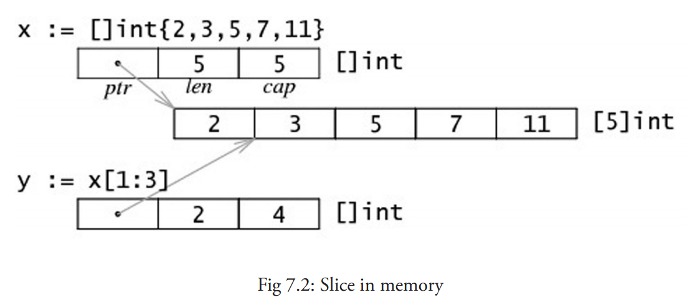
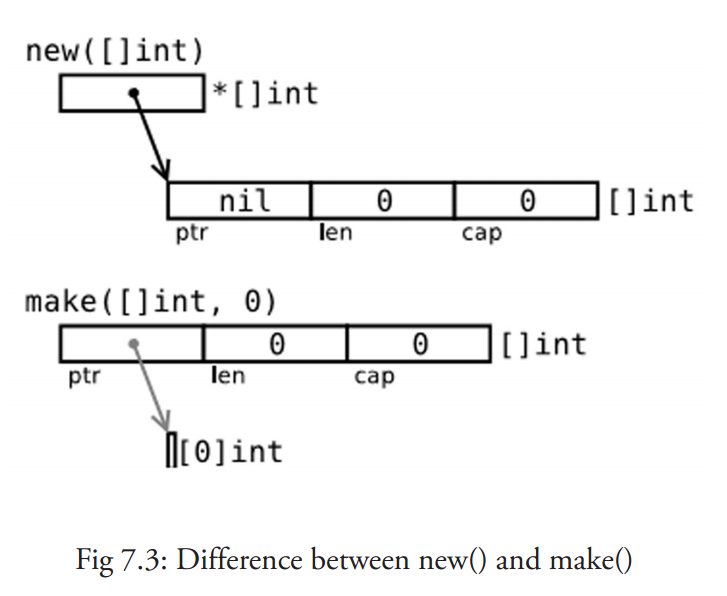
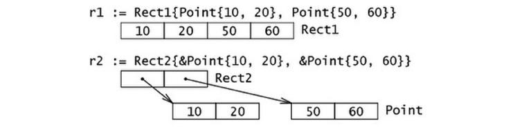

# Go入门指南

[Go入门指南](https://www.bookstack.cn/read/the-way-to-go_ZH_CN/eBook-directory.md)


# 第4章 基本结构和基本数据类型

## 4.2 Go 程序的基本结构和要素

hello_world.go

```go
package main

import"fmt"

func main(){
    fmt.Println("hello, world")
}
```

### 4.2.1 包的概念、导入与可见性

包是结构化代码的一种方式：每个程序都由包（通常简称为 pkg）的概念组成，可以使用自身的包或者从其它包中导入内容。

如同其它一些编程语言中的类库或命名空间的概念，每个 Go 文件都属于且仅属于一个包。一个包可以由许多以 `.go` 为扩展名的源文件组成，因此文件名和包名一般来说都是不相同的。

你必须在源文件中非注释的第一行指明这个文件属于哪个包，如：`package main`。`package main`表示一个可独立执行的程序，每个 Go 应用程序都包含一个名为 `main` 的包。

一个应用程序可以包含不同的包，而且即使你只使用 main 包也不必把所有的代码都写在一个巨大的文件里：你可以用一些较小的文件，并且在每个文件非注释的第一行都使用 `package main` 来指明这些文件都属于 main 包。如果你打算编译包名不是为 main 的源文件，如 `pack1`，编译后产生的对象文件将会是 `pack1.a` 而不是可执行程序。另外要注意的是，所有的包名都应该使用小写字母。

**标准库**

在 Go 的安装文件里包含了一些可以直接使用的包，即标准库。在 Windows 下，标准库的位置在 Go 根目录下的子目录 `pkg\windows_386` 中；在 Linux 下，标准库在 Go 根目录下的子目录 `pkg\linux_amd64` 中（如果是安装的是 32 位，则在 `linux_386` 目录中）。一般情况下，标准包会存放在 `$GOROOT/pkg/$GOOS_$GOARCH/` 目录下。

Go 的标准库包含了大量的包（如：fmt 和 os），但是你也可以创建自己的包（第 9 章）。

如果想要构建一个程序，则包和包内的文件都必须以正确的顺序进行编译。包的依赖关系决定了其构建顺序。

属于同一个包的源文件必须全部被一起编译，一个包即是编译时的一个单元，因此根据惯例，每个目录都只包含一个包。

**如果对一个包进行更改或重新编译，所有引用了这个包的客户端程序都必须全部重新编译。**

Go 中的包模型采用了显式依赖关系的机制来达到快速编译的目的，编译器会从后缀名为 `.o` 的对象文件（需要且只需要这个文件）中提取传递依赖类型的信息。

如果 `A.go` 依赖 `B.go`，而 `B.go` 又依赖 `C.go`：

- 编译 `C.go`, `B.go`, 然后是 `A.go`.
- 为了编译 `A.go`, 编译器读取的是 `B.o` 而不是 `C.o`.

这种机制对于编译大型的项目时可以显著地提升编译速度。

**每一段代码只会被编译一次**

一个 Go 程序是通过 `import` 关键字将一组包链接在一起。

`import "fmt"` 告诉 Go 编译器这个程序需要使用 `fmt` 包（的函数，或其他元素），`fmt` 包实现了格式化 IO（输入/输出）的函数。包名被封闭在半角双引号 `""` 中。如果你打算从已编译的包中导入并加载公开声明的方法，不需要插入已编译包的源代码。

如果需要多个包，它们可以被分别导入：

```go
import"fmt"
import"os"
```

或：

```go
import"fmt";import"os"
```

但是还有更短且更优雅的方法（被称为因式分解关键字，该方法同样适用于 const、var 和 type 的声明或定义）：

```go
import(
"fmt"
"os"
)
```

它甚至还可以更短的形式，但使用 gofmt 后将会被强制换行：

```go
import("fmt";"os")
```

当你导入多个包时，最好按照字母顺序排列包名，这样做更加清晰易读。

如果包名不是以 `.` 或 `/` 开头，如 `"fmt"` 或者 `"container/list"`，则 Go 会在全局文件进行查找；如果包名以 `./` 开头，则 Go 会在相对目录中查找；如果包名以 `/` 开头（在 Windows 下也可以这样使用），则会在系统的绝对路径中查找。

*译者注：以相对路径在GOPATH下导入包会产生报错信息*

*报错信息：local import “./XXX” in non-local package*

*引用：[Go programs cannot use relative import paths within a work space.](https://golang.org/cmd/go/#hdr-Relative_import_paths)*

*注解：在GOPATH外可以以相对路径的形式执行go build（go install 不可以）*

导入包即等同于包含了这个包的所有的代码对象。

除了符号 `_`，包中所有代码对象的标识符必须是唯一的，以避免名称冲突。但是相同的标识符可以在不同的包中使用，因为可以使用包名来区分它们。

包通过下面这个被编译器强制执行的规则来决定是否将自身的代码对象暴露给外部文件：

**可见性规则**

当标识符（包括常量、变量、类型、函数名、结构字段等等）以一个大写字母开头，如：Group1，那么使用这种形式的标识符的对象就可以被外部包的代码所使用（客户端程序需要先导入这个包），这被称为导出（像面向对象语言中的 public）；标识符如果以小写字母开头，则对包外是不可见的，但是他们在整个包的内部是可见并且可用的（像面向对象语言中的 private ）。

（大写字母可以使用任何 Unicode 编码的字符，比如希腊文，不仅仅是 ASCII 码中的大写字母）。

因此，在导入一个外部包后，能够且只能够访问该包中导出的对象。

假设在包 pack1 中我们有一个变量或函数叫做 Thing（以 T 开头，所以它能够被导出），那么在当前包中导入 pack1 包，Thing 就可以像面向对象语言那样使用点标记来调用：`pack1.Thing`（pack1 在这里是不可以省略的）。

因此包也可以作为命名空间使用，帮助避免命名冲突（名称冲突）：两个包中的同名变量的区别在于他们的包名，例如 `pack1.Thing` 和 `pack2.Thing`。

你可以通过使用包的别名来解决包名之间的名称冲突，或者说根据你的个人喜好对包名进行重新设置，如：`import fm "fmt"`。下面的代码展示了如何使用包的别名：

示例 4.2  alias.go

```go
package main

import fm "fmt"// alias3

func main(){
   fm.Println("hello, world")
}
```

**注意事项**

如果你导入了一个包却没有使用它，则会在构建程序时引发错误，如 `imported and not used: os`，这正是遵循了 Go 的格言：“没有不必要的代码！“。

**包的分级声明和初始化**

你可以在使用 `import` 导入包之后定义或声明 0 个或多个常量（const）、变量（var）和类型（type），这些对象的作用域都是全局的（在本包范围内），所以可以被本包中所有的函数调用（如 gotemplate.go 源文件中的 c 和 v），然后声明一个或多个函数（func）。


## 4.3常量

- 常量的值必须是能够在编译时就能够确定的；你可以在其赋值表达式中涉及计算过程，但是所有用于计算的值必须在编译期间就能获得。


---


## 4.4变量

### 4.4.1 简介

- 变量的类型也可以在运行时实现自动推断

### 4.4.2值类型和引用类型

程序中所用到的内存在计算机中使用一堆箱子来表示（这也是人们在讲解它的时候的画法），这些箱子被称为 “ 字 ”。根据不同的处理器以及操作系统类型，所有的字都具有 32 位（4 字节）或 64 位（8字节）的相同长度；所有的字都使用相关的内存地址来进行表示（以十六进制数表示）。


**值类型：**

- 所有像 int、float、bool 和 string 这些基本类型都属于值类型，使用这些类型的变量直接指向存在内存中的值。
- 当使用等号 `=` 将一个变量的值赋值给另一个变量时，如：`j = i`，实际上是在内存中将 `i` 的值进行了拷贝。
- 值类型的变量的值存储在 `栈` 中。


**引用类型：**

- 一个引用类型的变量 r1 存储的是 r1 的值所在的内存地址（数字），或内存地址中第一个字所在的位置。

- 当使用赋值语句 `r2 = r1` 时，只有引用（地址）被复制。
- 在 Go 语言中，指针（第 4.9 节）属于引用类型，其它的引用类型还包括 slices（第 7 章），maps（第 8 章）和 channel（第 13 章）。被引用的变量会存储在 `堆` 中，以便进行垃圾回收，且比栈拥有更大的内存空间。


### 4.4.3打印

- 函数 `fmt.Print` 和 `fmt.Println` 会自动使用格式化标识符 `%v` 对字符串进行格式化，两者都会在每个参数之间自动增加空格，而后者还会在字符串的最后加上一个换行符。


### 4.4.4 简短形式，使用 := 赋值操作符

- 这是使用变量的首选形式，但是它只能被用在 `函数体内`，而不可以用于全局变量的声明与赋值。使用操作符 `:=` 可以高效地创建一个新的变量，称之为初始化声明。

- 全局变量是允许声明但不使用。

- 这被称为 **并行** 或 **同时** 赋值。

    ```go
    a, b, c = 5, 7, "abc"
    ```


### 4.4.5 init 函数

- 变量除了可以在全局声明中初始化，也可以在 init 函数中初始化。这是一类非常特殊的函数，它不能够被人为调用，而是在每个包完成初始化后自动执行，并且执行优先级比 main 函数高。
- 每个源文件都只能包含一个 init 函数。初始化总是以单线程执行，并且按照包的依赖关系顺序执行。


---


## 4.5 基本类型和运算符

只有两个类型相同的值才可以和二元运算符结合，另外要注意的是，Go 是强类型语言，因此不会进行隐式转换，任何不同类型之间的转换都必须显式说明（第 4.2 节）。Go 不存在像 C 那样的运算符重载，表达式的解析顺序是从左至右。


### 4.5.1 布尔类型 bool

**值之间的比较：**

- Go 对于值之间的比较有非常严格的限制，只有两个类型相同的值才可以进行比较，如果值的类型是接口（interface，第 11 章），它们也必须都实现了相同的接口。如果其中一个值是常量，那么另外一个值的类型必须和该常量类型相兼容的。如果以上条件都不满足，则其中一个值的类型必须在被转换为和另外一个值的类型相同之后才可以进行比较。


`&&`  **和**  `||`  **的特性：**

- 在 Go 语言中，`&&`  和  `||`  是具有快捷性质的运算符，当运算符左边表达式的值已经能够决定整个表达式的值的时候（`&&` 左边的值为 false，`||` 左边的值为 true），运算符右边的表达式将不会被执行。利用这个性质，如果你有多个条件判断，应当将计算过程较为复杂的表达式放在运算符的右侧以减少不必要的运算。


### 4.5.2 数字类型

#### 4.5.2.1 整型 int 和浮点型 float

**整形：**

Go 也有基于架构的类型，例如：int、uint 和 uintptr。

这些类型的长度都是根据运行程序所在的操作系统类型所决定的：

- `int` 和 `uint` 在 32 位操作系统上，它们均使用 32 位（4 个字节），在 64 位操作系统上，它们均使用 64 位（8 个字节）。
- `uintptr` 的长度被设定为足够存放一个指针即可。

`int` 型是计算最快的一种类型。

整型的零值为 0。


**浮点型：**

- Go 语言中没有 float 类型。（Go语言中只有 `float32` 和 `float64`）没有double类型。

浮点型的零值为 0.0。


**注意：**

- 你应该尽可能地使用 `float64`，因为 `math` 包中所有有关数学运算的函数都会要求接收这个类型。

- 你可以通过增加前缀 0 来表示 8 进制数（如：077），增加前缀 0x 来表示 16 进制数（如：0xFF），以及使用 e 来表示 10 的连乘（如： 1e3 = 1000，或者 6.022e23 = 6.022 x 1e23）。

- Go 中不允许不同类型之间的混合使用，但是对于常量的类型限制非常少，因此允许常量之间的混合使用，下面这个程序很好地解释了这个现象（该程序无法通过编译）：

    ```go
    package main
    func main() {
        var a int
        var b int32
        a = 15
        b = a + a  // 编译错误（cannot use a + a (type int) as type int32 in assignment） 
        b = b + 5  // 因为 5 是常量，所以可以通过编译
    }
    ```


#### 4.5.2.2 复数

 **复数:**

- Go 拥有以下复数类型：

    ```go
    complex64 (32 位实数和虚数)
    complex128 (64 位实数和虚数)
    ```

- 复数支持和其它数字类型一样的运算。当你使用等号 `==` 或者不等号 `!=` 对复数进行比较运算时，注意对精确度的把握。`cmath` 包中包含了一些操作复数的公共方法。如果你对内存的要求不是特别高，最好使用 complex128 作为计算类型，因为相关函数都使用这个类型的参数。


#### 4.5.2.3 位运算

**位运算：**

位运算只能用于整数类型的变量，且需当它们拥有等长位模式时。

`%b` 是用于表示位的格式化标识符。

**二元运算符**

- 按位与 `&`：

- 按位或 `|`：

- 按位异或 `^`：

- 位清除 `&^`：将指定位置上的值设置为 0。

    ```go
    package main
    
    import "fmt"
    
    func main() {
    	a := 12
    	b := 4
    	c := a &^ b
    	fmt.Printf("a: %08b\n", a)
    	fmt.Printf("b: %08b\n", b)
    	fmt.Printf("c: %08b\n", c)
    	fmt.Printf("c: %#v   二进制：%08b\n", c, c)
    
    	/*输出：
    	a: 00001100
    	b: 00000100
    	c: 00001000
    	c: 8   二进制：00001000
    	*/
    }
    
    ```

    

**一元运算符**

- 按位补足 `^`：

- 位左移 `<<`：

- 位右移 `>>`：


#### 4.5.2.4 逻辑运算符

Go 中拥有以下逻辑运算符：`==`、`!=`（第 4.5.1 节）、`<`、`<=`、`>`、`>=`。

它们之所以被称为逻辑运算符是因为它们的运算结果总是为布尔值 `bool`。例如：

```
b3 := 10 > 5 // b3 is true
```


#### 4.5.2.5 算术运算符

常见可用于整数和浮点数的二元运算符有 `+`、`-`、`*` 和 `/`。

- `/` 对于整数运算而言，结果依旧为整数，例如：`9 / 4 -> 2`。

- 取余运算符只能作用于整数：`9 % 4 -> 1`。
- 整数除以 0 可能导致程序崩溃，将会导致运行时的恐慌状态（如果除以 0 的行为在编译时就能被捕捉到，则会引发编译错误）；第 13 章将会详细讲解如何正确地处理此类情况。
- 浮点数除以 0.0 会返回一个无穷尽的结果，使用 `+Inf` 表示。

- 你可以将语句 `b = b + a` 简写为 `b+=a`，同样的写法也可用于 `-=`、`*=`、`/=`、`%=`。
- 对于整数和浮点数，你可以使用一元运算符 `++`（递增）和 `--`（递减），但只能用于后缀。
    - 同时，带有 `++` 和 `--` 的只能作为语句，而非表达式，因此 `n = i++` 这种写法是无效的，其它像 `f(i++)` 或者 `a[i]=b[i++]` 这些可以用于 C、C++ 和 Java 中的写法在 Go 中也是不允许的。

- 在运算时 **溢出** 不会产生错误，Go 会简单地将超出位数抛弃。如果你需要范围无限大的整数或者有理数（意味着只被限制于计算机内存），你可以使用标准库中的 `big` 包，该包提供了类似 `big.Int` 和 `big.Rat` 这样的类型（第 9.4 节）。


#### 4.5.2.6 随机数

一些像游戏或者统计学类的应用需要用到随机数。`rand` 包实现了伪随机数的生成。

```go
package main

import (
	"fmt"
	"math/rand"
	"time"
)

func main() {
	for i := 0; i < 10; i++ {
		a := rand.Int()
		fmt.Printf("%d / ", a)
	}
	for i := 0; i < 5; i++ {
		r := rand.Intn(8)
		fmt.Printf("%d / ", r)
	}
	fmt.Println()

	timens := int64(time.Now().Nanosecond())
	rand.Seed(timens)
	for i := 0; i < 10; i++ {
		fmt.Printf("%2.2f / ", 100*rand.Float32())
	}
}
```

函数 `rand.Float32` 和 `rand.Float64` 返回介于 [0.0, 1.0) 之间的伪随机数，其中包括 0.0 但不包括 1.0。函数 `rand.Intn` 返回介于 [0, n) 之间的伪随机数。

你可以使用 `rand.Seed(value)` 函数来提供伪随机数的生成种子，一般情况下都会使用当前时间的纳秒级数字（第 4.8 节）。


### 4.5.3 运算符与优先级


### 4.5.4 类型别名

- 当你在使用某个类型时，你可以给它起另一个名字，然后你就可以在你的代码中使用新的名字（用于简化名称或解决名称冲突）。

- 在 `type TZ int` 中，TZ 就是 int 类型的新名称（用于表示程序中的时区），然后就可以使用 TZ 来操作 int 类型的数据。

    ```go
    package main
    
    import "fmt"
    
    type TZ int
    
    func main() {
        var a, b TZ = 3, 4
        c := a + b
        fmt.Printf("c has the value: %d", c) // 输出：c has the value: 7
    }
    ```

- 实际上，类型别名得到的新类型并非和原类型完全相同，新类型不会拥有原类型所附带的方法（第 10 章）；TZ 可以自定义一个方法用来输出更加人性化的时区信息。


### 4.5.5 字符类型

严格来说，这并不是 Go 语言的一个类型，字符只是整数的特殊用例。`byte` 类型是 `uint8` 的别名，对于只占用 1 个字节的传统 ASCII 编码的字符来说，完全没有问题。例如：`var ch byte = 'A'`；字符使用单引号括起来。

在 ASCII 码表中，A 的值是 65，而使用 16 进制表示则为 41，所以下面的写法是等效的：

```go
var ch byte = 65 或 var ch byte = '\x41'
```

（`\x` 总是紧跟着长度为 2 的 16 进制数）


包 `unicode` 包含了一些针对测试字符的非常有用的函数（其中 `ch` 代表字符）：

- 判断是否为字母：`unicode.IsLetter(ch)`
- 判断是否为数字：`unicode.IsDigit(ch)`
- 判断是否为空白符号：`unicode.IsSpace(ch)`

这些函数返回一个布尔值。


包 `utf8` 拥有更多与 rune 类型相关的函数。


---


## 4.6 字符串

Go 支持以下 2 种形式的字面值：

- 解释字符串：

    该类字符串使用双引号括起来，其中的相关的转义字符将被替换，这些转义字符包括：

    - `\n`：换行符
    - `\r`：回车符
    - `\t`：tab 键
    - `\u` 或 `\U`：Unicode 字符
    - `\\`：反斜杠自身

- 非解释字符串：

    该类字符串使用反引号括起来，支持换行，例如：

    ```go
    `This is a raw string \n` 中的 `\n` 会被原样输出。
    ```

- `string` 类型的零值为长度为零的字符串，即空字符串 `""`。

- **注意事项** 获取字符串中某个字节的地址的行为是非法的，例如：`&str[i]`。
- 在循环中使用加号 `+` 拼接字符串并不是最高效的做法，更好的办法是使用函数 `strings.Join()`（第 4.7.10 节），有没有更好的办法了？有！使用字节缓冲（`bytes.Buffer`）拼接更加给力（第 7.2.6 节）！


---


## 4.7 strings 和 strconv 包


### 4.7.12 字符串与其它类型的转换

与字符串相关的类型转换都是通过 `strconv` 包实现的。

该包包含了一些变量用于获取程序运行的操作系统平台下 int 类型所占的位数，如：`strconv.IntSize`。


**其他类型转字符串：**

任何类型 **T** 转换为字符串总是成功的。

针对从数字类型转换到字符串，Go 提供了以下函数：

- `strconv.Itoa(i int) string` 返回数字 i 所表示的字符串类型的十进制数。
- `strconv.FormatFloat(f float64, fmt byte, prec int, bitSize int) string` 将 64 位浮点型的数字转换为字符串，其中 `fmt` 表示格式（其值可以是 `'b'`、`'e'`、`'f'` 或 `'g'`），`prec` 表示精度，`bitSize` 则使用 32 表示 float32，用 64 表示 float64。


**字符串转其他类型：**

将字符串转换为其它类型 **tp** 并不总是可能的，可能会在运行时抛出错误 `parsing "…": invalid argument`。

针对从字符串类型转换为数字类型，Go 提供了以下函数：

- `strconv.Atoi(s string) (i int, err error)` 将字符串转换为 int 型。
- `strconv.ParseFloat(s string, bitSize int) (f float64, err error)` 将字符串转换为 float64 型。


---


## 4.8 时间和日期


---

## 4.9 指针


使用一个指针引用一个值被称为间接引用。

当一个指针被定义后没有分配到任何变量时，它的值为 `nil`。

一个指针变量通常缩写为 `ptr`。


**注意事项**

- 你不能获取字面量或常量的地址，例如：

```go
const i = 5
ptr := &i //error: cannot take the address of i

ptr2 := &10 //error: cannot take the address of 10
```

- Go 语言为程序员提供了控制数据结构的指针的能力；但是，你不能进行指针运算。因此 `c = *p++` 在 Go 语言的代码中是不合法的。

- 指针的一个高级应用是你可以传递一个变量的引用（如函数的参数），这样不会传递变量的拷贝。指针传递是很廉价的，只占用 4 个或 8 个字节。当程序在工作中需要占用大量的内存，或很多变量，或者两者都有，使用指针会减少内存占用和提高效率。被指向的变量也保存在内存中，直到没有任何指针指向它们，所以从它们被创建开始就具有相互独立的生命周期。

- 指针也可以指向另一个指针，并且可以进行任意深度的嵌套，导致你可以有多级的间接引用，但在大多数情况这会使你的代码结构不清晰。

- 对一个空指针的反向引用是不合法的，并且会使程序崩溃

    ```go
    package main
    func main() {
        var p *int = nil
        *p = 0
    }
    // in Windows: stops only with: <exit code="-1073741819" msg="process crashed"/>
    // runtime error: invalid memory address or nil pointer dereference
    ```

    


---


# 第5章 控制结构

到目前为止，我们看到的 Go 程序都是从 main() 函数开始执行，然后按顺序执行该函数体中的代码。但我们经常会需要只有在满足一些特定情况时才执行某些代码，也就是说在代码里进行条件判断。针对这种需求，Go 提供了下面这些条件结构和分支结构：

- if-else 结构
- switch 结构
- select 结构，用于 channel 的选择（第 14.4 节）


可以使用迭代或循环结构来重复执行一次或多次某段代码（任务）：

- for (range) 结构


一些如 `break` 和 `continue` 这样的关键字可以用于中途改变循环的状态。

此外，你还可以使用 `return` 来结束某个函数的执行，或使用 `goto` 和标签来调整程序的执行位置。


Go 完全省略了 `if`、`switch` 和 `for` 结构中条件语句两侧的括号，相比 Java、C++ 和 C# 中减少了很多视觉混乱的因素，同时也使你的代码更加简洁。


## 5.1 if-else 结构

- if 可以包含一个初始化语句（如：给一个变量赋值）。这种写法具有固定的格式（在初始化语句后方必须加上分号）

    ```go
    // 但要注意的是，使用简短方式 := 声明的变量的作用域只存在于 if 结构中（在 if 结构的大括号之间，如果使用 if-else 结构则在 else 代码块中变量也会存在）。
    if val := 10; val > max {
        // do something
    }
    ```


## 5.2 测试多返回值函数的错误

如果我们想要在错误发生的同时终止程序的运行，我们可以使用 `os` 包的 `Exit` 函数：

```go
// （此处的退出代码 1 可以使用外部脚本获取到）
if err != nil {
    fmt.Printf("Program stopping with error %v", err)
    os.Exit(1)
}
```


可以将错误的获取放置在 if 语句的初始化部分：

```go
if err := file.Chmod(0664); err != nil {
    fmt.Println(err)
    return err
}
```


## 5.3 switch 结构

在下面这个代码片段中，变量 a 和 b 被平行初始化，然后作为判断条件：

```go
switch a, b := x[i], y[j]; {
    case a < b: t = -1
    case a == b: t = 0
    case a > b: t = 1
}
```


`fallthrough` 的特性：

- Go里面 switch 默认相当于每个case最后带有break，匹配成功后不会自动向下执行其他case，而是跳出整个switch, 但是可以使用fallthrough强制执行后面的case代码。
- fallthrough不能用在switch的最后一个分支
- fallthrough到下一个case块时，**不执行case匹配检查！**


## 5.4 for 结构

- 循环开始前，会执行且仅会执行一次初始化语句。

- 特别注意，永远不要在循环体内修改计数器，这在任何语言中都是非常差的实践！

- 还可以在循环中同时使用多个计数器：

    ```go
    for i, j := 0, N; i < j; i, j = i+1, j-1 {}
    ```

- ASCII 编码的字符占用 1 个字节，既每个索引都指向不同的字符，而非 ASCII 编码的字符（占有 2 到 4 个字节）不能单纯地使用索引来判断是否为同一个字符。我们会在第 5.4.4 节解决这个问题。

    ```go
    package main
    
    import "fmt"
    
    func main() {
        str := "Go is a beautiful language!"
        fmt.Printf("The length of str is: %d\n", len(str))
        for ix :=0; ix < len(str); ix++ {
            fmt.Printf("Character on position %d is: %c \n", ix, str[ix])
        }
        
        str2 := "日本語"
        fmt.Printf("The length of str2 is: %d\n", len(str2))
        for ix :=0; ix < len(str2); ix++ {
            fmt.Printf("Character on position %d is: %c \n", ix, str2[ix])
        }
    }
    ```
    
- 死循环： `for { }`


### 5.4.4 for-range 结构

- 这是 Go 特有的一种的迭代结构，您会发现它在许多情况下都非常有用。它可以迭代任何一个集合（包括数组和 map，详见第 7 和 8 章）。语法上很类似其它语言中 foreach 语句，但您依旧可以获得每次迭代所对应的索引。一般形式为：`for ix, val := range coll { }`。

- 要注意的是，`val` 始终为集合中对应索引的值拷贝，因此它一般只具有只读性质，对它所做的任何修改都不会影响到集合中原有的值（**如果 `val` 为指针，则会产生指针的拷贝，依旧可以修改集合中的原值**）。一个字符串是 Unicode 编码的字符（或称之为 `rune`）集合，因此您也可以用它迭代字符串：

    ```go
    // 运行代码，从输出结果中我们可以看到，常用英文字符使用 1 个字节表示，而汉字使用 3 个字符表示。
    func main() {
    	str := "Go is a beautiful language!"
    	fmt.Printf("The length of str is: %d\n", len(str))
    	for pos, char := range str {
    		fmt.Printf("Character on position %d is: %c \n", pos, char)
    	}
    	fmt.Println()
    
    	str2 := "Chinese: 中国人"
    	fmt.Printf("The length of str2 is: %d\n", len(str2))
    	for pos, char := range str2 {
    		fmt.Printf("character %c starts at byte position %d\n", char, pos)
    	}
    	fmt.Println()
    
    	fmt.Println("index    int(rune)    rune    char bytes")
    	for index, rune_ := range str2 {
    		fmt.Printf("%-2d      %d      %U '%c' % X\n", index, rune_, rune_, rune_, []byte(string(rune_)))
    	}
    }
    ```


## 5.5 Break 与 continue

break:

- 一个 break 的作用范围为该语句出现后的最内部的结构，它可以被用于任何形式的 for 循环（计数器、条件判断等）。
- 但在 switch 或 select 语句中（详见第 13 章），break 语句的作用结果是跳过整个代码块，执行后续的代码。


continue:

- 关键字 continue 忽略剩余的循环体而直接进入下一次循环的过程，但不是无条件执行下一次循环，执行之前依旧需要满足循环的判断条件。
- 另外，关键字 continue 只能被用于 for 循环中。


## 5.6 标签 与 goto(不推荐使用)

for、switch 或 select 语句都可以配合标签（label）形式的标识符使用，即某一行第一个以冒号（`:`）结尾的单词（gofmt 会将后续代码自动移至下一行）。

```go
package main

import "fmt"

func main() {
LABEL1:
	for i := 0; i <= 5; i++ {
		for j := 0; j <= 5; j++ {
			if j == 4 {
				continue LABEL1
				// break LABEL1
			}
			fmt.Printf("i is: %d, and j is: %d\n", i, j)
		}
	}
}

```

您可以看到当 j=4  和  j=5 的时候，没有任何输出：标签的作用对象为外部循环，因此 i 会直接变成下一个循环的值，而此时 j 的值就被重设为 0，即它的初始值。如果将 continue 改为 break，则不会只退出内层循环，而是直接退出外层循环了。


还可以使用 goto 语句和标签配合使用来模拟循环。

```go
package main

func main() {
	i := 0
HERE:
	print(i)
	i++
	if i == 5 {
		return
	}
	goto HERE
}
//上面的代码会输出 01234
```


**特别注意** 使用标签和 goto 语句是不被鼓励的：它们会很快导致非常糟糕的程序设计，而且总有更加可读的替代方案来实现相同的需求。


一个建议使用 goto 语句的示例会在第 15.1 章的 simple_tcp_server.go 中出现：示例中在发生读取错误时，使用 goto 来跳出无限读取循环并关闭相应的客户端链接。


定义但未使用标签会导致编译错误：`label … defined and not used`。

---


# 第6章 函数（function）

函数是 Go 里面的基本代码块：Go 函数的功能非常强大，以至于被认为拥有函数式编程语言的多种特性。


## 6.1 介绍

Go是编译型语言，所以函数编写的顺序是无关紧要的；鉴于可读性的需求，最好把 `main()` 函数写在文件的前面，其他函数按照一定逻辑顺序进行编写（例如函数被调用的顺序）。

简单的 `return` 语句也可以用来结束 for 死循环，或者结束一个协程（goroutine）。


Go 里面有三种类型的函数：

- 普通的带有名字的函数
- 匿名函数或者lambda函数（参考 [第 6.8 节](https://www.bookstack.cn/read/the-way-to-go_ZH_CN/eBook-06.8.md)）
- 方法（Methods，参考 [第 10.6 节](https://www.bookstack.cn/read/the-way-to-go_ZH_CN/eBook-10.6.md)）


除了main()、init()函数外，其它所有类型的函数都可以有参数与返回值。函数参数、返回值以及它们的类型被统称为***函数签名***。


假设 f1 需要 3 个参数 `f1(a, b, c int)`，同时 f2 返回 3 个参数 `f2(a, b int) (int, int, int)`，就可以这样调用 f1：`f1(f2(a, b))`。


函数重载（function overloading）指的是可以编写多个同名函数，只要它们拥有不同的形参与/或者不同的返回值，在 Go 里面函数重载是***不被允许的***。这将导致一个编译错误：

```go
funcName redeclared inthis book, previous declaration at lineno
```


如果需要申明一个在外部定义的函数，你只需要给出函数名与函数签名，不需要给出函数体：

```
func flushICache(begin,end uintptr)// implemented externally
```

**函数也可以以申明的方式被使用，作为一个函数类型**，就像：

```
type binOp func(int,int)int
```

在这里，不需要函数体 `{}`。

函数是一等值（first-class value）：它们可以赋值给变量，就像 `add := binOp` 一样。

这个变量知道自己指向的函数的签名，所以给它赋一个具有不同签名的函数值是不可能的。

函数值（functions value）之间可以相互比较：如果它们引用的是相同的函数或者都是 nil 的话，则认为它们是相同的函数。函数不能在其它函数里面声明（不能嵌套），不过我们可以通过使用匿名函数（参考 [第 6.8 节](https://www.bookstack.cn/read/the-way-to-go_ZH_CN/eBook-06.8.md)）来破除这个限制。

目前 Go 没有泛型（generic）的概念，也就是说它不支持那种支持多种类型的函数。不过在大部分情况下可以通过接口（interface），特别是空接口与类型选择（type switch，参考 [第 11.12 节](https://www.bookstack.cn/read/the-way-to-go_ZH_CN/eBook-11.12.md)）与/或者通过使用反射（reflection，参考 [第 6.8 节](https://www.bookstack.cn/read/the-way-to-go_ZH_CN/eBook-06.8.md)）来实现相似的功能。使用这些技术将导致代码更为复杂、性能更为低下，所以在非常注意性能的的场合，最好是为每一个类型单独创建一个函数，而且代码可读性更强。


## 6.2 函数参数与返回值

函数定义时，它的形参一般是有名字的，不过我们也可以定义没有形参名的函数，只有相应的形参类型，就像这样：`func f(int, int, float64)`。


### 6.2.1 按值传递（call by value）按引用传递（call by reference）

Go 默认使用按值传递来传递参数，也就是传递参数的副本。函数接收参数副本之后，在使用变量的过程中可能对副本的值进行更改，但不会影响到原来的变量，比如 `Function(arg1)`。

如果你希望函数可以直接修改参数的值，而不是对参数的副本进行操作，你需要将参数的地址（变量名前面添加&符号，比如 &variable）传递给函数，这就是按引用传递，比如 `Function(&arg1)`，此时传递给函数的是一个指针。如果传递给函数的是一个指针，指针的值（一个地址）会被复制，但指针的值所指向的地址上的值不会被复制；我们可以通过这个指针的值来修改这个值所指向的地址上的值。（**译者注：指针也是变量类型，有自己的地址和值，通常指针的值指向一个变量的地址。所以，按引用传递也是按值传递。**）

几乎在任何情况下，传递指针（一个32位或者64位的值）的消耗都比传递副本来得少。

在函数调用时，像切片（slice）、字典（map）、接口（interface）、通道（channel）这样的引用类型都是默认使用引用传递（即使没有显式的指出指针）。

如果一个函数需要返回四到五个值，我们可以传递一个切片给函数（如果返回值具有相同类型）或者是传递一个结构体（如果返回值具有不同的类型）。因为传递一个指针允许直接修改变量的值，消耗也更少。


### 6.2.2 命名的返回值（named return variables）

命名返回值作为结果形参（result parameters）被初始化为相应类型的零值，当需要返回的时候，我们只需要一条简单的不带参数的return 语句。需要注意的是，即使只有一个命名返回值，也需要使用 `()` 括起来（参考 [第 6.6 节](https://www.bookstack.cn/read/the-way-to-go_ZH_CN/eBook-06.6.md)的 fibonacci.go 函数）。

注意：

- return 或 return var 都是可以的。
- 不过 `return var = expression`（表达式） 会引发一个编译错误：`syntax error: unexpected =, expecting semicolon or newline or }`。

即使函数使用了命名返回值，你依旧可以无视它而返回明确的值。

任何一个非命名返回值（使用非命名返回值是很糟的编程习惯）在 `return` 语句里面都要明确指出包含返回值的变量或是一个可计算的值（就像上面警告所指出的那样）。

**尽量使用命名返回值：会使代码更清晰、更简短，同时更加容易读懂。**


### 6.2.3 空白符（blank identifier）


### 6.2.4 改变外部变量（outside variable）

传递指针给函数不但可以节省内存（因为没有复制变量的值），而且赋予了函数直接修改外部变量的能力，所以被修改的变量不再需要使用 `return` 返回。如下的例子，`reply` 是一个指向 `int` 变量的指针，通过这个指针，我们在函数内修改了这个 `int` 变量的数值。

```go
package main

import (
    "fmt"
)

// this function changes reply:
func Multiply(a, b int, reply *int) {
    *reply = a * b
}
func main() {
    n := 0
    reply := &n
    Multiply(10, 5, reply)
    fmt.Println("Multiply:", *reply) // Multiply: 50
}
```

这仅仅是个指导性的例子，当需要在函数内改变一个占用内存比较大的变量时，性能优势就更加明显了。然而，如果不小心使用的话，传递一个指针很容易引发一些不确定的事，所以，我们要十分小心那些可以改变外部变量的函数，在必要时，需要添加注释以便其他人能够更加清楚的知道函数里面到底发生了什么。


## 6.3 传递变长参数

如果函数的最后一个参数是采用 `...type` 的形式，那么这个函数就可以处理一个变长的参数，这个长度可以为 0，这样的函数称为变参函数。

```
func myFunc(a, b, arg ...int) {}
```

这个函数接受一个类似某个类型的 slice 的参数（详见第 7 章），该参数可以通过第 5.4.4 节中提到的 for 循环结构迭代。

示例函数和调用：

```go
func Greeting(prefix string, who ...string)
Greeting("hello:", "Joe", "Anna", "Eileen")
```

在 Greeting 函数中，变量 `who` 的值为 `[]string{"Joe", "Anna", "Eileen"}`。


如果参数被存储在一个 slice 类型的变量 `slice` 中，则可以通过 `slice...` 的形式来传递参数，调用变参函数。

```go
package main

import "fmt"

func main() {
    x := min(1, 3, 2, 0)
    fmt.Printf("The minimum is: %d\n", x)
    slice := []int{7, 9, 3, 5, 1}
    x = min(slice...)
    fmt.Printf("The minimum in the slice is: %d", x)
}
func min(s ...int) int {
    if len(s) == 0 {
        return 0
    }
    min := s[0]
    for _, v := range s {
        if v < min {
            min = v
        }
    }
    return min
}
```


一个接受变长参数的函数可以将这个参数作为其它函数的参数进行传递：

```go
func F1(s ...string) {
    F2(s...)
    F3(s)
}
func F2(s ...string) { }
func F3(s []string) { }
```


但是如果变长参数的类型并不是都相同的呢？使用 5 个参数来进行传递并不是很明智的选择，有 2 种方案可以解决这个问题：

1. 使用结构（详见第 10 章）：

    定义一个结构类型，假设它叫 `Options`，用以存储所有可能的参数：

    ```go
     type Options struct {
         par1 type1,
         par2 type2,
         ...
     }
    ```

    函数 F1 可以使用正常的参数 a 和 b，以及一个没有任何初始化的 Options 结构： `F1(a, b, Options {})`。如果需要对选项进行初始化，则可以使用 `F1(a, b, Options {par1:val1, par2:val2})`。

2. 使用空接口：

    如果一个变长参数的类型没有被指定，则可以使用默认的空接口 `interface{}`，这样就可以接受任何类型的参数（详见第 11.9 节）。该方案不仅可以用于长度未知的参数，还可以用于任何不确定类型的参数。一般而言我们会使用一个 for-range 循环以及 switch 结构对每个参数的类型进行判断：

    ```go
    func typecheck(values ...interface{}) {
        for _, value := range values {
            switch v := value.(type) {
            case int:
                print(v)
            case float64:
                print(v)
            case string:
                print(v)
            case bool:
                print(v)
            default:
                print(v)
            }
        }
    }
    ```

    

## 6.4 defer 和 追踪

关键字 defer 允许我们推迟到函数返回之前（或任意位置执行 `return` 语句之后）一刻才执行某个语句或函数（为什么要在返回之后才执行这些语句？因为 `return` 语句同样可以包含一些操作，而不是单纯地返回某个值）。

关键字 defer 的用法类似于面向对象编程语言 Java 和 C# 的 `finally` 语句块，它一般用于释放某些已分配的资源。


当有多个 defer 行为被注册时，它们会以逆序执行（类似栈，即后进先出）：

```go
package main

import "fmt"

func main() {
    f()
}

func f() {
    for i := 0; i < 5; i++ {
        defer fmt.Printf("%d ", i)
    }
}
```


关键字 defer 允许我们进行一些函数执行完成后的收尾工作，例如：

1. 关闭文件流 （详见 [第 12.2 节](https://www.bookstack.cn/read/the-way-to-go_ZH_CN/eBook-12.2.md)）

```go
// open a file  
defer file.Close()
```

2. 解锁一个加锁的资源 （详见 [第 9.3 节](https://www.bookstack.cn/read/the-way-to-go_ZH_CN/eBook-09.3.md)）

```go
mu.Lock()  
defer mu.Unlock()
```

3. 打印最终报告

```go
printHeader()  
defer printFooter()
```

4. 关闭数据库链接

```go
// open a database connection  
defer disconnectFromDB()
```

合理使用 defer 语句能够使得代码更加简洁。


**使用 defer 语句实现代码追踪**

简洁版：

```go
package main

import "fmt"

func main() {
    b()
}

func trace(s string) string {
    fmt.Println("entering:", s)
    return s
}

func un(s string) {
    fmt.Println("leaving:", s)
}

func a() {
    defer un(trace("a"))
    fmt.Println("in a")
}

func b() {
    defer un(trace("b"))
    fmt.Println("in b")
    a()
}
```


**使用 defer 语句来记录函数的参数与返回值**

下面的代码展示了另一种在调试时使用 defer 语句的手法：

```go
package main

import (
    "io"
    "log"
)

func func1(s string) (n int, err error) {
    defer func() {
        log.Printf("func1(%q) = %d, %v", s, n, err)
    }()
    return 7, io.EOF
}

func main() {
    func1("Go")
}
// 输出结果：2021/07/05 20:20:57 func1("Go") = 7, EOF
```


## 6.5 内置函数

Go 语言拥有一些不需要进行导入操作就可以使用的内置函数。它们有时可以针对不同的类型进行操作，例如：len、cap 和 append，或必须用于系统级的操作，例如：panic。因此，它们需要直接获得编译器的支持。

- close
- len、cap
- new、make
- copy、append
- panic、recover
- print、println
- complex、real imag


## 6.6 递归函数

特别注意的是，使用 int 类型最多只能计算到 12 的阶乘，因为一般情况下 int 类型的大小为 32 位，继续计算会导致溢出错误。那么，如何才能解决这个问题呢？

最好的解决方案就是使用 big 包（详见第 9.4 节）。


## 6.7 将函数作为参数

函数可以作为其它函数的参数进行传递，然后在其它函数内调用执行，一般称之为***回调***。下面是一个将函数作为参数的简单例子：

```go
package main

import (
    "fmt"
)

func main() {
    callback(1, Add)
}

func Add(a, b int) {
    fmt.Printf("The sum of %d and %d is: %d\n", a, b, a+b)
}

func callback(y int, f func(int, int)) {
    f(y, 2) // this becomes Add(1, 2)
}
```


**练习 6.7**

包 `strings` 中的 `Map` 函数和 `strings.IndexFunc()` 一样都是非常好的使用例子。请学习它的源代码并基于该函数书写一个程序，要求将指定文本内的所有非 ASCII 字符替换成 `?` 或空格。您需要怎么做才能删除这些字符呢？


## 6.8 闭包

当我们不希望给函数起名字的时候，可以使用匿名函数，例如：`func(x, y int) int { return x + y }`。

这样的一个函数不能够独立存在（编译器会返回错误：`non-declaration statement outside function body`），但可以被赋值于某个变量，即保存函数的地址到变量中：`fplus := func(x, y int) int { return x + y }`，然后通过变量名对函数进行调用：`fplus(3,4)`。

当然，您也可以直接对匿名函数进行调用：`func(x, y int) int { return x + y } (3, 4)`。

匿名函数像所有函数一样可以接受或不接受参数。

请学习以下示例并思考：函数 `f` 返回时，变量 `ret` 的值是什么？

```go
package main

import "fmt"

func main() {
	fmt.Println(f())
}

func f() (ret int) {
	defer func() {
		ret++
	}()
	return 1
}
// 变量 ret 的值为 2，因为 ret++ 是在执行 return 1 语句后发生的。
// 这可用于在返回语句之后修改返回的 error 时使用。
```


## 6.9 应用闭包：将函数作为返回值

闭包实现计数器

```go
package main

import "fmt"

func main() {
	var f = Adder()
	fmt.Print(f(1), " - ")
	fmt.Print(f(20), " - ")
	fmt.Print(f(300))
}

func Adder() func(int) int {
	var x int
	return func(delta int) int {
		x += delta
		return x
	}
}
```

函数 Adder() 现在被赋值到变量 f 中（类型为 `func(int) int`）。

输出结果：`1 - 21 - 321`

三次调用函数 f 的过程中函数 Adder() 中变量 delta 的值分别为：1、20 和 300。

我们可以看到，在多次调用中，变量 x 的值是被保留的，即 `0 + 1 = 1`，然后 `1 + 20 = 21`，最后 `21 + 300 = 321`：闭包函数保存并积累其中的变量的值，不管外部函数退出与否，它都能够继续操作外部函数中的局部变量。

这些局部变量同样可以是参数，例如之前例子中的 `Adder(x int)`。


在闭包中使用到的变量可以是在闭包函数体内声明的，也可以是在外部函数声明的：

```go
package main

import (
	"fmt"
	"time"
)

func main() {
	var g int
	go func(i int) {
		s := 0
		for j := 0; j <= i; j++ {
			s += j
		}
		g = s
	}(1000) // Passes argument 1000 to the function literal.

	time.Sleep(100 * time.Millisecond)
	fmt.Println(g)
}
```


**练习 6.9** 不使用递归但使用闭包改写第 6.6 节中的斐波那契数列程序。

```go
package main

import "fmt"

func main() {
	fib := fibonacci()
	for i := 0; i < 10; i++ {
		fmt.Println(fib())
	}
}

func fibonacci() func() int {
	a, b := 0, 1
	return func() int {
		a, b = b, a+b
		return a
	}
}
```


可以返回其它函数的函数和接受其它函数作为参数的函数均被称之为高阶函数，是函数式语言的特点。我们已经在第 6.7 中得知函数也是一种值，因此很显然 Go 语言具有一些函数式语言的特性。闭包在 Go 语言中非常常见，常用于 goroutine 和管道操作（详见第 14.8-14.9 节）。在第 11.14 节的程序中，我们将会看到 Go 语言中的函数在处理混合对象时的强大能力。


## 6.10 使用闭包调试

当您在分析和调试复杂的程序时，无数个函数在不同的代码文件中相互调用，如果这时候能够准确地知道哪个文件中的具体哪个函数正在执行，对于调试是十分有帮助的。您可以使用 `runtime` 或 `log` 包中的特殊函数来实现这样的功能。包 `runtime` 中的函数 `Caller()` 提供了相应的信息，因此可以在需要的时候实现一个 `where()` 闭包函数来打印函数执行的位置：

```go
where := func() {
    _, file, line, _ := runtime.Caller(1)
    log.Printf("%s:%d", file, line)
}
where()
// some code
where()
// some more code
where()
```

您也可以设置 `log` 包中的 flag 参数来实现：

```go
log.SetFlags(log.Llongfile)
log.Print("")
```

或使用一个更加简短版本的 `where` 函数：

```go
var where = log.Print
func func1() {
where()
... some code
where()
... some code
where()
}
```


## 6.11 计算函数执行时间

有时候，能够知道一个计算执行消耗的时间是非常有意义的，尤其是在对比和基准测试中。最简单的一个办法就是在计算开始之前设置一个起始时候，再由计算结束时的结束时间，最后取出它们的差值，就是这个计算所消耗的时间。想要实现这样的做法，可以使用 `time` 包中的 `Now()` 和 `Sub` 函数：

```go
package main

import (
	"fmt"
	"time"
)

func longCalculation() {
	time.Sleep(500 * time.Millisecond)
}

func main() {
	start := time.Now()
	longCalculation()
	end := time.Now()
	delta := end.Sub(start)
	fmt.Printf("longCalculation took this amount of time: %s\n", delta)
}
```

您可以查看示例 6.20 [fibonacci.go](https://www.bookstack.cn/read/the-way-to-go_ZH_CN/$eBook-examples-chapter_6-fibonacci.go) 作为实例学习。

如果您对一段代码进行了所谓的优化，请务必对它们之间的效率进行对比再做出最后的判断。在接下来的章节中，我们会学习如何进行有价值的优化操作。


## 6.12 通过内存缓存来提升性能

当在进行大量的计算时，提升性能最直接有效的一种方式就是避免重复计算。通过在内存中缓存和重复利用相同计算的结果，称之为内存缓存。最明显的例子就是生成斐波那契数列的程序（详见第 6.6 和 6.11 节）：

要计算数列中第 n 个数字，需要先得到之前两个数的值，但很明显绝大多数情况下前两个数的值都是已经计算过的。即每个更后面的数都是基于之前计算结果的重复计算。

而我们要做就是将第 n 个数的值存在数组中索引为 n 的位置（详见第 7 章），然后在数组中查找是否已经计算过，如果没有找到，则再进行计算。

```go
package main

import (
	"fmt"
	"time"
)

const LIM = 41

var fibs [LIM]uint64

func main() {
	var result uint64 = 0
	start := time.Now()
	for i := 0; i < LIM; i++ {
		result = fibonacci(i)
		fmt.Printf("fibonacci(%d) is: %d\n", i, result)
	}
	end := time.Now()
	delta := end.Sub(start)
	fmt.Printf("longCalculation took this amount of time: %s\n", delta)
}
func fibonacci(n int) (res uint64) {
	// memoization: check if fibonacci(n) is already known in array:
	if fibs[n] != 0 {
		res = fibs[n]
		return
	}
	if n <= 1 {
		res = 1
	} else {
		res = fibonacci(n-1) + fibonacci(n-2)
	}
	fibs[n] = res
	return
}
```

内存缓存的优势显而易见，而且您还可以将它应用到其它类型的计算中，例如使用 map（详见第 7 章）而不是数组或切片。

内存缓存的技术在使用计算成本相对昂贵的函数时非常有用（不仅限于例子中的递归），譬如大量进行相同参数的运算。这种技术还可以应用于纯函数中，即相同输入必定获得相同输出的函数。


---


# 第7章 数组与切片


这章我们开始剖析 **容器**, 它是可以包含大量条目（item）的数据结构, 例如数组、切片和 map。从这看到 Go 明显受到 Python 的影响。

以 `[]` 符号标识的数组类型几乎在所有的编程语言中都是一个基本主力。Go 语言中的数组也是类似的，只是有一些特点。Go 没有 C 那么灵活，但是拥有切片（slice）类型。这是一种建立在 Go 语言数组类型之上的抽象，要想理解切片我们必须先理解数组。数组有特定的用处，但是却有一些呆板，所以在 Go 语言的代码里并不是特别常见。相对的，切片确实随处可见的。它们构建在数组之上并且提供更强大的能力和便捷。


## 7.1 声明和初始化（数组）

### 7.1.1 概念

数组是具有相同 **唯一类型** 的一组已编号且长度固定的数据项序列（这是一种同构的数据结构）

数组长度必须是一个常量表达式，并且必须是一个非负整数。

数组长度也是数组类型的一部分，所以 `[5]int` 和 `[10]int` 是属于不同类型的。

**注意事项** 如果我们想让数组元素类型为任意类型的话可以使用空接口作为类型（参考 [第 11 章](https://www.bookstack.cn/read/the-way-to-go_ZH_CN/eBook-11.9.md)）。当使用值时我们必须先做一个类型判断（参考 [第 11 章](https://www.bookstack.cn/read/the-way-to-go_ZH_CN/eBook-11.3.md)）。

元素的数目，也称为长度或者数组大小必须是固定的并且在声明该数组时就给出（编译时需要知道数组长度以便分配内存）；数组长度最大为 2Gb。

数组声明的格式是：

```go
 var identifier [len]type
```

对索引项为 `i` 的数组元素赋值可以这么操作：`arr[i] = value`，所以数组是 **可变的**。

在声明 **数组** 时你可以忽略数组的长度并用 `...` 代替，让编译器为你自动推导数组的长度。

```go
var arrLazy = [...]int{5, 6, 7, 8, 22}
```


Go 语言中的数组是一种 **值类型**（不像 C/C++ 中是指向首元素的指针），所以可以通过 `new()` 来创建： `var arr1 = new([5]int)`。

那么这种方式和 `var arr2 [5]int` 的区别是什么呢？arr1 的类型是 `*[5]int`，而 arr2的类型是 `[5]int`。

这样的结果就是当把一个数组赋值给另一个时，需要再做一次数组内存的拷贝操作。例如：

```go
arr2 := *arr1
arr2[2] = 100
```

这样两个数组就有了不同的值，在赋值后修改 arr2 不会对 arr1 生效。

所以在函数中数组作为参数传入时，如 `func1(arr2)`，会产生一次数组拷贝，func1 方法不会修改原始的数组 arr2。

如果你想修改原数组，那么 arr2 必须通过&操作符以引用方式传过来，例如 func1(&arr2），下面是一个例子：

```go
package main
import "fmt"
func f(a [3]int) { fmt.Println(a) }
func fp(a *[3]int) { fmt.Println(a) }
func main() {
    var ar [3]int
    f(ar)     // passes a copy of ar
    fp(&ar) // passes a pointer to ar
}
// 输出结果：
// [0 0 0]
// &[0 0 0]
```


### 7.1.2 数组常量

如果数组值已经提前知道了，那么可以通过 **数组常量** 的方法来初始化数组，而不用依次使用 `[]=` 方法（所有的组成元素都有相同的常量语法）。

```go
package main
import "fmt"

func main() {
    // var arrAge = [5]int{18, 20, 15, 22, 16}
    // var arrLazy = [...]int{5, 6, 7, 8, 22}
    // var arrLazy = []int{5, 6, 7, 8, 22}    //注：初始化得到的实际上是切片slice
    var arrKeyValue = [5]string{3: "Chris", 4: "Ron"}
    // var arrKeyValue = []string{3: "Chris", 4: "Ron"}    //注：初始化得到的实际上是切片slice
    
    for i:=0; i < len(arrKeyValue); i++ {
        fmt.Printf("Person at %d is %s\n", i, arrKeyValue[i])
    }
}
```


### 7.1.3 多维数组

数组通常是一维的，但是可以用来组装成多维数组，例如：`[3][5]int`，`[2][2][2]float64`。

内部数组总是长度相同的。Go 语言的多维数组是矩形式的（**唯一的例外** 是切片的数组，参见第 7.2.5 节）。

```go
package main

import "fmt"

const (
	WIDTH  = 10
	HEIGHT = 5
)

type pixel int

var screen [HEIGHT][WIDTH]pixel

func main() {
	for x := 0; x < HEIGHT; x++ {
		i := pixel(0)
		for y := 0; y < WIDTH; y, i = y+1, i+pixel(1) {
			screen[x][y] = i
		}
	}
	fmt.Printf("%v", screen)
}
```


### 7.1.4 将数组传递给函数

把一个大数组传递给函数会消耗很多内存。有两种方法可以避免这种现象：

- 传递数组的指针
- 使用数组的切片

接下来的例子阐明了第一种方法：

```go
package main

import "fmt"

func main() {
	array := [3]float64{7.0, 8.5, 9.1}
	x := Sum(&array) // Note the explicit address-of operator
	// to pass a pointer to the array
	fmt.Printf("The sum of the array is: %f", x)
}

func Sum(a *[3]float64) (sum float64) {
	for _, v := range a { // dereferencing *a to get back to the array is not necessary!
		sum += v
	}
	return
}
```

但这在 Go 中并不常用，通常使用切片（参考 [第 7.2 节](https://www.bookstack.cn/read/the-way-to-go_ZH_CN/eBook-07.2.md)）。


## 7.2 切片

### 7.2.1 概念

- 切片（slice）是对数组一个连续片段的引用（该数组我们称之为相关数组，通常是匿名的），所以切片是一个 **引用类型**（因此更类似于 C/C++ 中的数组类型，或者 Python 中的 list 类型）。这个片段可以是整个数组，或者是由起始和终止索引标识的一些项的子集。需要注意的是，终止索引标识的项不包括在切片内。切片提供了一个相关数组的动态窗口。

- 给定项的切片索引可能比相关数组的相同元素的索引小。和数组不同的是，切片的长度可以在运行时修改，最小为 0 最大为相关数组的长度：切片是一个 **长度可变的数组**。

- 切片提供了计算容量的函数 `cap()` 可以测量切片最长可以达到多少：切片的容量是从它的第一个元素到其底层数组的末尾元素的个数。如果 s 是一个切片，`cap(s)` 就是从 `s[0]` 到其底层数组末尾元素的数组长度。切片的长度永远不会超过它的容量，所以对于 切片 `s` 来说该不等式永远成立：`0 <= len(s) <= cap(s)`。

- 多个切片如果表示同一个数组的片段，它们可以共享数据；因此一个切片和相关数组的其他切片是共享存储的，相反，不同的数组总是代表不同的存储。数组实际上是切片的构建块。

- **优点** 因为切片是引用，所以它们不需要使用额外的内存并且比使用数组更有效率，所以在 Go 代码中 切片比数组更常用。


- 声明切片的格式是： `var identifier []type`（不需要说明长度）。

- 一个切片在未初始化之前默认为 nil，长度为 0。

- 切片的初始化格式是：`var slice1 []type = arr1[start:end]`。

- 这表示 slice1 是由数组 arr1 从 start 索引到 `end-1` 索引之间的元素构成的子集（切分数组，start:end 被称为 slice 表达式）。所以 `slice1[0]` 就等于 `arr1[start]`。这可以在 arr1 被填充前就定义好。

- 如果某个人写：`var slice1 []type = arr1[:]` 那么 slice1 就等于完整的 arr1 数组（所以这种表示方式是 `arr1[0:len(arr1)]` 的一种缩写）。另外一种表述方式是：`slice1 = &arr1`。

- 一个由数字 1、2、3 组成的切片可以这么生成：`s := [3]int{1,2,3}[:]` (注: 应先用`s := [3]int{1, 2, 3}` 生成数组, 再使用 `s[:]` 转成切片) 甚至更简单的 `s := []int{1,2,3}`。

- `s2 := s[:]` 是用切片组成的切片，拥有相同的元素，但是仍然指向相同的相关数组。

- 一个切片 s 可以这样扩展到它的大小上限：`s = s[:cap(s)]`，如果再扩大的话就会导致运行时错误（参见第 7.7 节）。

- 对于每一个切片（包括 string），以下状态总是成立的：

    ```go
    s == s[:i] + s[i:] // i是一个整数且: 0 <= i <= len(s)
    len(s) <= cap(s)
    ```

- 切片也可以用类似数组的方式初始化：`var x = []int{2, 3, 5, 7, 11}`。这样就创建了一个长度为 5 的数组并且创建了一个相关切片。

- 切片在内存中的组织方式实际上是 ***一个有 3 个域的结构体***：**指向相关数组的指针**，**切片长度** 以及 **切片容量**。下图给出了一个长度为 2，容量为 4 的切片 y。

    - `y[0] = 3` 且 `y[1] = 5`。
    - 切片 `y[0:4]` 由 元素 3，5，7 和 11 组成。

    

    

- 如果 s2 是一个 slice，你可以将 s2 向后移动一位 `s2 = s2[1:]`，但是末尾没有移动。切片只能向后移动，`s2 = s2[-1:]` 会导致编译错误。切片 **不能 **被重新分片以获取数组的前一个元素。

- **注意** 绝对不要用指针指向 slice。切片本身已经是一个引用类型，所以它本身就是一个指针！！！


### 7.2.2 将切片传递给函数

如果你有一个函数需要对数组做操作，你可能总是需要把参数声明为切片。当你调用该函数时，把数组分片，创建为一个 切片引用并传递给该函数。这里有一个计算数组元素和的方法:

```go
 package main

import "fmt"

func main() {
	var arr = [5]int{0, 1, 2, 3, 4}
	res := sum(arr[:])
	fmt.Printf("res = %v", res)
}

func sum(a []int) int {
	s := 0
	for i := 0; i < len(a); i++ {
		s += a[i]
	}
	return s
}
```


### 7.2.3 用 make() 创建一个切片

- 当相关数组还没有定义时，我们可以使用 make() 函数来创建一个切片 同时创建好相关数组：

    ```go
    var slice1 []type = make([]type, len)
    
    // 也可以简写为 
    slice1 := make([]type, len)  // 这里 len 是数组的长度并且也是 slice 的初始长度。
    ```

- 所以定义 `s2 := make([]int, 10)`，那么 `cap(s2) == len(s2) == 10`。

- make 接受 2 个参数：元素的类型以及切片的元素个数。

- 如果你想创建一个 slice1，它不占用整个数组，而只是占用以 len 为个数个项，那么只要：`slice1 := make([]type, len, cap)`。

- make 的使用方式是：`func make([]T, len, cap)`，其中 cap 是可选参数。

- 所以下面两种方法可以生成相同的切片:

    ```go
    make([]int, 50, 100)
    new([100]int)[0:50]
    ```

- 下图描述了使用 make 方法生成的切片的内存结构：

    

- 因为字符串是纯粹不可变的字节数组，它们也可以被切分成 切片。


### 7.2.4 new() 和 make() 的区别

看起来二者没有什么区别，都在堆上分配内存，但是它们的行为不同，适用于不同的类型。

- **new(T)** 为每个新的类型 **T** 分配一片内存，初始化为 0 并且返回类型为 ***T**  的内存地址：这种方法 **返回一个指向类型为 T，值为 0 的地址的指针**，它适用于值类型如数组和结构体（参见第 10 章）；它相当于 `&T{}`。
- **make(T)** **返回一个类型为 T 的初始值**，它只适用于3种内建的引用类型：**切片**、**map** 和 **channel**（参见第 8 章，第 13 章）。

换言之，**new** 函数分配内存，**make** 函数初始化；下图给出了区别：



在图 7.3 的第一幅图中：

```go
var p *[]int = new([]int) // *p == nil; with len and cap 0
p := new([]int)
```

在第二幅图中， `p := make([]int, 0)` ，切片 已经被初始化，但是指向一个空的数组。

以上两种方式实用性都不高。下面的方法：

```go
var v []int = make([]int, 10, 50)
```

或者

```go
v := make([]int, 10, 50)
```

这样分配一个有 50 个 int 值的数组，并且创建了一个长度为 10，容量为 50 的 切片 v，该 切片 指向数组的前 10 个元素。


*译者注：如何理解new、make、slice、map、channel的关系*

*1.slice、map以及channel都是golang内建的一种引用类型，三者在内存中存在多个组成部分， 需要对内存组成部分初始化后才能使用，而make就是对三者进行初始化的一种操作方式*

*2. new 获取的是存储指定变量内存地址的一个变量，对于变量内部结构并不会执行相应的初始化操作， 所以slice、map、channel需要make进行初始化并获取对应的内存地址，而非new简单的获取内存地址*


### 7.2.5 多维 切片

和数组一样，切片通常也是一维的，但是也可以由一维组合成高维。通过分片的分片（或者切片的数组），**长度可以任意动态变化**，所以 Go 语言的多维切片可以任意切分。而且，内层的切片必须单独分配（通过 make 函数）。


### 7.2.6 bytes 包

类型 `[]byte` 的切片十分常见，Go 语言有一个 bytes 包专门用来解决这种类型的操作方法。

bytes 包和字符串包十分类似（参见第 4.7 节）。而且它还包含一个十分有用的类型 Buffer:

```go
import "bytes"
type Buffer struct {
    ...
}
```

这是一个长度可变的 bytes 的 buffer，提供 Read 和 Write 方法，因为读写长度未知的 bytes 最好使用 buffer。

Buffer 可以这样定义：`var buffer bytes.Buffer`。

或者使用 new 获得一个指针：`var r *bytes.Buffer = new(bytes.Buffer)`。

或者通过函数：`func NewBuffer(buf []byte) *Buffer`，创建一个 Buffer 对象并且用 buf 初始化好；NewBuffer 最好用在从 buf 读取的时候使用。


**通过 buffer 串联字符串**

类似于 Java 的 StringBuilder 类。

在下面的代码段中，我们创建一个 buffer，通过 `buffer.WriteString(s)` 方法将字符串 s 追加到后面，最后再通过 `buffer.String()` 方法转换为 string：

```go
var buffer bytes.Buffer
for {
    if s, ok := getNextString(); ok { //method getNextString() not shown here
        buffer.WriteString(s)
    } else {
        break
    }
}
fmt.Print(buffer.String(), "\n")
```

这种实现方式比使用 `+=` 要更节省内存和 CPU，尤其是要串联的字符串数目特别多的时候。


## 7.3 For-range 结构

这种构建方法可以应用于数组和切片:

```go
for ix, value := range slice1 {
	...
}
```

第一个返回值 ix 是数组或者切片的索引，第二个是在该索引位置的值；他们都是仅在 for 循环内部可见的局部变量。value 只是 slice1 某个索引位置的值的一个拷贝，不能用来修改 slice1 该索引位置的值。

如果你只需要索引，你可以忽略第二个变量，例如：

```go
package main

import "fmt"

func main() {
	seasons := []string{"Spring", "Summer", "Autumn", "Winter"}
	for i := range seasons {
		fmt.Printf("%v", i)
	}
}
// Output: 0 1 2 3
```


## 7.4 切片重组（reslice）

我们已经知道切片创建的时候通常比相关数组小，例如：

```go
slice1 := make([]type, start_length, capacity)
```

其中 `start_length` 作为切片初始长度而 `capacity` 作为相关数组的长度。

这么做的好处是我们的切片在达到容量上限后可以扩容。改变切片长度的过程称之为切片重组 **reslicing**，做法如下：`slice1 = slice1[0:end]`，其中 end 是新的末尾索引（即长度）。

将切片扩展 1 位可以这么做：

```go
sl = sl[0:len(sl)+1]
```

切片可以反复扩展直到占据整个相关数组。

```go
package main

import "fmt"

func main() {
	var ar = [10]int{0, 1, 2, 3, 4, 5, 6, 7, 8, 9}
	var a = ar[5:7] // reference to subarray {5,6} - len(a) is 2 and cap(a) is 5
	fmt.Printf("len = %d, cap = %d\n", len(a), cap(a))
	
	a = a[0:4] // ref of subarray {5,6,7,8} - len(a) is now 4 but cap(a) is still 5
	fmt.Printf("len = %d, cap = %d\n", len(a), cap(a))

	a = a[1:1]
	fmt.Printf("len = %d, cap = %d\n", len(a), cap(a))
}
// 输出结果：
// len = 2, cap = 5
// len = 4, cap = 5
// len = 0, cap = 4
```


## 7.5 切片的复制与追加

如果想增加切片的容量，我们必须创建一个新的更大的切片并把原分片的内容都拷贝过来。下面的代码描述了从拷贝切片的 copy 函数和向切片追加新元素的 append 函数。

```go
package main
import "fmt"
func main() {
    slFrom := []int{1, 2, 3}
    slTo := make([]int, 10)
    n := copy(slTo, slFrom)
    fmt.Println(slTo)
    fmt.Printf("Copied %d elements\n", n) // n == 3
    sl3 := []int{1, 2, 3}
    sl3 = append(sl3, 4, 5, 6)
    fmt.Println(sl3)
}
```

`func append(s[]T, x ...T) []T` 其中 append 方法将 **0 个或多个** 具有相同类型 s 的元素追加到切片后面并且返回新的切片；追加的元素必须和原切片的元素同类型。如果 s 的容量不足以存储新增元素，append 会分配新的切片来保证已有切片元素和新增元素的存储。因此，返回的切片可能已经指向一个不同的相关数组了。append 方法总是返回成功，除非系统内存耗尽了。

如果你想将切片 y 追加到切片 x 后面，只要将第二个参数扩展成一个列表即可：`x = append(x, y...)`。

**注意**： append 在大多数情况下很好用，但是如果你想完全掌控整个追加过程，你可以实现一个这样的 AppendByte 方法：

```go
func AppendByte(slice []byte, data ...byte) []byte {
    m := len(slice)
    n := m + len(data)
    if n > cap(slice) { // if necessary, reallocate
        // allocate double what's needed, for future growth.
        newSlice := make([]byte, (n+1)*2)
        copy(newSlice, slice)
        slice = newSlice
    }
    slice = slice[0:n]
    copy(slice[m:n], data)
    return slice
}
```

`func copy(dst, src []T) int` copy 方法将类型为 T 的切片从源地址 src 拷贝到目标地址 dst，覆盖 dst 的相关元素，并且返回拷贝的元素个数。源地址和目标地址可能会有重叠。拷贝个数是 src 和 dst 的长度最小值。如果 src 是字符串那么元素类型就是 byte。如果你还想继续使用 src，在拷贝结束后执行 `src = dst`。


## 7.6 字符串、数组和切片的应用

### 7.6.1 从字符串生成字节切片

假设 s 是一个字符串（本质上是一个字节数组），那么就可以直接通过 `c := []byte(s)` 来获取一个字节的切片 c。另外，您还可以通过 copy 函数来达到相同的目的：`copy(dst []byte, src string)`。


同样的，还可以使用 for-range 来获得每个元素：

```go
package main
import "fmt"
func main() {
    s := "\u00ff\u754c"
    for i, c := range s {
        fmt.Printf("%d:%c ", i, c)
    }
}
// 输出
// 0:ÿ 2:界
```

我们知道，Unicode 字符会占用 2 个字节，有些甚至需要 3 个或者 4 个字节来进行表示。如果发现错误的 UTF8 字符，则该字符会被设置为 U+FFFD 并且索引向前移动一个字节。和字符串转换一样，您同样可以使用 `c := []int32(s)` 语法，这样切片中的每个 int 都会包含对应的 Unicode 代码，因为字符串中的每个字符都会对应一个整数。类似的，您也可以将字符串转换为元素类型为 rune 的切片：`r := []rune(s)`。

可以通过代码 `len([]int32(s))` 来获得字符串中字符的数量，但使用 `utf8.RuneCountInString(s)` 效率会更高一点。


### 7.6.2 获取字符串的某一部分

使用 `substr := str[start:end]` 可以从字符串 str 获取到从索引 start 开始到 `end-1` 位置的子字符串。同样的，`str[start:]` 则表示获取从 start 开始到 `len(str)-1` 位置的子字符串。而 `str[:end]` 表示获取从 0 开始到 `end-1` 的子字符串。


### 7.6.3 字符串和切片的内存结构

在内存中，一个字符串实际上是一个 **双字结构**，即 **一个指向实际数据的指针** 和 **另一个记录字符串长度的整数**（见图 7.4）。因为指针对用户来说是完全不可见，因此我们可以依旧把字符串看做是一个值类型，也就是一个 **字符数组**。

字符串 `string s = "hello"` 和子字符串 `t = s[2:3]` 在内存中的结构可以用下图表示：


### 7.6.4 修改字符串中的某个字符

Go 语言中的字符串是不可变的，也就是说 `str[index]` 这样的表达式是不可以被放在等号左侧的。如果尝试运行 `str[i] = 'D'` 会得到错误：`cannot assign to str[i]`。

因此，您必须先将字符串转换成字节数组，然后再通过修改数组中的元素值来达到修改字符串的目的，最后将字节数组转换回字符串格式。

例如，将字符串 “hello” 转换为 “cello”：

```go
func main() {
	s := "hello"
	c := []byte(s)
	c[0] = 'c'
	s2 := string(c) // s2 == "cello"
	fmt.Printf("s2=%v\n", s2)
}
```

所以，您可以通过操作切片来完成对字符串的操作。


### 7.6.5 字节数组对比函数

下面的 `Compare` 函数会返回两个字节数组字典顺序的整数对比结果，

即 `0 if a == b, -1 if a < b, 1 if a > b`。

```go
package main

import "fmt"

func main() {
	a := []byte("你好，中国")
	b := []byte("你好，中国")
	fmt.Printf("Compare(a, b)=%v", Compare(a, b))
}

func Compare(a, b []byte) int {
	for i := 0; i < len(a) && i < len(b); i++ {
		switch {
		case a[i] > b[i]:
			return 1
		case a[i] < b[i]:
			return -1
		}
	}
	// 数组的长度可能不同
	switch {
	case len(a) < len(b):
		return -1
	case len(a) > len(b):
		return 1
	}
	return 0 // 数组相等
}
```


### 7.6.6 搜索及排序切片和数组

标准库提供了 `sort` **包** 来实现常见的搜索和排序操作。您可以使用 `sort` 包中的函数 `func Ints(a []int)` 来实现对 int 类型的切片排序。例如 `sort.Ints(arri)`，其中变量 arri 就是需要被升序排序的数组或切片。为了检查某个数组是否已经被排序，可以通过函数 `IntsAreSorted(a []int) bool` 来检查，如果返回 true 则表示已经被排序。

类似的，可以使用函数 `func Float64s(a []float64)` 来排序 float64 的元素，或使用函数 `func Strings(a []string)` 排序字符串元素。

想要在数组或切片中搜索一个元素，该数组或切片必须先被排序（因为标准库的搜索算法使用的是 **二分法**）。然后，您就可以使用函数 `func SearchInts(a []int, n int) int` 进行搜索，并返回对应结果的索引值。

当然，还可以搜索 float64 和字符串：

```go
func SearchFloat64s(a []float64, x float64) int
func SearchStrings(a []string, x string) int
```

您可以通过查看 [官方文档](http://golang.org/pkg/sort/) 来获取更详细的信息。

这就是如何使用 `sort` 包的方法，我们会在第 11.6 节对它的细节进行深入，并实现一个属于我们自己的版本。


### 7.6.7 append 函数常见操作

我们在第 7.5 节提到的 append 非常有用，它能够用于各种方面的操作：

1. 将切片 b 的元素追加到切片 a 之后：

    ```go
    a = append(a, b...)
    ```

2. 复制切片 a 的元素到新的切片 b 上：

    ```go
     b = make([]T, len(a))
     copy(b, a)
    ```

3. 删除位于索引 i 的元素：

    ```go
    a = append(a[:i], a[i+1:]...)
    ```

4. 切除切片 a 中从索引 i 至 j 位置的元素：

    ```go
    a = append(a[:i], a[j:]...)
    ```

5. 为切片 a 扩展 j 个元素长度：

    ```go
    a = append(a, make([]T, j)...)
    ```

6. 在索引 i 的位置插入元素 x：

    ```go
    a = append(a[:i], append([]T{x}, a[i:]...)...)
    ```

7. 在索引 i 的位置插入长度为 j 的新切片：

    ```go
    a = append(a[:i], append(make([]T, j), a[i:]...)...)
    ```

8. 在索引 i 的位置插入切片 b 的所有元素：

    ```go
    a = append(a[:i], append(b, a[i:]...)...)
    ```

9. 取出位于切片 a 最末尾的元素 x：

    ```go
    x, a = a[len(a)-1], a[:len(a)-1]
    ```

10. 将元素 x 追加到切片 a：

    ```go
    a = append(a, x)
    ```


因此，您可以使用切片和 append 操作来表示任意可变长度的序列。

从数学的角度来看，切片相当于向量，如果需要的话可以定义一个向量作为切片的别名来进行操作。

如果您需要更加完整的方案，可以学习一下 Eleanor McHugh 编写的几个包：[slices](http://github.com/feyeleanor/slices)、[chain](http://github.com/feyeleanor/chain) 和 [lists](http://github.com/feyeleanor/lists)。


### 7.6.8 切片和垃圾回收

切片的底层指向一个数组，该数组的实际容量可能要大于切片所定义的容量。**只有在没有任何切片指向的时候**，底层的数组内存才会被释放，这种特性有时会导致程序占用多余的内存。

**示例** 函数 `FindDigits` 将一个文件加载到内存，然后搜索其中所有的数字并返回一个切片。

```go
var digitRegexp = regexp.MustCompile("[0-9]+")
func FindDigits(filename string) []byte {
    b, _ := ioutil.ReadFile(filename)
    return digitRegexp.Find(b)
}
```

这段代码可以顺利运行，但返回的 `[]byte` 指向的底层是整个文件的数据。只要该返回的切片不被释放，垃圾回收器就不能释放整个文件所占用的内存。换句话说，一点点有用的数据却占用了整个文件的内存。

想要避免这个问题，可以通过拷贝我们需要的部分到一个新的切片中：

```go
func FindDigits(filename string) []byte {
   b, _ := ioutil.ReadFile(filename)
   b = digitRegexp.Find(b)
   c := make([]byte, len(b))
   copy(c, b)
   return c
}
```

事实上，上面这段代码只能找到第一个匹配正则表达式的数字串。要想找到所有的数字，可以尝试下面这段代码：

```go
func FindFileDigits(filename string) []byte {
   fileBytes, _ := ioutil.ReadFile(filename)
   b := digitRegexp.FindAll(fileBytes, len(fileBytes))
   c := make([]byte, 0)
   for _, bytes := range b {
      c = append(c, bytes...)
   }
   return c
}
```


---


# 第8章 Map

map 是一种特殊的数据结构：一种元素对（pair）的无序集合，pair 的一个元素是 key，对应的另一个元素是 value，所以这个结构也称为关联数组或字典。这是一种快速寻找值的理想结构：给定 key，对应的 value 可以迅速定位。

map 这种数据结构在其他编程语言中也称为字典（Python）、hash 和 HashTable 等。


## 8.1 声明、初始化和 make

### 8.1.1 概念

map 是引用类型，可以使用如下声明：

```go
var map1 map[keytype]valuetype
var map1 map[string]int
```

（`[keytype]` 和 `valuetype` 之间允许有空格，但是 gofmt 移除了空格）

在声明的时候不需要知道 map 的长度，map 是可以动态增长的。

未初始化的 map 的值是 nil。

key 可以是任意可以用 == 或者 != 操作符比较的类型，比如 string、int、float。所以数组、切片和结构体不能作为 key (译者注：含有数组切片的结构体不能作为 key，只包含内建类型的 struct 是可以作为 key 的），但是指针和接口类型可以。如果要用结构体作为 key 可以提供 `Key()` 和 `Hash()` 方法，这样可以通过结构体的域计算出唯一的数字或者字符串的 key。

value 可以是任意类型的；通过使用空接口类型（详见第 11.9 节），我们可以存储任意值，但是使用这种类型作为值时需要先做一次类型断言（详见第 11.3 节）。

map 传递给函数的代价很小：在 32 位机器上占 4 个字节，64 位机器上占 8 个字节，无论实际上存储了多少数据。通过 key 在 map 中寻找值是很快的，比线性查找快得多，但是仍然比从数组和切片的索引中直接读取要慢 100 倍；所以如果你很在乎性能的话还是建议用切片来解决问题。

map 也可以用函数作为自己的值，这样就可以用来做分支结构（详见第 5 章）：key 用来选择要执行的函数。

如果 key1 是 map1 的key，那么 `map1[key1]` 就是对应 key1 的值，就如同数组索引符号一样（数组可以视为一种简单形式的 map，key 是从 0 开始的整数）。

key1 对应的值可以通过赋值符号来设置为 val1：`map1[key1] = val1`。

令 `v := map1[key1]` 可以将 key1 对应的值赋值给 v；如果 map 中没有 key1 存在，那么 v 将被赋值为 map1 的值类型的空值。

常用的 `len(map1)` 方法可以获得 map 中的 pair 数目，这个数目是可以伸缩的，因为 map-pairs 在运行时可以动态添加和删除。


示例:

```go
package main

import "fmt"

func main() {
	var mapLit map[string]int
	// var mapCreated map[string]float32
	var mapAssigned map[string]int
	mapLit = map[string]int{"one": 1, "two": 2}
	mapCreated := make(map[string]float32)
	mapAssigned = mapLit
	mapCreated["key1"] = 4.5
	mapCreated["key2"] = 3.14159
	mapAssigned["two"] = 3
	fmt.Printf("Map literal at \"one\" is: %d\n", mapLit["one"])
	fmt.Printf("Map created at \"key2\" is: %f\n", mapCreated["key2"])
	fmt.Printf("Map assigned at \"two\" is: %d\n", mapLit["two"])
	fmt.Printf("Map literal at \"ten\" is: %d\n", mapLit["ten"])
}
```

mapLit 说明了 `map literals` 的使用方法： map 可以用 `{key1: val1, key2: val2}` 的描述方法来初始化，就像数组和结构体一样。

map 是 **引用类型** 的： 内存用 make 方法来分配。

map 的初始化：`var map1 = make(map[keytype]valuetype)`。

或者简写为：`map1 := make(map[keytype]valuetype)`。

上面例子中的 mapCreated 就是用这种方式创建的：`mapCreated := make(map[string]float32)`。

相当于：`mapCreated := map[string]float32{}`。

mapAssigned 也是 mapLit 的引用，对 mapAssigned 的修改也会影响到 mapLit 的值。

**不要使用 new，永远用 make 来构造 map**

**注意** 如果你错误的使用 new() 分配了一个引用对象，你会获得一个空引用的指针，相当于声明了一个未初始化的变量并且取了它的地址：

```go
mapCreated1 := new(map[string]float32)
mapCreated1["asd"] = 1.1 // invalid operation: mapCreated1["asd"] (type *map[string]float32 does not support indexing)
```


### 8.1.2 map 容量

和数组不同，map 可以根据新增的 key-value 对动态的伸缩，因此它不存在固定长度或者最大限制。但是你也可以选择标明 map 的初始容量 `capacity`，就像这样：`make(map[keytype]valuetype, cap)`。例如：

```go
map2 := make(map[string]float32,100)
```

当 map 增长到容量上限的时候，如果再增加新的 key-value 对，map 的大小会自动加 1。所以出于性能的考虑，对于大的 map 或者会快速扩张的 map，即使只是大概知道容量，也最好先标明。


### 8.1.3 用切片作为 map 的值

既然一个 key 只能对应一个 value，而 value 又是一个原始类型，那么如果一个 key 要对应多个值怎么办？例如，当我们要处理unix机器上的所有进程，以父进程（pid 为整型）作为 key，所有的子进程（以所有子进程的 pid 组成的切片）作为 value。通过将 value 定义为 `[]int` 类型或者其他类型的切片，就可以优雅的解决这个问题。

这里有一些定义这种 map 的例子：

```go
mp1 := make(map[int][]int)
mp2 := make(map[int]*[]int)
```


## 8.2 测试键值对是否存在及删除元素

- 测试键值对是否存在，我们可以这么用：

    ```go
    val1, isPresent := map1[key1]
    ```

    - isPresent 返回一个 bool 值：如果 key1 存在于 map1，val1 就是 key1 对应的 value 值，并且 isPresent为true；如果 key1 不存在，val1 就是一个空值，并且 isPresent 会返回 false。

- 如果你只是想判断某个 key 是否存在而不关心它对应的值到底是多少，你可以这么做：

    ```go
    _, ok := map1[key1] // 如果key1存在则ok == true，否则ok为false
    ```

- 或者和 if 混合使用：

    ```go
    if _, ok := map1[key1]; ok {
        // ...
    }
    ```


- 从 map1 中删除 key1：

    直接 `delete(map1, key1)` 就可以。

    如果 key1 不存在，该操作不会产生错误。


## 8.3 for-range 的配套用法

可以使用 for 循环构造 map：

```go
for key, value := range map1 {
    ...
}
```

第一个返回值 key 是 map 中的 key 值，第二个返回值则是该 key 对应的 value 值；这两个都是仅 for 循环内部可见的局部变量。其中第一个返回值key值是一个可选元素。如果你只关心值，可以这么使用：

```go
for _, value := range map1 {
    ...
}
```

如果只想获取 key，你可以这么使用：

```go
for key := range map1 {
    fmt.Printf("key is: %d\n", key)
}
```

- 注意 map 不是按照 key 的顺序排列的，也不是按照 value 的序排列的。


## 8.4 map 类型的切片

假设我们想获取一个 map 类型的切片，我们必须使用两次 `make()` 函数，第一次分配切片，第二次分配 切片中每个 map 元素。

```go
package main
import "fmt"
func main() {
    // Version A:
    items := make([]map[int]int, 5)
    for i:= range items {
        items[i] = make(map[int]int, 1)
        items[i][1] = 2
    }
    fmt.Printf("Version A: Value of items: %v\n", items)
    // Version B: NOT GOOD!
    items2 := make([]map[int]int, 5)
    for _, item := range items2 {
        item = make(map[int]int, 1) // item is only a copy of the slice element.
        item[1] = 2 // This 'item' will be lost on the next iteration.
    }
    fmt.Printf("Version B: Value of items: %v\n", items2)
}

// 输出结果
// Version A: Value of items: [map[1:2] map[1:2] map[1:2] map[1:2] map[1:2]]
// Version B: Value of items: [map[] map[] map[] map[] map[]]
```

需要注意的是，应当像 A 版本那样通过索引使用切片的 map 元素。在 B 版本中获得的项只是 map 值的一个拷贝而已，所以真正的 map 元素没有得到初始化。


## 8.5 map 的排序

map 默认是无序的，不管是按照 key 还是按照 value 默认都不排序（详见第 8.3 节）。

如果你想为 map 排序，需要将 key（或者 value）拷贝到一个切片，再对切片排序（使用 sort 包，详见第 7.6.6 节），然后可以使用切片的 for-range 方法打印出所有的 key 和 value。

下面有一个示例：

```go
// the telephone alphabet:
package main

import (
	"fmt"
	"sort"
)

var (
	barVal = map[string]int{
		"alpha": 34, "bravo": 56, "charlie": 23,
		"delta": 87, "echo": 56, "foxtrot": 12,
		"golf": 34, "hotel": 16, "indio": 87,
		"juliet": 65, "kili": 43, "lima": 98}
)

func main() {
	fmt.Println("unsorted:")
	for k, v := range barVal {
		fmt.Printf("Key: %v, Value: %v / ", k, v)
	}
	keys := make([]string, len(barVal))
	i := 0
	for k, _ := range barVal {
		keys[i] = k
		i++
	}
	sort.Strings(keys)
	fmt.Println()
	fmt.Println("sorted:")
	for _, k := range keys {
		fmt.Printf("Key: %v, Value: %v / ", k, barVal[k])
	}
}
```


## 8.6 将 map 的键值对调

这里对调是指调换 key 和 value。如果 map 的值类型可以作为 key 且所有的 value 是唯一的，那么通过下面的方法可以简单的做到键值对调。

```go
package main

import (
	"fmt"
)

var (
	barVal = map[string]int{"alpha": 34, "bravo": 56, "charlie": 23,
		"delta": 87, "echo": 56, "foxtrot": 12,
		"golf": 34, "hotel": 16, "indio": 87,
		"juliet": 65, "kili": 43, "lima": 98}
)

func main() {
	invMap := make(map[int]string, len(barVal))
	for k, v := range barVal {
		invMap[v] = k
	}
	fmt.Println("inverted:")
	for k, v := range invMap {
		fmt.Printf("Key: %v, Value: %v / ", k, v)
	}
}
```

如果原始 value 值不唯一那这么做肯定会出问题；这种情况下不会报错，但是当遇到不唯一的 key 时应当直接停止对调，且此时对调后的 map 很可能没有包含原 map 的所有键值对！一种解决方法就是仔细检查唯一性并且使用多值 map，比如使用 `map[int][]string` 类型。


---


# 第9章 包（package）


## 9.2 regexp 包

正则表达式语法和使用的详细信息请参考 [维基百科](http://en.wikipedia.org/wiki/Regular_expression)。

在下面的程序里，我们将在字符串中对正则表达式模式（pattern）进行匹配。

如果是简单模式，使用 `Match` 方法便可：

```
ok, _ := regexp.Match(pat, []byte(searchIn))
```

变量 ok 将返回 true 或者 false,我们也可以使用 `MatchString`：

```
ok, _ := regexp.MatchString(pat, searchIn)
```

更多方法中，必须先将正则模式通过 `Compile` 方法返回一个 Regexp 对象。然后我们将掌握一些匹配，查找，替换相关的功能。

```go
package main

import (
	"fmt"
	"regexp"
	"strconv"
)

func main() {
	// 目标字符串
	searchIn := "John: 2578.34 William: 4567.23 Steve: 5632.18"
	pat := "[0-9]+.[0-9]+" // 正则

	f := func(s string) string {
		v, _ := strconv.ParseFloat(s, 32)
		return strconv.FormatFloat(v*2, 'f', 2, 32)
	}

	if ok, _ := regexp.Match(pat, []byte(searchIn)); ok {
		fmt.Println("Match Found!")
	}

	re, _ := regexp.Compile(pat)
	// 将匹配到的部分替换为"##.#"
	str := re.ReplaceAllString(searchIn, "##.#")
	fmt.Println(str)
	// 参数为函数时
	str2 := re.ReplaceAllStringFunc(searchIn, f)
	fmt.Println(str2)
}

// 输出结果：
// Match Found! true
// John: ##.# William: ##.# Steve: ##.#
// John: 5156.68 William: 9134.46 Steve: 11264.36

```

`Compile` 函数也可能返回一个错误，我们在使用时忽略对错误的判断是因为我们确信自己正则表达式是有效的。当用户输入或从数据中获取正则表达式的时候，我们有必要去检验它的正确性。另外我们也可以使用 `MustCompile` 方法，它可以像 `Compile` 方法一样检验正则的有效性，但是当正则不合法时程序将 panic（详情查看第 13.2 节)。


## 9.3 锁和 sync 包

特别是我们之前章节学习的 map 类型是不存在锁的机制来实现这种效果(出于对性能的考虑)，所以 map 类型是非线程安全的。当并行访问一个共享的 map 类型的数据，map 数据将会出错。

在 Go 语言中这种锁的机制是通过 sync 包中 Mutex 来实现的。sync 来源于 “synchronized” 一词，这意味着线程将有序的对同一变量进行访问。

`sync.Mutex` 是一个互斥锁，它的作用是守护在临界区入口来确保同一时间只能有一个线程进入临界区。

假设 info 是一个需要上锁的放在共享内存中的变量。通过包含 `Mutex` 来实现的一个典型例子如下：

```go
import  "sync"

type Info struct {
    mu sync.Mutex
    // ... other fields, e.g.: Str string
}
```

如果一个函数想要改变这个变量可以这样写:

```go
func Update(info *Info) {
    info.mu.Lock()
    // critical section:
    info.Str = // new value
    // end critical section
    info.mu.Unlock()
}
```

还有一个很有用的例子是通过 Mutex 来实现一个可以上锁的共享缓冲器:

```go
type SyncedBuffer struct {
    lock     sync.Mutex
    buffer  bytes.Buffer
}
```


[一个讲的比较好的文章](https://www.cnblogs.com/f-ck-need-u/p/9998729.html)


## 9.4 精密计算和 big 包

对于整数的高精度计算 Go 语言中提供了 big 包，被包含在 math 包下：有用来表示大整数的 `big.Int` 和表示大有理数的 `big.Rat` 类型（可以表示为 2/5 或 3.1416 这样的分数，而不是无理数或 π）。这些类型可以实现任意位类型的数字，只要内存足够大。缺点是更大的内存和处理开销使它们使用起来要比内置的数字类型慢很多。

大的整型数字是通过 `big.NewInt(n)` 来构造的，其中 n 为 int64 类型整数。而大有理数是通过 `big.NewRat(n, d)` 方法构造。n（分子）和 d（分母）都是 int64 型整数。因为 Go 语言不支持运算符重载，所以所有大数字类型都有像是 `Add()` 和 `Mul()` 这样的方法。它们作用于作为 receiver 的整数和有理数，大多数情况下它们修改 receiver 并以 receiver 作为返回结果。因为没有必要创建 `big.Int` 类型的临时变量来存放中间结果，所以运算可以被链式地调用，并节省内存。

```go
package main

import (
    "fmt"
    "math"
    "math/big"
)

func main() {
    // Here are some calculations with bigInts:
    im := big.NewInt(math.MaxInt64)
    in := im
    io := big.NewInt(1956)
    ip := big.NewInt(1)
    ip.Mul(im, in).Add(ip, im).Div(ip, io)
    fmt.Printf("Big Int: %v\n", ip)
    
    // Here are some calculations with bigInts:
    rm := big.NewRat(math.MaxInt64, 1956)
    rn := big.NewRat(-1956, math.MaxInt64)
    ro := big.NewRat(19, 56)
    rp := big.NewRat(1111, 2222)
    rq := big.NewRat(1, 1)
    rq.Mul(rm, rn).Add(rq, ro).Mul(rq, rp)
    fmt.Printf("Big Rat: %v\n", rq)
}

/* Output:
Big Int: 43492122561469640008497075573153004
Big Rat: -37/112
*/
```


## 9.5 自定义包和可见性


# 第10章 结构（struct）与方法（method）

Go 通过类型别名（alias types）和结构体的形式支持用户自定义类型，或者叫定制类型。一个带属性的结构体试图表示一个现实世界中的实体。结构体是复合类型（composite types），当需要定义一个类型，它由一系列属性组成，每个属性都有自己的类型和值的时候，就应该使用结构体，它把数据聚集在一起。然后可以访问这些数据，就好像它是一个独立实体的一部分。结构体也是值类型，因此可以通过 **new** 函数来创建。

组成结构体类型的那些数据称为 **字段（fields）**。每个字段都有一个类型和一个名字；在一个结构体中，字段名字必须是唯一的。

结构体的概念在软件工程上旧的术语叫  **ADT**（抽象数据类型：Abstract Data Type），在一些老的编程语言中叫 **记录（Record）**，比如 Cobol，在 C 家族的编程语言中它也存在，并且名字也是 **struct**，在面向对象的编程语言中，跟一个无方法的轻量级类一样。不过因为 Go 语言中没有类的概念，因此在 Go 中结构体有着更为重要的地位。


## 10.1 结构体定义

- **使用 new**

    使用 **new** 函数给一个新的结构体变量分配内存，它返回指向已分配内存的指针：`var t *T = new(T)`，如果需要可以把这条语句放在不同的行（比如定义是包范围的，但是分配却没有必要在开始就做）。

    ```go
    var t *T
    t = new(T)
    ```

    写这条语句的惯用方法是：`t := new(T)`，变量 `t` 是一个指向 `T`的指针，此时结构体字段的值是它们所属类型的零值。

    声明 `var t T` 也会给 `t` 分配内存，并零值化内存，但是这个时候 `t` 是类型T。在这两种方式中，`t` 通常被称做类型 T 的一个实例（instance）或对象（object）。

- 在 Go 语言中这叫 **选择器（selector）**。无论变量是一个结构体类型还是一个结构体类型指针，都使用同样的 **选择器符（selector-notation）** 来引用结构体的字段：

    ```go
    type myStruct struct { i int }
    var v myStruct    // v是结构体类型变量
    var p *myStruct   // p是指向一个结构体类型变量的指针
    v.i
    p.i
    ```

- 混合字面量语法（composite literal syntax）`&struct1{a, b, c}` 是一种简写，底层仍然会调用 `new ()`，这里值的顺序必须按照字段顺序来写。在下面的例子中能看到可以通过在值的前面放上字段名来初始化字段的方式。表达式 `new(Type)` 和 `&Type{}` 是等价的。

- 时间间隔（开始和结束时间以秒为单位）是使用结构体的一个典型例子：

    ```go
    type Interval struct {
        start int
        end   int
    }
    ```

    初始化方式：

    ```go
    intr := Interval{0, 3}            (A)
    intr := Interval{end:5, start:1}  (B)
    intr := Interval{end:5}           (C)
    ```

    在（A）中，值必须以字段在结构体定义时的顺序给出，**&** 不是必须的。（B）显示了另一种方式，字段名加一个冒号放在值的前面，这种情况下值的顺序不必一致，并且某些字段还可以被忽略掉，就像（C）中那样。

- 结构体类型和字段的命名遵循 **可见性规则**（第 4.2节），一个导出的结构体类型中有些字段是导出的，另一些不是，这是可能的。

- 下图说明了结构体类型实例和一个指向它的指针的内存布局：

    ```go
    type Point struct { x, y int }
    ```

    使用 new 初始化：

    

    作为结构体字面量初始化：

    

    下面的例子，显示了一个结构体 Person，一个方法，方法有一个类型为 `*Person` 的参数（因此对象本身是可以被改变的），以及三种调用这个方法的不同方式：

    ```go
    package main
    
    import (
    	"fmt"
    	"strings"
    )
    
    type Person struct {
    	firstName string
    	lastName  string
    }
    
    func upPerson(p *Person) {
    	p.firstName = strings.ToUpper(p.firstName)
    	p.lastName = strings.ToUpper(p.lastName)
    }
    func main() {
    	// 1-struct as a value type:
    	var pers1 Person
    	pers1.firstName = "Chris"
    	pers1.lastName = "Woodward"
    	upPerson(&pers1)
    	fmt.Printf("The name of the person is %s %s\n", pers1.firstName, pers1.lastName)
    
    	// 2—struct as a pointer:
    	pers2 := new(Person)
    	pers2.firstName = "Chris"
    	pers2.lastName = "Woodward"
    	(*pers2).lastName = "Woodward" // 这是合法的
    	upPerson(pers2)
    	fmt.Printf("The name of the person is %s %s\n", pers2.firstName, pers2.lastName)
    
    	// 3—struct as a literal:
    	pers3 := &Person{"Chris", "Woodward"}
    	upPerson(pers3)
    	fmt.Printf("The name of the person is %s %s\n", pers3.firstName, pers3.lastName)
    }
    // 输出
    // The name of the person is CHRIS WOODWARD
    // The name of the person is CHRIS WOODWARD
    // The name of the person is CHRIS WOODWARD
    ```


    在上面例子的第二种情况中，可以直接通过指针，像 `pers2.lastName="Woodward"` 这样给结构体字段赋值，没有像 C++ 中那样需要使用 `->` 操作符，Go 会自动做这样的转换。
    
    注意也可以通过解指针的方式来设置值：`(*pers2).lastName = "Woodward"`

- **结构体的内存布局**

    Go 语言中，结构体和它所包含的数据在内存中是以连续块的形式存在的，即使结构体中嵌套有其他的结构体，这在性能上带来了很大的优势。不像 Java 中的引用类型，一个对象和它里面包含的对象可能会在不同的内存空间中，这点和 Go 语言中的指针很像。下面的例子清晰地说明了这些情况：

    ```go
    type Rect1 struct {Min, Max Point }
    type Rect2 struct {Min, Max *Point }
    ```

    

- **递归结构体**

    结构体类型可以通过引用自身来定义。这在定义链表或二叉树的元素（通常叫节点）时特别有用，此时节点包含指向临近节点的链接（地址）。如下所示，链表中的 `su`，树中的 `ri` 和 `le` 分别是指向别的节点的指针。

    - 链表：

        

        这块的 `data` 字段用于存放有效数据（比如 float64），`su` 指针指向后继节点。

        Go 代码：

        ```go
        type Node struct {
            data    float64
            su      *Node
        }
        ```
        
    - 二叉树：
    
        
    
        二叉树中每个节点最多能链接至两个节点：左节点（le）和右节点（ri），这两个节点本身又可以有左右节点，依次类推。树的顶层节点叫根节点（**root**），底层没有子节点的节点叫叶子节点（**leaves**），叶子节点的 `le` 和 `ri` 指针为 nil 值。在 Go 中可以如下定义二叉树：
    
        ```go
        type Tree struct {
            le      *Tree
            data    float64
            ri      *Tree
        }
        ```
    
- **结构体转换**

    Go 中的类型转换遵循严格的规则。当为结构体定义了一个 alias 类型时，此结构体类型和它的 alias 类型都有相同的底层类型，它们可以如示例 10.3 那样互相转换，同时需要注意其中非法赋值或转换引起的编译错误。

    ```go
    package main
    
    import "fmt"
    
    type number struct {
    	f float32
    }
    
    type nr number // alias type
    
    func main() {
    	a := number{5.0}
    	b := nr{5.0}
    	// var i float32 = b   // compile-error: cannot use b (type nr) as type float32 in assignment
    	// var i = float32(b)  // compile-error: cannot convert b (type nr) to type float32
    	// var c number = b    // compile-error: cannot use b (type nr) as type number in assignment
    	// needs a conversion:
    	var c = number(b)
    	fmt.Println(a, b, c)
    	// fmt.Printf("a==b is %v", a == b) // invalid operation: a == b (mismatched types number and nr)
    	fmt.Printf("a==c is %v", a == c) // true
    }
    
    // 输出
    // {5} {5} {5}
    // a==c is true
    ```


## 10.2 使用工厂方法创建结构体实例

### 10.2.1 结构体工厂

- Go 语言不支持面向对象编程语言中那样的构造子方法，但是可以很容易的在 Go 中实现 "构造子工厂" 方法。为了方便通常会为类型定义一个工厂，按惯例，工厂的名字以 new 或 New 开头。假设定义了如下的 File 结构体类型：

    ```go
    type File struct {
        fd      int     // 文件描述符
        name    string  // 文件名
    }
    ```

    下面是这个结构体类型对应的工厂方法，它返回一个指向结构体实例的指针：

    ```go
    func NewFile(fd int, name string) *File {
        if fd < 0 {
            return nil
        }
        return &File{fd, name}
    }
    ```

    然后这样调用它：

    ```go
    f := NewFile(10, "./test.txt")
    ```

    在 Go 语言中常常像上面这样在工厂方法里使用初始化来简便的实现构造函数。

    如果 `File` 是一个结构体类型，那么表达式 `new(File)` 和 `&File{}` 是等价的。

    这可以和大多数面向对象编程语言中笨拙的初始化方式做个比较：`File f = new File(...)`。

    我们可以说是工厂实例化了类型的一个对象，就像在基于类的OO语言中那样。

    如果想知道结构体类型T的一个实例占用了多少内存，可以使用：`size := unsafe.Sizeof(T{})`。
    
- **如何强制使用工厂方法**

    通过应用可见性规则参考[4.2.1节](https://www.bookstack.cn/read/the-way-to-go_ZH_CN/eBook-04.2.md)、[9.5 节](https://www.bookstack.cn/read/the-way-to-go_ZH_CN/eBook-09.5.md)就可以禁止使用 new 函数，强制用户使用工厂方法，从而使类型变成私有的，就像在面向对象语言中那样。

    ```go
    type matrix struct {
        ...
    }
    
    func NewMatrix(params) *matrix {
        m := new(matrix) // 初始化 m
        return m
    }
    ```

    在其他包里使用工厂方法：

    ```go
    package main
    import "matrix"
    ...
    wrong := new(matrix.matrix)     // 编译失败（matrix 是私有的）
    right := matrix.NewMatrix(...)  // 实例化 matrix 的唯一方式
    ```


### 10.2.2 map 和 struct vs new() 和 make()

new 和 make 这两个内置函数已经在第 [7.2.4](https://www.bookstack.cn/read/the-way-to-go_ZH_CN/eBook-07.2.md) 节通过切片的例子说明过一次。

现在为止我们已经见到了可以使用 `make()` 的三种类型中的其中两个：

```go
slices  /  maps / channels（见第 14 章）
```

下面的例子说明了在映射上使用 new 和 make 的区别以及可能发生的错误：

```go
package main

type Foo map[string]string
type Bar struct {
	thingOne string
	thingTwo int
}

func main() {
	// OK
	y := new(Bar)
	(*y).thingOne = "hello"
	(*y).thingTwo = 1

	// NOT OK
	z := make(Bar) // 编译错误：cannot make type Bar
	(*z).thingOne = "hello"
	(*z).thingTwo = 1

	// OK
	x := make(Foo)
	x["x"] = "goodbye"
	x["y"] = "world"

	// NOT OK
	u := new(Foo)
	(*u)["x"] = "goodbye" // 运行时错误!! panic: assignment to entry in nil map
	(*u)["y"] = "world"
}
```

试图 `make()` 一个结构体变量，会引发一个编译错误，这还不是太糟糕，但是 `new()` 一个 map 并试图向其填充数据，将会引发运行时错误！ 因为 `new(Foo)` 返回的是一个指向 `nil` 的指针，它尚未被分配内存。所以在使用 `map` 时要特别谨慎。


## 10.4 带标签的结构体

结构体中的字段除了有名字和类型外，还可以有一个可选的 **标签（tag）**：它是一个附属于字段的字符串，可以是文档或其他的重要标记。标签的内容不可以在一般的编程中使用，只有包 `reflect` 能获取它。我们将在下一章（第 [11.10 节](https://www.bookstack.cn/read/the-way-to-go_ZH_CN/eBook-11.10.md)）中深入的探讨 `reflect` 包，它可以在 **运行时** 自省类型、属性和方法，比如：在一个变量上调用 `reflect.TypeOf()` 可以获取变量的正确类型，如果变量是一个结构体类型，就可以通过 `Field()` 来索引结构体的字段，然后就可以使用 `Tag` 属性。

```go
package main
import (
    "fmt"
    "reflect"
)

type TagType struct { // tags
    field1 bool   "An important answer"
    field2 string "The name of the thing"
    field3 int    "How much there are"
}

func main() {
    tt := TagType{true, "Barak Obama", 1}
    for i := 0; i < 3; i++ {
        refTag(tt, i)
    }
}

func refTag(tt TagType, ix int) {
    ttType := reflect.TypeOf(tt)
    ixField := ttType.Field(ix)
    fmt.Printf("%v\n", ixField.Tag)
}
// An important answer
// The name of the thing
// How much there are
```


## 10.5 匿名字段和内嵌结构体

### 10.5.1 定义

结构体可以包含一个或多个 **匿名（或内嵌）字段**，即这些字段没有显式的名字，只有字段的类型是必须的，此时类型就是字段的名字。匿名字段本身可以是一个结构体类型，即 **结构体可以包含内嵌结构体**。

可以粗略地将这个和面向对象语言中的继承概念相比较，随后将会看到它被用来模拟类似继承的行为。Go 语言中的继承是通过内嵌或组合来实现的，所以可以说，在 Go 语言中，相比较于继承，组合更受青睐。

考虑如下的程序：

```go
package main

import "fmt"

type innerS struct {
    in1 int
    in2 int
}

type outerS struct {
    b    int
    c    float32
    int  // anonymous field
    innerS //anonymous field
}

func main() {
    outer := new(outerS)
    outer.b = 6
    outer.c = 7.5
    outer.int = 60
    outer.in1 = 5
    outer.in2 = 10
    fmt.Printf("outer.b is: %d\n", outer.b)
    fmt.Printf("outer.c is: %f\n", outer.c)
    fmt.Printf("outer.int is: %d\n", outer.int)
    fmt.Printf("outer.in1 is: %d\n", outer.in1)
    fmt.Printf("outer.in2 is: %d\n", outer.in2)
    // 使用结构体字面量
    outer2 := outerS{6, 7.5, 60, innerS{5, 10}}
    fmt.Println("outer2 is:", outer2)
}
// 输出结果
// outer.b is: 6
// outer.c is: 7.500000
// outer.int is: 60
// outer.in1 is: 5
// outer.in2 is: 10
// outer2 is:{6 7.5 60 {5 10}}
```

通过类型 `outer.int` 的名字来获取存储在匿名字段中的数据，于是可以得出一个结论：在一个结构体中对于每一种数据类型只能有一个匿名字段。


### 10.5.2 内嵌结构体

同样地结构体也是一种数据类型，所以它也可以作为一个匿名字段来使用，如同上面例子中那样。外层结构体通过 `outer.in1` 直接进入内层结构体的字段，内嵌结构体甚至可以来自其他包。内层结构体被简单的插入或者内嵌进外层结构体。这个简单的“继承”机制提供了一种方式，使得可以从另外一个或一些类型继承部分或全部实现。

另外一个例子：

```go
package main

import "fmt"

type A struct {
    ax, ay int
}

type B struct {
    A
    bx, by float32
}

func main() {
    b := B{A{1, 2}, 3.0, 4.0}
    fmt.Println(b.ax, b.ay, b.bx, b.by)
    fmt.Println(b.A)
}
// 输出结果
// 1 2 3 4
// {1 2}
```


### 10.5.3 命名冲突

当两个字段拥有相同的名字（可能是继承来的名字）时该怎么办呢？

1. **外层名字会覆盖内层名字**（但是两者的内存空间都保留），这提供了一种重载字段或方法的方式；
2. 如果相同的名字在同一级别出现了两次，如果这个名字被程序使用了，将会引发一个错误（不使用没关系）。没有办法来解决这种问题引起的二义性，必须由程序员自己修正。

例子：

```go
type A struct {a int}
type B struct {a, b int}

type C struct {A; B}
var c C
```

规则 2：使用 `c.a` 是错误的，到底是 `c.A.a` 还是 `c.B.a` 呢？会导致编译器错误：**ambiguous DOT reference c.a disambiguate with either c.A.a or c.B.a**。

```go
type D struct {B; b float32}
var d D
```

规则1：使用 `d.b` 是没问题的：它是 float32，而不是 `B` 的 `b`。如果想要内层的 `b` 可以通过 `d.B.b` 得到。


## 10.6 方法

### 10.6.1 方法是什么

- 在 Go 语言中，结构体就像是类的一种简化形式，那么面向对象程序员可能会问：类的方法在哪里呢？在 Go 中有一个概念，它和方法有着同样的名字，并且大体上意思相同：Go 方法是作用在 **接收者**（receiver）上的一个函数，接收者是某种类型的变量。因此方法是一种特殊类型的函数。
- 接收者类型可以是（几乎）任何类型，不仅仅是结构体类型：任何类型都可以有方法，甚至可以是函数类型，可以是 int、bool、string 或数组的别名类型。但是接收者不能是一个接口类型（参考 第 11 章），因为接口是一个抽象定义，但是方法却是具体实现；如果这样做会引发一个编译错误：**invalid receiver type…**。

- 最后接收者不能是一个指针类型（***njl:不知什么意思！！！***），但是它可以是任何其他允许类型的指针。

- 一个类型加上它的方法等价于面向对象中的一个类。一个重要的区别是：在 Go 中，类型的代码和绑定在它上面的方法的代码可以不放置在一起，它们可以存在在不同的源文件，唯一的要求是：它们必须是同一个包的。

- 类型 T（或 *T）上的所有方法的集合叫做类型 T（或 *T）的方法集（method set）。

- 因为方法是函数，所以同样的，不允许方法重载，即对于一个类型只能有一个给定名称的方法。但是如果基于接收者类型，是有重载的：具有同样名字的方法可以在 2 个或多个不同的接收者类型上存在，比如在同一个包里这么做是允许的：

    ```go
    func (a *denseMatrix) Add(b Matrix) Matrix
    func (a *sparseMatrix) Add(b Matrix) Matrix
    ```

- 别名类型没有原始类型上已经定义过的方法。

- 定义方法的一般格式如下：

    ```go
    func (recv receiver_type) methodName(parameter_list) (return_value_list) { ... }
    ```

    在方法名之前，`func` 关键字之后的括号中指定 receiver。

    如果 `recv` 是 receiver 的实例，Method1 是它的方法名，那么方法调用遵循传统的 `object.name` 选择器符号：**recv.Method1()**。

    如果 `recv` 是一个指针，Go 会自动解引用。

    如果方法不需要使用 `recv` 的值，可以用 `_` 替换它，比如：

    ```go
    func (_ receiver_type) methodName(parameter_list) (return_value_list) { ... }
    ```

    `recv` 就像是面向对象语言中的 `this` 或 `self`，但是 Go 中并没有这两个关键字。随个人喜好，你可以使用 `this` 或 `self` 作为 receiver 的名字。下面是一个结构体上的简单方法的例子：

    ```go
    package main
    
    import "fmt"
    
    type TwoInts struct {
    	a int
    	b int
    }
    
    func main() {
    	two1 := new(TwoInts)
    	two1.a = 12
    	two1.b = 10
    
    	fmt.Printf("The sum is: %d\n", two1.AddThem())
    	fmt.Printf("Add them to the param: %d\n", two1.AddToParam(20))
    
    	two2 := TwoInts{3, 4}
    	fmt.Printf("The sum is: %d\n", two2.AddThem())
    }
    
    func (tn *TwoInts) AddThem() int {
    	return tn.a + tn.b
    }
    
    func (tn *TwoInts) AddToParam(param int) int {
    	return tn.a + tn.b + param
    }
    // 输出结果：
    // The sum is: 22
    // Add them to the param: 42
    // The sum is: 7
    ```

    下面是非结构体类型上方法的例子：

    ```go
    package main
    
    import "fmt"
    
    type IntVector []int
    
    func main() {
    	fmt.Println(IntVector{1, 2, 3}.Sum()) // 输出是6
    }
    
    func (v IntVector) Sum() (s int) {
    	for _, x := range v {
    		s += x
    	}
    	return
    }
    ```

- 类型和作用在它上面定义的方法必须在同一个包里定义，这就是为什么不能在 int、float 或类似这些的类型上定义方法。试图在 int 类型上定义方法会得到一个编译错误：

    ```go
    cannot define new methods on non-local type int
    ```

    但是有一个间接的方式：可以先定义该类型（比如：int 或 float）的别名类型，然后再为别名类型定义方法。

    或者像下面这样将它作为匿名类型嵌入在一个新的结构体中。当然方法只在这个别名类型上有效。

    ```go
    package main
    
    import (
    	"fmt"
    	"time"
    )
    
    type myTime struct {
    	time.Time // anonymous field
    }
    
    func (t myTime) first3Chars() string {
    	return t.Time.String()[0:3]
    }
    
    func main() {
    	m := myTime{time.Now()}
    	// 调用匿名Time上的String方法
    	fmt.Println("Full time now:", m.String())
    	// 调用myTime.first3Chars
    	fmt.Println("First 3 chars:", m.first3Chars())
    }
    ```

    

### 10.6.2 函数和方法的区别

- 函数将变量作为参数：**Function1(recv)**

- 方法在变量上被调用：**recv.Method1()**
- 在接收者是指针时，方法可以改变接收者的值（或状态），这点函数也可以做到（当参数作为指针传递，即通过引用调用时，函数也可以改变参数的状态）。
- 接收者必须有一个显式的名字，这个名字必须在方法中被使用。（***njl：现在的go版本，方法中不使用接受者貌似也可以。***）
- **receiver_type** 叫做 **（接收者）基本类型**，这个类型必须在和方法同样的包中被声明。
- 在 Go 中，（接收者）类型关联的方法不写在类型结构里面，就像类那样；耦合更加宽松；类型和方法之间的关联由 **接收者** 来建立。
- **方法没有和数据定义（结构体）混在一起：它们是正交的类型；表示（数据）和行为（方法）是独立的。**


### 10.6.3 指针或值作为接收者

- 鉴于性能的原因，`recv` 最常见的是一个指向 receiver_type 的指针（因为我们不想要一个实例的拷贝，如果按值调用的话就会是这样），特别是在 receiver 类型是结构体时，就更是如此了。

    如果想要方法改变接收者的数据，就在接收者的指针类型上定义该方法。否则，就在普通的值类型上定义方法。

- 我们知道方法将指针作为接收者不是必须的，如下面的例子，我们只是需要 `Point3` 的值来做计算：

    ```go
    type Point3 struct { x, y, z float64 }
    // A method on Point3
    func (p Point3) Abs() float64 {
        return math.Sqrt(p.x*p.x + p.y*p.y + p.z*p.z)
    }
    ```

    这样做稍微有点昂贵，因为 `Point3` 是作为值传递给方法的，因此传递的是它的拷贝，这在 Go 中是合法的。也可以在指向这个类型的指针上调用此方法（会自动 **解引用**）。

    假设 `p3` 定义为一个指针：`p3 := &Point{ 3, 4, 5}`。

    可以使用 `p3.Abs()` 来替代 `(*p3).Abs()`。

- 在值和指针上调用方法：

    可以有连接到类型的方法，也可以有连接到类型指针的方法。

    但是这没关系：对于类型 T，如果在 *T 上存在方法 `Meth()`，并且 `t` 是这个类型的变量，那么 `t.Meth()` 会被自动转换为 `(&t).Meth()`。

    **指针方法和值方法都可以在指针或非指针上被调用**，如下面程序所示，类型 `List` 在值上有一个方法 `Len()`，在指针上有一个方法 `Append()`，但是可以看到两个方法都可以在两种类型的变量上被调用。

    示例 10.14 methodset1.go：
    
    ```go
    package main
    
    import (
    	"fmt"
    )
    
    type List []int
    
    func (l List) Len() int { return len(l) }
    
    func (l *List) Append(val int) { *l = append(*l, val) }
    
    func main() {
    	// 值
    	var lst List
    	lst = make(List, 0)
    	lst.Append(1)
    	fmt.Printf("%v (len: %d)\n", lst, lst.Len()) // [1] (len: 1)
    
    	// 指针
    	plst := new(List)
    	plst.Append(2)
    	fmt.Printf("%v (len: %d)\n", plst, plst.Len()) // &[2] (len: 1)
    }
    // 输出结果
    // [1] (len: 1)
    // &[2] (len: 1)
    ```


### 10.6.4 方法和未导出字段

考虑 `person2.go` 中的 `person` 包：类型 `Person` 被明确的导出了，但是它的字段没有被导出。例如在 `use_person2.go` 中 `p.firstName` 就是错误的。该如何在另一个程序中修改或者只是读取一个 `Person` 的名字呢？

这可以通过面向对象语言一个众所周知的技术来完成：提供 getter 和 setter 方法。对于 setter 方法使用 Set 前缀，对于 getter 方法只使用成员名。

示例 10.15 person2.go：

```go
package person

type Person struct {
    firstName string
    lastName  string
}

func (p *Person) FirstName() string {
    return p.firstName
}

func (p *Person) SetFirstName(newName string) {
    p.firstName = newName
}
```

示例 10.16—use_person2.go：

```go
package main

import (
    "./person"
    "fmt"
)

func main() {
    p := new(person.Person)
    // p.firstName undefined
    // (cannot refer to unexported field or method firstName)
    // p.firstName = "Eric"
    p.SetFirstName("Eric")
    fmt.Println(p.FirstName()) // Output: Eric
}
```

**并发访问对象**

对象的字段（属性）不应该由 2 个或 2 个以上的不同线程在同一时间去改变。如果在程序发生这种情况，为了安全并发访问，可以使用包 `sync`（参考第 9.3 节）中的方法。在第 14.17 节中我们会通过 goroutines 和 channels 探索另一种方式。


### 10.6.5 内嵌类型的方法和继承

当一个匿名类型被内嵌在结构体中时，匿名类型的可见方法也同样被内嵌，这在效果上等同于外层类型 **继承** 了这些方法：**将父类型放在子类型中来实现亚型**。这个机制提供了一种简单的方式来模拟经典面向对象语言中的子类和继承相关的效果，也类似 Ruby 中的混入（mixin）。

下面是一个示例：假定有一个 `Engine` 接口类型，一个 `Car` 结构体类型，它包含一个 `Engine` 类型的匿名字段：

```go
type Engine interface {
    Start()
    Stop()
}

type Car struct {
    Engine
}
```

我们可以构建如下的代码：

```go
func (c *Car) GoToWorkIn() {
    // get in car
    c.Start()
    // drive to work
    c.Stop()
    // get out of car
}
```

下面是 `method3.go` 的完整例子，它展示了内嵌结构体上的方法可以直接在外层类型的实例上调用：

```go
package main

import (
	"fmt"
	"math"
)

type Point struct {
	x, y float64
}

type NamedPoint struct {
	Point
	name string
}

func main() {
	n := &NamedPoint{Point{3, 4}, "Pythagoras"}
	fmt.Println(n.Abs()) // 打印5
}

func (p *Point) Abs() float64 {
	return math.Sqrt(p.x*p.x + p.y*p.y)
}
```

内嵌将一个已存在类型的字段和方法注入到了另一个类型里：匿名字段上的方法“晋升”成为了外层类型的方法。当然类型可以有只作用于本身实例而不作用于内嵌“父”类型上的方法，

可以覆写方法（像字段一样）：和内嵌类型方法具有同样名字的外层类型的方法会覆写内嵌类型对应的方法。

在示例 method3.go 中添加：

```go
func (n *NamedPoint) Abs() float64 {
    return n.Point.Abs() * 100.
}
```

现在 `fmt.Println(n.Abs())` 会打印 `500`。

因为一个结构体可以嵌入多个匿名类型，所以实际上我们可以有一个简单版本的多重继承，就像：`type Child struct { Father; Mother}`。在第 10.6.7 节中会进一步讨论这个问题。

结构体内嵌和自己在同一个包中的结构体时，可以彼此访问对方所有的字段和方法。


### 10.6.6 如何在类型中嵌入功能

主要有两种方法来实现在类型中嵌入功能：

A：聚合（或组合）：包含一个所需功能类型的具名字段。

B：内嵌：内嵌（匿名地）所需功能类型，像前一节 10.6.5 所演示的那样。

为了使这些概念具体化，假设有一个 `Customer` 类型，我们想让它通过 `Log` 类型来包含日志功能，`Log` 类型只是简单地包含一个累积的消息（当然它可以是复杂的）。如果想让特定类型都具备日志功能，你可以实现一个这样的 `Log` 类型，然后将它作为特定类型的一个字段，并提供 `Log()`，它返回这个日志的引用。

- 方式 A 可以通过如下方法实现（使用了第 10.7 节中的 `String()` 功能）：

    ```go
    package main

    import (
        "fmt"
    )

    type Log struct {
        msg string
    }

    type Customer struct {
        Name string
        log  *Log
    }

    func main() {
        c := new(Customer)
        c.Name = "Barak Obama"
        c.log = new(Log)
        c.log.msg = "1 - Yes we can!"
        // shorter
        c = &Customer{"Barak Obama", &Log{"1 - Yes we can!"}}
        // fmt.Println(c) &{Barak Obama 1 - Yes we can!}
        c.Log().Add("2 - After me the world will be a better place!")
        // fmt.Println(c.log)
        fmt.Println(c.Log())
    }

    func (l *Log) Add(s string) {
        l.msg += "\n" + s
    }

    func (l *Log) String() string {
        return l.msg
    }

    func (c *Customer) Log() *Log {
        return c.log
    }

    // 输出结果
    // 1 - Yes we can!
    // 2 - After me the world will be a better place!
    ```

- 相对的方式 B 可能会像这样：

    ```go
    package main
    
    import (
        "fmt"
    )
    
    type Log struct {
        msg string
    }
    
    type Customer struct {
        Name string
        Log
    }
    
    func main() {
        c := &Customer{"Barak Obama", Log{"1 - Yes we can!"}}
        c.Add("2 - After me the world will be a better place!")
        fmt.Println(c)
    }
    
    func (l *Log) Add(s string) {
        l.msg += "\n" + s
    }
    
    func (l *Log) String() string {
        return l.msg
    }
    
    func (c *Customer) String() string {
        return c.Name + "\nLog:" + fmt.Sprintln(c.Log.String())
    }
    
    // 输出结果
    // Barak Obama
    // Log:1 - Yes we can!
    // 2 - After me the world will be a better place!
    ```
    
    内嵌的类型不需要指针，`Customer` 也不需要 `Add` 方法，它使用 `Log` 的 `Add` 方法，`Customer` 有自己的 `String` 方法，并且在它里面调用了 `Log` 的 `String` 方法。
    
    如果内嵌类型嵌入了其他类型，也是可以的，那些类型的方法可以直接在外层类型中使用。
    
    因此一个好的策略是创建一些小的、可复用的类型作为一个工具箱，用于组成域类型。


### 10.6.7 多重继承

多重继承指的是类型获得多个父类型行为的能力，它在传统的面向对象语言中通常是不被实现的（C++ 和 Python 例外）。因为在类继承层次中，多重继承会给编译器引入额外的复杂度。但是在 Go 语言中，通过在类型中 **嵌入** 所有必要的父类型，可以很简单的实现多重继承。

作为一个例子，假设有一个类型 `CameraPhone`，通过它可以 `Call()`，也可以 `TakeAPicture()`，但是第一个方法属于类型 `Phone`，第二个方法属于类型 `Camera`。

只要嵌入这两个类型就可以解决这个问题，如下所示：

```go
package main

import (
	"fmt"
)

type Camera struct{}

func (c *Camera) TakeAPicture() string {
	return "Click"
}

type Phone struct{}

func (p *Phone) Call() string {
	return "Ring Ring"
}

type CameraPhone struct {
	Camera
	Phone
}

func main() {
	cp := new(CameraPhone)
	fmt.Println("Our new CameraPhone exhibits multiple behaviors...")
	fmt.Println("It exhibits behavior of a Camera: ", cp.TakeAPicture())
	fmt.Println("It works like a Phone too: ", cp.Call())
}

// 输出结果
// Our new CameraPhone exhibits multiple behaviors...
// It exhibits behavior of a Camera:  Click
// It works like a Phone too:  Ring Ring
```


### 10.6.8 通用方法和方法命名

在编程中一些基本操作会一遍又一遍的出现，比如打开（Open）、关闭（Close）、读（Read）、写（Write）、排序（Sort）等等，并且它们都有一个大致的意思：打开（Open）可以作用于一个文件、一个网络连接、一个数据库连接等等。具体的实现可能千差万别，但是基本的概念是一致的。在 Go 语言中，通过使用接口（参考 第 11 章），标准库广泛的应用了这些规则，在标准库中这些通用方法都有一致的名字，比如 `Open()`、`Read()`、`Write()`等。想写规范的 Go 程序，就应该遵守这些约定，给方法合适的名字和签名，就像那些通用方法那样。这样做会使 Go 开发的软件更加具有一致性和可读性。比如：如果需要一个 convert-to-string 方法，应该命名为 `String()`，而不是 `ToString()`（参考第 10.7 节）。


### 10.6.9 和其他面向对象语言比较 Go 的类型和方法

在如 C++、Java、C# 和 Ruby 这样的面向对象语言中，方法在类的上下文中被定义和继承：在一个对象上调用方法时，运行时会检测类以及它的超类中是否有此方法的定义，如果没有会导致异常发生。

在 Go 语言中，这样的继承层次是完全没必要的：如果方法在此类型定义了，就可以调用它，和其他类型上是否存在这个方法没有关系。在这个意义上，Go 具有更大的灵活性。

下面的模式就很好的说明了这个问题：


Go 不需要一个显式的类定义，如同 Java、C++、C# 等那样，相反地，“类“是通过提供一组作用于一个共同类型的方法集来隐式定义的。类型可以是结构体或者任何用户自定义类型。

比如：我们想定义自己的 `Integer` 类型，并添加一些类似转换成字符串的方法，在 Go 中可以如下定义：

```go
type Integer int
func (i *Integer) String() string {
    return strconv.Itoa(int(*i))
}
```

在 Java 或 C# 中，这个方法需要和类 `Integer` 的定义放在一起，在 Ruby 中可以直接在基本类型 int 上定义这个方法。


**总结**

在 Go 中，类型就是类（数据和关联的方法）。Go 不知道类似面向对象语言的类继承的概念。继承有两个好处：代码复用和多态。

在 Go 中，代码复用通过组合和委托实现，多态通过接口的使用来实现：有时这也叫 **组件编程（Component Programming）**。

许多开发者说相比于类继承，Go 的接口提供了更强大、却更简单的多态行为。

**备注**

如果真的需要更多面向对象的能力，看一下 [`goop`](https://github.com/losalamos/goop) 包（Go Object-Oriented Programming），它由 Scott Pakin 编写: 它给 Go 提供了 JavaScript 风格的对象（基于原型的对象），并且支持多重继承和类型独立分派，通过它可以实现你喜欢的其他编程语言里的一些结构。


## 10.7 类型的 String() 方法和格式化描述符

当定义了一个有很多方法的类型时，十之八九你会使用 `String()` 方法来定制类型的字符串形式的输出，换句话说：一种可阅读性和打印性的输出。如果类型定义了 `String()` 方法，它会被用在 `fmt.Printf()` 中生成默认的输出：等同于使用格式化描述符 `%v` 产生的输出。还有 `fmt.Print()` 和 `fmt.Println()` 也会自动使用 `String()` 方法。

测试：

```go
package main

import (
	"fmt"
	"strconv"
)

type TwoInts struct {
	a int
	b int
}

func main() {
	two1 := new(TwoInts)
	two1.a = 12
	two1.b = 10
	fmt.Printf("two1 is: %v\n", two1)
	fmt.Println("two1 is:", two1)
	fmt.Printf("two1 is: %T\n", two1)
	fmt.Printf("two1 is: %#v\n", two1)
}

func (tn *TwoInts) String() string {
	return "(" + strconv.Itoa(tn.a) + "/" + strconv.Itoa(tn.b) + ")"
}
// 输出结果
// two1 is: (12/10)
// two1 is: (12/10)
// two1 is: *main.TwoInts
// two1 is: &main.TwoInts{a:12, b:10}
```

当你广泛使用一个自定义类型时，最好为它定义 `String()`方法。从上面的例子也可以看到，格式化描述符 `%T` 会给出类型的完全规格，`%#v` 会给出实例的完整输出，包括它的字段（在程序自动生成 `Go` 代码时也很有用）。

**备注**

不要在 `String()` 方法里面调用涉及 `String()` 方法的方法，它会导致意料之外的错误，比如下面的例子，它导致了一个无限递归调用（`TT.String()` 调用 `fmt.Sprintf`，而 `fmt.Sprintf` 又会反过来调用 `TT.String()`…），很快就会导致内存溢出：

```go
package main

import "fmt"

type TT float64

func (t TT) String() string {
    return fmt.Sprintf("%v", t)
}

func main() {
    t := TT(123.)
    _ = t.String()
}
// 运行时报错
// runtime: goroutine stack exceeds 1000000000-byte limit
// runtime: sp=0xc0201403a0 stack=[0xc020140000, 0xc040140000]
// fatal error: stack overflow
```


## 10.8 垃圾回收和 SetFinalizer

Go 开发者不需要写代码来释放程序中不再使用的变量和结构占用的内存，在 Go 运行时中有一个独立的进程，即 **垃圾收集器（GC**），会处理这些事情，它搜索不再使用的变量然后释放它们的内存。可以通过 `runtime` 包访问 **GC 进程**。

通过调用 `runtime.GC()` 函数可以显式的触发 GC，***但这只在某些罕见的场景下才有用***，比如当内存资源不足时调用 `runtime.GC()`，它会在此函数执行的点上立即释放一大片内存，此时程序可能会有短时的性能下降（因为 `GC` 进程在执行）。

如果想知道当前的内存状态，可以使用：

```go
// fmt.Printf("%d\n", runtime.MemStats.Alloc/1024)
// 此处代码在 Go 1.5.1下不再有效，更正为
var m runtime.MemStats
runtime.ReadMemStats(&m)
fmt.Printf("%d Kb\n", m.Alloc / 1024)
```

上面的程序会给出已分配内存的总量，单位是 Kb。进一步的测量参考 [文档页面](http://golang.org/pkg/runtime/#MemStatsType)。

如果需要在一个对象 obj 被从内存移除前执行一些特殊操作，比如写到日志文件中，可以通过如下方式调用函数来实现：

```go
runtime.SetFinalizer(obj, func(obj *typeObj))
```

`func(obj *typeObj)` 需要一个 `typeObj` 类型的指针参数 `obj`，特殊操作会在它上面执行。`func` 也可以是一个匿名函数。

在对象被 **GC 进程** 选中并从内存中移除以前，`SetFinalizer` 都不会执行，即使程序正常结束或者发生错误。


# 第11章 接口（interface）与反射（reflection）

## 11.1 接口是什么

Go 语言不是一种 *“传统”* 的面向对象编程语言：它里面没有类和继承的概念。

但是 Go 语言里有非常灵活的 **接口** 概念，通过它可以实现很多面向对象的特性。接口提供了一种方式来 **说明** 对象的行为：如果谁能搞定这件事，它就可以用在这儿。

接口定义了一组方法（方法集），但是这些方法不包含（实现）代码：它们没有被实现（它们是抽象的）。接口里也不能包含变量。

- 通过如下格式定义接口：

    ```go
    type Namer interface {
        Method1(param_list) return_type
        Method2(param_list) return_type
        ...
    }
    ```

    上面的 `Namer` 是一个 **接口类型**。

    （按照约定，只包含一个方法的）接口的名字由方法名加 `[e]r` 后缀组成，例如 `Printer`、`Reader`、`Writer`、`Logger`、`Converter` 等等。还有一些不常用的方式（当后缀 `er` 不合适时），比如 `Recoverable`，此时接口名以 `able` 结尾，或者以 `I` 开头（像 `.NET` 或 `Java` 中那样）。

    Go 语言中的接口都很简短，通常它们会包含 0 个、最多 3 个方法。

    不像大多数面向对象编程语言，在 Go 语言中接口可以有值，一个接口类型的变量或一个 **接口值** ：`var ai Namer`，`ai` 是一个多字（multiword）数据结构，它的值是 `nil`。它本质上是一个指针，虽然不完全是一回事。指向接口值的指针是非法的，它们不仅一点用也没有，还会导致代码错误。

    

    此处的方法指针表是通过运行时反射能力构建的。

    类型（比如结构体）可以实现某个接口的方法集；这个实现可以描述为，该类型的变量上的每一个具体方法所组成的集合，包含了该接口的方法集。实现了 `Namer` 接口的类型的变量可以赋值给 `ai`（即 `receiver` 的值），方法表指针（method table ptr）就指向了当前的方法实现。当另一个实现了 `Namer` 接口的类型的变量被赋给 `ai`，`receiver` 的值和方法表指针也会相应改变。
    
- 接口特性：

    - **类型不需要显式声明它实现了某个接口：接口被隐式地实现。多个类型可以实现同一个接口**。
    - **实现某个接口的类型（除了实现接口方法外）可以有其他的方法**。
    - **一个类型可以实现多个接口**。
    - **一个接口类型的变量可以包含一个实例的引用， 该实例的类型实现了此接口（接口是动态类型）**。
    - 即使接口在类型之后才定义，二者处于不同的包中，被单独编译：只要类型实现了接口中的方法，它就实现了此接口。

- 所有这些特性使得接口具有很大的灵活性。

    - 第一个例子：

        示例 11.1 interfaces.go：
    
        ```go
        package main
        
        import "fmt"
        
        type Shaper interface {
        	Area() float32
        }
        
        type Square struct {
        	side float32
        }
        
        func (sq *Square) Area() float32 {
        	return sq.side * sq.side
        }
        
        func main() {
        	sq1 := new(Square)
        	sq1.side = 5
        	var areaIntf Shaper
        	areaIntf = sq1
        	// shorter,without separate declaration:
        	// areaIntf := Shaper(sq1)
        	// or even:
        	// areaIntf := sq1
        	fmt.Printf("The square has area: %f\n", areaIntf.Area())
        }
        
        // 输出结果
        // The square has area: 25.000000
        ```

        上面的程序定义了一个结构体 `Square` 和一个接口 `Shaper`，接口有一个方法 `Area()`。

        在 `main()` 方法中创建了一个 `Square` 的实例。在主程序外边定义了一个接收者类型是 `Square` 的方法 `Area()`，用来计算正方形的面积：结构体 `Square` 实现了接口 `Shaper` 。

        所以可以将一个 `Square` 类型的变量赋值给一个接口类型的变量：`areaIntf = sq1` 。

        现在接口变量包含一个指向 `Square` 变量的引用，通过它可以调用 `Square` 上的方法 `Area()`。当然也可以直接在 `Square` 的实例上调用此方法，但是在接口实例上调用此方法更令人兴奋，它使此方法更具有一般性。**接口变量里包含了接收者实例的值和指向对应方法表的指针**。

        这是 **多态** 的 Go 版本，多态是面向对象编程中一个广为人知的概念：根据当前的类型选择正确的方法，或者说：同一种类型在不同的实例上似乎表现出不同的行为。

        如果 `Square` 没有实现 `Area()` 方法，编译器将会给出清晰的错误信息：
    
        ```go
        cannot use sq1 (type *Square) as type Shaper in assignment:
        *Square does not implement Shaper (missing Area method)
        ```

        如果 `Shaper` 有另外一个方法 `Perimeter()`，但是`Square` 没有实现它，即使没有人在 `Square` 实例上调用这个方法，编译器也会给出上面同样的错误。

    - 扩展一下上面的例子，类型 `Rectangle` 也实现了 `Shaper` 接口。接着创建一个 `Shaper` 类型的数组，迭代它的每一个元素并在上面调用 `Area()` 方法，以此来展示多态行为：
    
        示例 11.2 interfaces_poly.go：
    
        ```go
        package main
        
        import "fmt"
        
        type Shaper interface {
        	Area() float32
        }
        
        type Square struct {
        	side float32
        }
        
        func (sq *Square) Area() float32 {
        	return sq.side * sq.side
        }
        
        type Rectangle struct {
        	length, width float32
        }
        
        func (r Rectangle) Area() float32 {
        	return r.length * r.width
        }
        
        func main() {
        	r := Rectangle{5, 3} // Area() of Rectangle needs a value
        	q := &Square{5}      // Area() of Square needs a pointer
        	// shapes := []Shaper{Shaper(r), Shaper(q)}
        	// or shorter
        	shapes := []Shaper{r, q}
        	fmt.Println("Looping through shapes for area ...")
        	for n, _ := range shapes {
        		fmt.Println("Shape details: ", shapes[n])
        		fmt.Println("Area of this shape is: ", shapes[n].Area())
        	}
        }
        
        // 输出结果
        // Looping through shapes for area ...
        // Shape details:  {5 3}
        // Area of this shape is:  15
        // Shape details:  &{5}
        // Area of this shape is:  25
        ```

        在调用 `shapes[n].Area()` 这个时，只知道 `shapes[n]` 是一个 `Shaper` 对象，最后它摇身一变成为了一个 `Square` 或 `Rectangle` 对象，并且表现出了相对应的行为。

        也许从现在开始你将看到通过接口如何产生 **更干净**、**更简单** 及 **更具有扩展性** 的代码。在 11.12.3 中将看到在开发中为类型添加新的接口是多么的容易。
    
    - 下面是一个更具体的例子：有两个类型 `stockPosition` 和 `car`，它们都有一个 `getValue()` 方法，我们可以定义一个具有此方法的接口 `valuable`。接着定义一个使用 `valuable` 类型作为参数的函数 `showValue()`，所有实现了 `valuable` 接口的类型都可以用这个函数。
    
        示例 11.3 valuable.go：
    
        ```go
        package main
        
        import "fmt"
        
        type stockPosition struct {
        	ticker     string
        	sharePrice float32
        	count      float32
        }
        
        /* method to determine the value of a stock position */
        func (s stockPosition) getValue() float32 {
        	return s.sharePrice * s.count
        }
        
        type car struct {
        	make  string
        	model string
        	price float32
        }
        
        /* method to determine the value of a car */
        func (c car) getValue() float32 {
        	return c.price
        }
        
        /* contract that defines different things that have value */
        type valuable interface {
        	getValue() float32
        }
        
        func showValue(asset valuable) {
        	fmt.Printf("Value of the asset is %f\n", asset.getValue())
        }
        
        func main() {
        	var o valuable = stockPosition{"GOOG", 577.20, 4}
        	showValue(o)
        	o = car{"BMW", "M3", 66500}
        	showValue(o)
        }
        
        // 输出结果
        // Value of the asset is 2308.800049
        // Value of the asset is 66500.000000
        ```
    
    - **一个标准库的例子**
    
        `io` 包里有一个接口类型 `Reader`:

        ```go
        type Reader interface {
            Read(p []byte) (n int, err error)
        }
        ```
    
        定义变量 `r`：`var r io.Reader`
    
        那么就可以写如下的代码：
    
        ```go
        var r io.Reader
        r = os.Stdin    // see 12.1
        r = bufio.NewReader(r)
        r = new(bytes.Buffer)
        f,_ := os.Open("test.txt")
        r = bufio.NewReader(f)
        ```
    
        上面 `r` 右边的类型都实现了 `Read()` 方法，并且有相同的方法签名，`r` 的静态类型是 `io.Reader`。


**备注**

有的时候，也会以一种稍微不同的方式来使用接口这个词：从某个类型的角度来看，它的接口指的是：它的所有导出方法，只不过没有显式地为这些导出方法额外定一个接口而已。


## 11.2 接口嵌套接口

一个接口可以包含一个或多个其他的接口，这相当于直接将这些内嵌接口的方法列举在外层接口中一样。

比如接口 `File` 包含了 `ReadWrite` 和 `Lock` 的所有方法，它还额外有一个 `Close()` 方法。

```go
package main

import (
    "bytes"
)

type ReadWrite interface {
    Read(b bytes.Buffer) bool
    Write(b bytes.Buffer) bool
}

type Lock interface {
    Lock()
    Unlock()
}

type File interface {
    ReadWrite
    Lock
    Close()
}
```


## 11.3 类型断言：如何检测和转换接口变量的类型

一个接口类型的变量 `varI` 中可以包含任何类型的值，必须有一种方式来检测它的 **动态** 类型，即运行时在变量中存储的值的实际类型。在执行过程中动态类型可能会有所不同，但是它总是可以分配给接口变量本身的类型。通常我们可以使用 **类型断言** 来测试在某个时刻 `varI` 是否包含类型 `T` 的值：

```go
v := varI.(T)       // unchecked type assertion
```

**varI 必须是一个接口变量**，否则编译器会报错：

```
invalid type assertion: varI.(T) (non-interface type (type of varI) on left)
```

类型断言可能是无效的，虽然编译器会尽力检查转换是否有效，但是它不可能预见所有的可能性。如果转换在程序运行时失败会导致错误发生。

更安全的方式是使用以下形式来进行类型断言：

```go
if v, ok := varI.(T); ok {  // checked type assertion
Process(v)
return
}
// varI is not of type T
```

如果转换合法，`v` 是 `varI` 转换到类型 `T` 的值，`ok` 会是 `true`；否则 `v` 是类型 `T` 的零值，`ok` 是 `false`，也没有运行时错误发生。

**应该总是使用上面的方式来进行类型断言**。

多数情况下，我们可能只是想在 `if` 中测试一下 `ok` 的值，此时使用以下的方法会是最方便的：

```go
if _, ok := varI.(T); ok {
// ...
}
```

示例：

```go
package main

import (
   "fmt"
   "math"
)

type Square struct {
   side float32
}

type Circle struct {
   radius float32
}

type Shaper interface {
   Area() float32
}

func main() {
   var areaIntf Shaper
   sq1 := new(Square)
   sq1.side = 5
   areaIntf = sq1

   // Is Square the type of areaIntf?
   if t, ok := areaIntf.(*Square); ok {
      fmt.Printf("The type of areaIntf is: %T\n", t)
   }

   if u, ok := areaIntf.(*Circle); ok {
      fmt.Printf("The type of areaIntf is: %T\n", u)
   } else {
      fmt.Println("areaIntf does not contain a variable of type Circle")
   }
}

func (sq *Square) Area() float32 {
   return sq.side * sq.side
}

func (ci *Circle) Area() float32 {
   return ci.radius * ci.radius * math.Pi
}

// 输出结果
// The type of areaIntf is: *main.Square
// areaIntf does not contain a variable of type Circle
```

示例程序中定义了一个新类型 `Circle`，它也实现了 `Shaper` 接口。 `if t, ok := areaIntf.(*Square); ok` 测试 `areaIntf` 里是否有一个包含 `*Square` 类型的变量，结果是确定的；然后我们测试它是否包含一个 `*Circle` 类型的变量，结果是否定的。

**备注**

- 如果指针类型的接受者（`*Square`）实现了接口，忽略 `areaIntf.(*Square)` 中的 `*` 号，会导致编译错误：`impossible type assertion: Square does not implement Shaper (Area method has pointer receiver)`。
- 如果值类型的接受者（`Square`）实现了接口， `areaIntf.(*Square)` 和 `areaIntf.(*Square)` 都可以正确执行。


## 11.4 类型判断：type-switch

接口变量的类型也可以使用一种特殊形式的 `switch` 来检测：**type-switch** （下面是示例 11.4 的第二部分）：

```go
package main

import (
	"fmt"
	"math"
)

type Square struct {
	side float32
}

type Circle struct {
	radius float32
}

type Shaper interface {
	Area() float32
}

func main() {
	var areaIntf Shaper
	// sq1 := *new(Square)
	// sq1.side = 5
	sq1 := Square{5}
	areaIntf = &sq1

	switch t := areaIntf.(type) {
	case *Square:
		fmt.Printf("Type Square %T with value %v\n", t, t)
	case *Circle:
		fmt.Printf("Type Circle %T with value %v\n", t, t)
	case nil:
		fmt.Printf("nil value: nothing to check?\n")
	default:
		fmt.Printf("Unexpected type %T\n", t)
	}
}

func (sq Square) Area() float32 {
	return sq.side * sq.side
}

func (ci *Circle) Area() float32 {
	return ci.radius * ci.radius * math.Pi
}

// 输出结果
// Type Square *main.Square with value &{5}
```

变量 `t` 得到了 `areaIntf` 的值和类型， 所有 `case` 语句中列举的类型（`nil` 除外）都必须实现对应的接口（在上例中即 `Shaper`），如果被检测类型没有在 `case` 语句列举的类型中，就会执行 `default` 语句。

可以用 `type-switch` 进行运行时类型分析，但是在 `type-switch` **不允许有** `fallthrough` 。

如果仅仅是测试变量的类型，不用它的值，那么就可以不需要赋值语句，比如：

```go
switch areaIntf.(type) {
case *Square:
    // TODO
case *Circle:
    // TODO
...
default:
    // TODO
}
```

下面的代码片段展示了一个类型分类函数，它有一个可变长度参数，可以是任意类型的数组，它会根据数组元素的实际类型执行不同的动作：

```go
package main

import "fmt"

func main() {
	sl := make([]interface{}, 0)
	sl = append(sl, true)
	sl = append(sl, 2.)
	sl = append(sl, 1)
	sl = append(sl, nil)
	sl = append(sl, "中国")
	sl = append(sl, []byte("666"))
	// fmt.Printf("len=%d, cap=%d\n", len(sl), cap(sl))
	// fmt.Printf("sl=%v\n", sl)
	classifier(sl...)
}

func classifier(items ...interface{}) {
	for i, x := range items {
		switch x.(type) {
		case bool:
			fmt.Printf("(%v)\tParam #%d is a bool\n", x, i)
		case float64:
			fmt.Printf("(%v)\tParam #%d is a float64\n", x, i)
		case int, int64:
			fmt.Printf("(%v)\tParam #%d is a int\n", x, i)
		case nil:
			fmt.Printf("(%v)\tParam #%d is a nil\n", x, i)
		case string:
			fmt.Printf("(%v)\tParam #%d is a string\n", x, i)
		default:
			fmt.Printf("(%v)\tParam #%d is unknown\n", x, i)
		}
	}
}
// 输出结果
// (true)  Param #0 is a bool
// (2)     Param #1 is a float64
// (1)     Param #2 is a int
// (<nil>) Param #3 is a nil
// (中国)  Param #4 is a string
// ([54 54 54])    Param #5 is unknown
```

在处理来自于外部的、类型未知的数据时，比如解析诸如 JSON 或 XML 编码的数据，类型测试和转换会非常有用。

在示例 12.17（xml.go）中解析 XML 文档时，我们就会用到 `type-switch`。


## 11.5 测试一个值是否实现了某个接口

首先golang是强类型的语言，如果类型不匹配的话编译就通不过，所以一个对象是否实现了某个接口根本就不需要判断，看这个的对象的类型就知道了。

之所以会有这样的问题，是因为一个对象的类型可能是未知的，具体表现就是它是一个接口，要么是空接口 interface{}, 要么是非空接口 interfaceA。

这是 [11.3 类型断言](#11.3 类型断言：如何检测和转换接口变量的类型) 中的一个特例：假定 `v` 是一个值（**v是接口变量**），然后我们想测试它是否实现了 `Stringer` 接口，可以这样做：(njl：**下面的方法会报错**)

```go
package main

import (
	"fmt"
	"strconv"
)

type Stringer interface {
	String() string
}

type myInt int

func (v myInt) String() string {
	return strconv.Itoa(int(v))
}

func main() {
    // v := myInt(6)  // 会报错 invalid type assertion: v.(Stringer) (non-interface type myInt on left)
    var v Stringer  // 注意: v是接口类型的变量
	v = myInt(6)
	if sv, ok := v.(Stringer); ok {
		fmt.Printf("v implements String(): %s\n", sv.String()) // note: sv, not v
	}
}
```

接口是一种契约，实现类型必须满足它，它描述了类型的行为，规定类型可以做什么。接口彻底将类型能做什么，以及如何做分离开来，使得相同接口的变量在不同的时刻表现出不同的行为，这就是多态的本质。

编写参数是接口变量的函数，这使得它们更具有一般性。

**使用接口使代码更具有普适性。**

标准库里到处都使用了这个原则，如果对接口概念没有良好的把握，是不可能理解它是如何构建的。

在接下来的章节中，我们会讨论两个重要的例子，试着去深入理解它们，这样你就可以更好的应用上面的原则。


## 11.6 使用方法集与接口

在第 10.6.3 节及例子 methodset1.go 中我们看到，作用于变量上的方法实际上是不区分变量到底是指针还是值的。当碰到接口类型值时，这会变得有点复杂，原因是 **接口变量中存储的具体值是不可寻址的**，幸运的是，如果使用不当编译器会给出错误。考虑下面的程序：

示例 11.5 methodset2.go：

```go
package main

import (
	"fmt"
)

type Lener interface {
	Len() int
}

type Appender interface {
	Append(int)
}

type List []int

func (l List) Len() int {
	return len(l)
}

func (l *List) Append(val int) {
	*l = append(*l, val)
}

func CountInto(a Appender, start, end int) {
	for i := start; i <= end; i++ {
		a.Append(i)
	}
}

func LongEnough(l Lener) bool {
	return l.Len()*10 > 42
}

func main() {
	// A bare value
	var lst List
	// compiler error:
	// cannot use lst (type List) as type Appender in argument to CountInto:
	//       List does not implement Appender (Append method has pointer receiver)
	// CountInto(lst, 1, 10)
	if LongEnough(lst) { // VALID:Identical receiver type
		fmt.Printf("- lst is long enough\n")
	}

	// A pointer value
	plst := new(List)
	CountInto(plst, 1, 10) // VALID:Identical receiver type
	if LongEnough(plst) {
		// VALID: a *List can be dereferenced for the receiver
		fmt.Printf("- plst is long enough\n")
	}
}
```

**讨论**

- 在 `lst` 上调用 `CountInto` 时会导致一个编译器错误，因为 `CountInto` 需要一个 `Appender`，而它的方法 `Append` 只定义在指针上。 在 `lst` 上调用 `LongEnough` 是可以的，因为 `Len` 定义在值上。

- 在 `plst` 上调用 `CountInto` 是可以的，因为 `CountInto` 需要一个 `Appender`，并且它的方法 `Append` 定义在指针上。 在 `plst` 上调用 `LongEnough` 也是可以的，因为指针会被自动 **解引用**。


**总结**

**在接口上调用方法时！！！**，必须有和方法定义时相同的接收者类型或者是可以从具体类型 `P` 直接可以辨识的：

- 指针方法可以通过指针调用
- 值方法可以通过值调用
- 接收者是值的方法可以通过指针调用，因为指针会首先被 **解引用**
- 接收者是指针的方法**不可以**通过值调用，因为**存储在接口变量中的值没有地址**

将一个值赋值给一个接口变量时，编译器会确保所有可能的接口方法都可以在此值上被调用，因此**不正确的赋值在编译期就会失败**。


## 11.7 第一个例子：使用 Sorter 接口排序

一个很好的例子是来自标准库的 `sort` 包，要对一组数字或字符串排序，只需要实现三个方法：反映元素个数的 `Len()`方法、比较第 `i` 和 `j` 个元素的 `Less(i, j)` 方法以及交换第 `i` 和 `j` 个元素的 `Swap(i, j)` 方法。

示例 11.6 sort.go：

```go
package sort

type Sorter interface {
	Len() int
	Less(i, j int) bool
	Swap(i, j int)
}

// bubble sort
func Sort(data Sorter) {
	for pass := 1; pass < data.Len(); pass++ {
		for i := 0; i < data.Len()-pass; i++ {
			if data.Less(i+1, i) {
				data.Swap(i, i+1)
			}
		}
	}
}

func IsSorted(data Sorter) bool {
	n := data.Len()
	for i := n - 1; i > 0; i-- {
		if data.Less(i, i-1) {
			return false
		}
	}
	return true
}

// Convenience types for common cases
type IntArray []int

func (p IntArray) Len() int           { return len(p) }
func (p IntArray) Less(i, j int) bool { return p[i] < p[j] }
func (p IntArray) Swap(i, j int)      { p[i], p[j] = p[j], p[i] }

type StringArray []string

func (p StringArray) Len() int           { return len(p) }
func (p StringArray) Less(i, j int) bool { return p[i] < p[j] }
func (p StringArray) Swap(i, j int)      { p[i], p[j] = p[j], p[i] }

// Convenience wrappers for common cases
func SortInts(a []int)                 { Sort(IntArray(a)) }
func SortStrings(a []string)           { Sort(StringArray(a)) }
func IntsAreSorted(a []int) bool       { return IsSorted(IntArray(a)) }
func StringsAreSorted(a []string) bool { return IsSorted(StringArray(a)) }
```

示例 11.7 sortmain.go：

```go
package main

import (
    "./sort"
    "fmt"
)

func ints() {
    data := []int{74, 59, 238, -784, 9845, 959, 905, 0, 0, 42, 7586, -5467984, 7586}
    a := sort.IntArray(data) // conversion to type IntArray
    sort.Sort(a)
    if !sort.IsSorted(a) {
        panic("fails")
    }
    fmt.Printf("The sorted array is: %v\n", a)
}

func strings() {
    data := []string{"monday", "friday", "tuesday", "wednesday", "sunday", "thursday", "", "saturday"}
    a := sort.StringArray(data)
    sort.Sort(a)
    if !sort.IsSorted(a) {
        panic("fail")
    }
    fmt.Printf("The sorted array is: %v\n", a)
}

type day struct {
    num       int
    shortName string
    longName  string
}

type dayArray struct {
    data []*day
}

func (p *dayArray) Len() int           { return len(p.data) }
func (p *dayArray) Less(i, j int) bool { return p.data[i].num < p.data[j].num }
func (p *dayArray) Swap(i, j int)      { p.data[i], p.data[j] = p.data[j], p.data[i] }
func days() {
    Sunday := day{0, "SUN", "Sunday"}
    Monday := day{1, "MON", "Monday"}
    Tuesday := day{2, "TUE", "Tuesday"}
    Wednesday := day{3, "WED", "Wednesday"}
    Thursday := day{4, "THU", "Thursday"}
    Friday := day{5, "FRI", "Friday"}
    Saturday := day{6, "SAT", "Saturday"}
    data := []*day{&Tuesday, &Thursday, &Wednesday, &Sunday, &Monday, &Friday, &Saturday}
    a := dayArray{data}
    sort.Sort(&a)
    if !sort.IsSorted(&a) {
        panic("fail")
    }
    for _, d := range data {
        fmt.Printf("%s ", d.longName)
    }
    fmt.Printf("\n")
}

func main() {
    ints()
    strings()
    days()
}
```

**备注**：

`panic("fail")` 用于停止处于在非正常情况下的程序（详细请参考 第13章），当然也可以先打印一条信息，然后调用 `os.Exit(1)` 来停止程序。

上面的例子帮助我们进一步了解了接口的意义和使用方式。对于基本类型的排序，标准库已经提供了相关的排序函数，所以不需要我们再重复造轮子了。对于一般性的排序，`sort` 包定义了一个接口：

```go
type Interface interface {
    Len() int
    Less(i, j int) bool
    Swap(i, j int)
}
```

这个接口总结了需要用于排序的抽象方法，函数 `Sort(data Interface)` 用来对此类对象进行排序，可以用它们来实现对其他类型的数据（非基本类型）进行排序。在上面的例子中，我们也是这么做的，不仅可以对 `int` 和 `string` 序列进行排序，也可以对用户自定义类型 `dayArray` 进行排序。


## 11.8 第二个例子：读和写

读和写是软件中很普遍的行为，提起它们会立即想到读写文件、缓存（比如字节或字符串切片）、标准输入输出、标准错误以及网络连接、管道等等，或者读写我们的自定义类型。为了让代码尽可能通用，Go 采取了一致的方式来读写数据。

`io` 包提供了用于读和写的接口 `io.Reader` 和 `io.Writer`：

```go
type Reader interface {
    Read(p []byte) (n int, err error)
}

type Writer interface {
    Write(p []byte) (n int, err error)
}
```

只要类型实现了读写接口，提供 `Read()` 和 `Write()` 方法，就可以从它读取数据，或向它写入数据。一个对象要是可读的，它必须实现 `io.Reader` 接口，这个接口只有一个签名是 `Read(p []byte) (n int, err error)` 的方法，它从调用它的对象上读取数据，并把读到的数据放入参数中的字节切片中，然后返回读取的字节数和一个 `error` 对象，如果没有错误发生返回 `nil`，如果已经到达输入的尾端，会返回 `io.EOF("EOF")`，如果读取的过程中发生了错误，就会返回具体的错误信息。类似地，一个对象要是可写的，它必须实现 `io.Writer` 接口，这个接口也只有一个签名是 `Write(p []byte) (n int, err error)` 的方法，它将指定字节切片中的数据写入调用它的对象里，然后返回实际写入的字节数和一个 `error` 对象（如果没有错误发生就是 `nil`）。

`io` 包里的 `Readers` 和 `Writers` 都是不带缓冲的，`bufio` 包里提供了对应的带缓冲的操作，在读写 `UTF-8` 编码的文本文件时它们尤其有用。在 第12章 我们会看到很多在实战中使用它们的例子。

在实际编程中尽可能的使用这些接口，会使程序变得更通用，可以在任何实现了这些接口的类型上使用读写方法。

例如一个 `JPEG` 图形解码器，通过一个 `Reader` 参数，它可以解码来自磁盘、网络连接或以 `gzip` 压缩的 `HTTP` 流中的 `JPEG` 图形数据，或者其他任何实现了 `Reader` 接口的对象。


## 11.9 空接口

### 11.9.1 概念

**空接口或者最小接口** 不包含任何方法，它对实现不做任何要求：

```go
type Any interface {}
```

任何其他类型都实现了空接口（它不仅仅像 `Java/C#` 中 `Object` 引用类型），`any` 或 `Any` 是空接口一个很好的别名或缩写。

空接口类似 `Java/C#` 中所有类的基类： `Object` 类，二者的目标也很相近。

可以给一个空接口类型的变量 `var val interface {}` 赋任何类型的值。

示例 11.8 empty_interface.go：

```go
package main

import "fmt"

var i = 5
var str = "ABC"

type Person struct {
	name string
	age  int
}

type Any interface{}

func main() {
	var val Any
	val = i
	fmt.Printf("val has the value: %v\n", val)

	val = str
	fmt.Printf("val has the value: %v\n", val)

	pers1 := new(Person)
	pers1.name = "Rob Pike"
	pers1.age = 55
	val = pers1
	fmt.Printf("val has the value: %v\n", val)

	switch t := val.(type) {
	case int:
		fmt.Printf("Type int %T\n", t)
	case string:
		fmt.Printf("Type string %T\n", t)
	case bool:
		fmt.Printf("Type boolean %T\n", t)
	case *Person:
		fmt.Printf("Type pointer to Person %T\n", t)
	default:
		fmt.Printf("Unexpected type %T", t)
	}
}
// 输出结果
// val has the value: 5
// val has the value: ABC
// val has the value: &{Rob Pike 55}
// Type pointer to Person *main.Person
```

在上面的例子中，接口变量 `val` 被依次赋予一个 `int`，`string` 和 `Person` 实例的值，然后使用 `type-switch` 来测试它的实际类型。每个 `interface {}` 变量在内存中占据 **两个字长**：一个用来存储它包含的类型，另一个用来存储它包含的数据或者指向数据的指针。

示例  emptyint_switch.go 说明了空接口在 `type-switch` 中联合 `lambda` 函数(匿名函数)的用法：

```go
package main

import "fmt"

type specialString string

var whatIsThis specialString = "hello"

func TypeSwitch() {
	testFunc := func(any interface{}) {
		switch v := any.(type) {
		case bool:
			fmt.Printf("any %v is a bool type", v)
		case int:
			fmt.Printf("any %v is an int type", v)
		case float32:
			fmt.Printf("any %v is a float32 type", v)
		case string:
			fmt.Printf("any %v is a string type", v)
		case specialString:
			fmt.Printf("any %v is a special String!", v)
		default:
			fmt.Println("unknown type!")
		}
	}
	testFunc(whatIsThis)
}

func main() {
	TypeSwitch()
}
// 输出：
// any hello is a special String!
```


### 11.9.2 构建通用类型或包含不同类型变量的数组

在 7.6.6 中我们看到了能被搜索和排序的 `int` 数组、`float` 数组以及 `string` 数组，那么对于其他类型的数组呢，是不是我们必须得自己编程实现它们？

现在我们知道该怎么做了，就是通过使用空接口。让我们给空接口定一个别名类型 `Element`：`type Element interface{}`

然后定义一个容器类型的结构体 `Vector`，它包含一个 `Element` 类型元素的切片：

```go
type Vector struct {
    a []Element
}
```

`Vector` 里能放任何类型的变量，因为 **任何类型都实现了空接口**，实际上 `Vector` 里放的每个元素可以是不同类型的变量。我们为它定义一个 `At()` 方法用于返回第 `i` 个元素：

```go
func (p *Vector) At(i int) Element {
    return p.a[i]
}
```

再定一个 `Set()` 方法用于设置第 `i` 个元素的值：

```go
func (p *Vector) Set(i int, e Element) {
    p.a[i] = e
}
```

`Vector` 中存储的所有元素都是 `Element` 类型，要得到它们的原始类型（unboxing：拆箱）需要用到 **类型断言**。

**类型断言** 总是在运行时才执行，因此它会产生运行时错误。


### 11.9.3 复制数据切片至空接口切片

假设你有一个 `myType` 类型的数据切片，你想将切片中的数据复制到一个空接口切片中，类似：

```go
package main

import "fmt"

type myType int

func FuncReturnSlice() []myType {
	return []myType{myType(1), myType(2), myType(3)}
}
func main() {
	var dataSlice []myType = FuncReturnSlice()
	var interfaceSlice []interface{} = dataSlice
	fmt.Printf("interfaceSlice=%v", interfaceSlice)
}
```

可惜不能这么做，编译时会出错：

```go
cannot use dataSlice (type []myType) as type []interface {} in assignment
```

原因是它们俩在内存中的布局是不一样的（参考 [Go wiki](https://github.com/golang/go/wiki/InterfaceSlice)）。

必须使用 `for-range` 语句来一个一个显式地赋值：

```go
package main

import "fmt"

type myType int

func FuncReturnSlice() []myType {
	return []myType{myType(1), myType(2), myType(3)}
}
func main() {
	var dataSlice []myType = FuncReturnSlice()
	var interfaceSlice []interface{} = make([]interface{}, len(dataSlice))
	for i, d := range dataSlice {
		interfaceSlice[i] = d
	}
	fmt.Printf("interfaceSlice=%v", interfaceSlice)
}
```


### 11.9.4 通用类型的节点数据结构

在10.1中我们遇到了诸如列表和树这样的数据结构，在它们的定义中使用了一种叫节点的递归结构体类型，节点包含一个某种类型的数据字段。现在可以使用空接口作为数据字段的类型，这样我们就能写出通用的代码。下面是实现一个二叉树的部分代码：通用定义、用于创建空节点的 `NewNode` 方法，及设置数据的 `SetData` 方法。

示例 11.10 node_structures.go：

```go
package main

import "fmt"

type Node struct {
	le   *Node
	data interface{}
	ri   *Node
}

func NewNode(left, right *Node) *Node {
	return &Node{left, nil, right}
}

func (n *Node) SetData(data interface{}) {
	n.data = data
}

func main() {
	root := NewNode(nil, nil)
	root.SetData("root node")
	// make child (leaf) nodes:
	a := NewNode(nil, nil)
	a.SetData("left node")
	b := NewNode(nil, nil)
	b.SetData("right node")
	root.le = a
	root.ri = b
	fmt.Printf("%v\n", root) // Output: &{0x125275f0 root node 0x125275e0}
}
```


### 11.9.5 接口到接口

一个接口的值可以赋值给另一个接口变量，只要底层类型实现了必要的方法。这个转换是在运行时进行检查的，转换失败会导致一个运行时错误：这是 `Go` 语言动态的一面，可以拿它和 `Ruby` 和 `Python` 这些动态语言相比较。

示例：

```go
package main

type AbsInterface interface {
	Abs()
}

type SqrInterface interface {
	Sqr() float64
}

type Point struct {
	X, Y float64
}

func main() {
	// 假定：
	var ai AbsInterface // declares method Abs()
	var si SqrInterface
	pp := new(Point) // say *Point implements Abs, Sqr
	var empty interface{}

	// 那么下面的语句和类型断言是合法的：
	empty = pp                // everything satisfies empty
	ai = empty.(AbsInterface) // underlying value pp implements Abs()
	// (runtime failure otherwise)
	si = ai.(SqrInterface) // *Point has Sqr() even though AbsInterface doesn’t
	empty = si             // *Point implements empty set
	// Note: statically checkable so type assertion not necessary.
}

func (p *Point) Abs()         {}
func (p *Point) Sqr() float64 { return 1.0 }
```

下面是函数调用的一个例子：

```go
type myPrintInterface interface {
    print()
}
func f3(x myInterface) {
    x.(myPrintInterface).print() // type assertion to myPrintInterface
}
```

下面是函数调用的一个例子：

```go
package main

import "fmt"

type myPrintInterface interface {
	print()
}

type myInterface interface {
	do()
}

type myType int

// *myType 实现了接口 myPrintInterface 和接口 myInterface
func (mt *myType) do() {}
func (mt *myType) print() {
	fmt.Printf("mt=%v", *mt)
}

func f3(x myInterface) {
	x.(myPrintInterface).print() // type assertion to myPrintInterface
}

func main() {
	var val myInterface
	var p *myType
	a := myType(666)
	p = &a
	val = p
	f3(val)
}
// 输出结果
// mt=666
```

`x` 转换为 `myPrintInterface` 类型是完全动态的：只要 `x` 的底层类型（动态类型）定义了 `print` 方法这个调用就可以正常运行（译注：若 `x` 的底层类型未定义 `print` 方法，此处类型断言会导致 `panic`，最佳实践应该为 `if mpi, ok := x.(myPrintInterface); ok { mpi.print() }`，参考 11.3 章节）。


## 11.10 反射包

### 11.10.1 方法和类型的反射

在 10.4 节我们看到可以通过反射来分析一个结构体。本节我们进一步探讨强大的反射功能。反射是用程序检查其所拥有的结构，尤其是类型的一种能力；这是元编程的一种形式。反射可以在运行时检查类型和变量，例如它的大小、方法和 `动态` 的调用这些方法。这对于没有源代码的包尤其有用。这是一个强大的工具，**除非真得有必要，否则应当避免使用或小心使用**。

变量的最基本信息就是类型和值：反射包的 `Type` 用来表示一个 Go 类型，反射包的 `Value` 为 Go 值提供了反射接口。

两个简单的函数，`reflect.TypeOf` 和 `reflect.ValueOf`，返回被检查对象的类型和值。例如，x 被定义为：`var x float64 = 3.4`，那么 `reflect.TypeOf(x)` 返回 `float64`，`reflect.ValueOf(x)` 返回 `<float64 Value>`

实际上，反射是通过检查一个接口的值，变量首先被转换成空接口。这从下面两个函数签名能够很明显的看出来：

```go
func TypeOf(i interface{}) Type
func ValueOf(i interface{}) Value
```

接口的值包含一个 type 和 value。

反射可以从接口值反射到对象，也可以从对象反射回接口值。

reflect.Type 和 reflect.Value 都有许多方法用于检查和操作它们。一个重要的例子是 Value 有一个 Type 方法返回 reflect.Value 的 Type。另一个是 Type 和 Value 都有 Kind 方法返回一个常量来表示类型：Uint、Float64、Slice 等等。同样 Value 有叫做 Int 和 Float 的方法可以获取存储在内部的值（跟 int64 和 float64 一样）

```go
type Kind uint

const (
    Invalid Kind = iota
    Bool
    Int
    Int8
    Int16
    Int32
    Int64
    Uint
    Uint8
    Uint16
    Uint32
    Uint64
    Uintptr
    Float32
    Float64
    Complex64
    Complex128
    Array
    Chan
    Func
    Interface
    Map
    Ptr
    Slice
    String
    Struct
    UnsafePointer
)
```

对于 float64 类型的变量 x，如果 `v:=reflect.ValueOf(x)`，那么 `v.Kind()` 返回 `reflect.Float64` ，所以下面的表达式是 `true` `v.Kind() == reflect.Float64`

Kind 总是返回底层类型：

```go
package main

import (
	"fmt"
	"reflect"
)

type myInterface interface {
	play()
}

type MyInt int

func (mi MyInt) play() {
	fmt.Printf("mi=%v\n", mi)
}

func main() {
	var m MyInt = 5
	v := reflect.ValueOf(m)
	fmt.Printf("Type of v.Kind() is %T\n", v.Kind())
	fmt.Println(v.Kind() == reflect.Int)  // true

	fmt.Println(v.Interface()) // v.Interface() 返回接口变量

	x, ok := v.Interface().(myInterface)
	x.play()
	fmt.Printf("ok=%v\n", ok)
}
// 输出结果
// Type of v.Kind() is reflect.Kind
// true
// 5
// mi=5
// ok=true
```

方法 `v.Kind()` 返回 `reflect.Int`。

变量 v 的 `Interface()` 方法可以得到还原（接口）值，所以可以这样打印 v 的值：`fmt.Println(v.Interface())`

尝试运行下面的代码：

示例 11.11 reflect1.go：

```go
// blog: Laws of Reflection
package main

import (
    "fmt"
    "reflect"
)

func main() {
    var x float64 = 3.4
    fmt.Println("type:", reflect.TypeOf(x))
    v := reflect.ValueOf(x)
    fmt.Println("value:", v)
    fmt.Println("type:", v.Type())
    fmt.Println("kind:", v.Kind())
    fmt.Println("value:", v.Float())
    fmt.Println(v.Interface())
    // %5.2e 其中的 5表示输出的格式字符最少占的位数，位数不足5时左边补空格
    fmt.Printf("value is %5.2e\n", v.Interface())
    y := v.Interface().(float64)
    fmt.Println(y)
}
// 输出结果
// type: float64
// value: 3.4
// type: float64
// kind: float64
// value: 3.4
// 3.4
// value is 3.40e+00
// 3.4
```

x 是一个 float64 类型的值，`reflect.ValueOf(x).Float()` 返回这个 float64 类型的实际值；同样的适用于 `Int(), Bool(), Complex(), String()`


### 11.10.2 通过反射修改(设置)值

继续前面的例子，假设我们要把 x 的值改为 3.1415。Value 有一些方法可以完成这个任务，但是必须小心使用：`v.SetFloat(3.1415)`。

这将产生一个错误：`reflect.Value.SetFloat using unaddressable value`。

为什么会这样呢？问题的原因是 v 不是可设置的（这里并不是说值不可寻址）。是否可设置是 Value 的一个属性，并且不是所有的反射值都有这个属性：可以使用 `CanSet()` 方法测试是否可设置。

在例子中我们看到 `v.CanSet()` 返回 false： `settability of v: false`

当 `v := reflect.ValueOf(x)` 函数通过传递一个 x 拷贝创建了 v，那么 v 的改变并不能更改原始的 x。要想 v 的更改能作用到 x，那就**必须传递 x 的地址** `v = reflect.ValueOf(&x)`。

通过 Type() 我们看到 v 现在的类型是 `*float64` 并且仍然是不可设置的。

要想让其可设置我们需要使用 `Elem()` 函数，这间接的使用指针：`v = v.Elem()`

现在 `v.CanSet()` 返回 true 并且 `v.SetFloat(3.1415)` 设置成功了！

示例 11.12 reflect2.go：

```go
package main

import (
	"fmt"
	"reflect"
)

func main() {
	var x float64 = 3.4
	v := reflect.ValueOf(x)
	fmt.Printf("The type of v is: %T\n", v)
	// setting a value:
	// v.SetFloat(3.1415) // Error: will panic: reflect.Value.SetFloat using unaddressable value
	fmt.Println("settability of v:", v.CanSet())
	v = reflect.ValueOf(&x) // Note: take the address of x.
	fmt.Println("type of v:", v.Type())
	fmt.Println("settability of v:", v.CanSet())
	v = v.Elem()
	fmt.Println("The Elem of v is: ", v)
	fmt.Println("settability of v:", v.CanSet())
	v.SetFloat(3.1415) // this works!
	fmt.Println(v.Interface())
	fmt.Println(v)
	fmt.Println(x)
}
// 输出结果
// The type of v is: reflect.Value
// settability of v: false
// type of v: *float64
// settability of v: false
// The Elem of v is:  3.4
// settability of v: true
// 3.1415
// 3.1415
// 3.1415
```

**反射中有些内容是需要用地址去改变它的状态的。**


### 11.10.3 反射结构

有些时候需要反射一个结构类型。`NumField()` 方法返回结构内的字段数量；通过一个 for 循环用索引取得每个字段的值 `Field(i)`。

我们同样能够调用签名在结构上的方法，例如，使用索引 n 来调用：`Method(n).Call(nil)`。

示例 11.13 reflect_struct.go：

```go
package main

import (
	"fmt"
	"reflect"
	"strconv"
)

type NotknownType struct {
	s1, s2, s3 string
}

func (n NotknownType) String() string {
	return n.s1 + " - " + n.s2 + " - " + n.s3
}

func (n NotknownType) X(i int) string {
	fmt.Printf("i=%v\n", i)
	return strconv.Itoa(i)
}

// variable to investigate:
var secret interface{} = NotknownType{"Ada", "Go", "Oberon"}

func main() {
	value := reflect.ValueOf(secret) // <main.NotknownType Value>
	typ := reflect.TypeOf(secret)    // main.NotknownType
	// alternative:
	// typ := value.Type()  // main.NotknownType
	fmt.Println(typ)
	knd := value.Kind() // struct
	fmt.Println(knd)

	// iterate through the fields of the struct:
	for i := 0; i < value.NumField(); i++ {
		fmt.Printf("Field %d: %v\n", i, value.Field(i))
		// error: panic: reflect.Value.SetString using value obtained using unexported field
		// value.Field(i).SetString("C#")
	}

	// call the first method, which is String():
	results := value.Method(0).Call(nil)
	fmt.Println(results) // [Ada - Go - Oberon]
	// - - -

	// 调用第二个函数
	params := make([]reflect.Value, 1)
	params[0] = reflect.ValueOf(123)
	results1 := value.Method(1).Call(params)
	fmt.Printf("%T\n", results1[0])
	var x string
	x = results1[0].String()
	fmt.Printf("x=%v\n", x)
}
// 输出结果
// main.NotknownType
// struct
// Field 0: Ada
// Field 1: Go
// Field 2: Oberon
// [Ada - Go - Oberon]
// i=123
// reflect.Value
// x=123
```

但是如果尝试更改一个值，会得到一个错误：

```go
panic: reflect.Value.SetString using value obtained using unexported field
```

**这是因为结构中只有被导出字段（首字母大写）才是可设置的**；来看下面的例子：

示例 11.14 reflect_struct2.go：

```go
package main

import (
	"fmt"
	"reflect"
)

type T struct {
	A int
	B string
}

func main() {
	t := T{23, "skidoo"}
	s := reflect.ValueOf(&t).Elem() // 注意这里用的是指针(&t)
	typeOfT := s.Type()
	for i := 0; i < s.NumField(); i++ {
		f := s.Field(i)
		fmt.Printf("%d: %s %s = %v\n", i,
			typeOfT.Field(i).Name, f.Type(), f.Interface())
	}
	s.Field(0).SetInt(77)
	s.Field(1).SetString("Sunset Strip")
	fmt.Println("t is now", t)
}
// 输出结果
// 0: A int = 23
// 1: B string = skidoo
// t is now {77 Sunset Strip}
```


## 11.11 Printf 和反射

在 Go 语言的标准库中，前几节所述的反射的功能被大量地使用。举个例子，fmt 包中的 Printf（以及其他格式化输出函数）都会使用反射来分析它的 `...` 参数。

Printf 的函数声明为：

```go
func Printf(format string, a ...interface{}) (n int, err error)
```

Printf 中的 `...` 参数为空接口类型。Printf 使用反射包来解析这个参数列表。所以，Printf 能够知道它每个参数的类型。因此格式化字符串中只有%d而没有 %u 和 %ld，因为它知道这个参数是 unsigned 还是 long。这也是为什么 Print 和 Println 在没有格式字符串的情况下还能如此漂亮地输出。

为了让大家更加具体地了解 Printf 中的反射，我们实现了一个简单的通用输出函数。其中使用了 type-switch 来推导参数类型，并根据类型来输出每个参数的值（这里用了 10.7 节中练习 10.13 的部分代码）

```go
package main

import (
	"fmt"
	"os"
	"strconv"
)

type Stringer interface {
	String() string
}

type Celsius float64

func (c Celsius) String() string {
	return strconv.FormatFloat(float64(c), 'f', 1, 64) + " °C"
}

type Day int

var dayName = []string{"Monday", "Tuesday", "Wednesday", "Thursday", "Friday", "Saturday", "Sunday"}

func (day Day) String() string {
	return dayName[day]
}

func myPrint(args ...interface{}) {
	for i, arg := range args {
		if i > 0 {
			os.Stdout.WriteString(" ")
		}
		switch a := arg.(type) { // type switch
		case Stringer:
			os.Stdout.WriteString(a.String())
		case int:
			os.Stdout.WriteString(strconv.Itoa(a))
		case string:
			os.Stdout.WriteString(a)
		// more types
		default:
			os.Stdout.WriteString("???")
		}
	}
}

func main() {
	myPrint(Day(1), "was", Celsius(18.36)) // Tuesday was 18.4 °C

	// 测试接口断言返回的值的类型
	fmt.Println()
	var x interface{}
	x = 1
	v, ok := x.(int)
	fmt.Printf("v=%v, type of v is %T, ok=%v\n", v, v, ok)
}
// 输出结果
// Tuesday was 18.4 °C
// v=1, type of v is int, ok=true
```

在 12.8 节中我们将阐释 `fmt.Fprintf()` 是怎么运用同样的反射原则的。


## 11.12 接口与动态类型

### 11.12.1 Go 的动态类型

在经典的面向对象语言（像 C++，Java 和 C#）中数据和方法被封装为 `类` 的概念：类包含它们两者，并且不能剥离。

Go 没有类：数据（结构体或更一般的类型）和方法是一种松耦合的正交关系。

Go 中的接口跟 Java/C# 类似：都是必须提供一个指定方法集的实现。但是更加灵活通用：**任何提供了接口方法实现代码的类型都隐式地实现了该接口，而不用显式地声明**。

和其它语言相比，Go 是唯一结合了接口值，静态类型检查（是否该类型实现了某个接口），运行时动态转换的语言，并且不需要显式地声明类型是否满足某个接口。该特性允许我们在不改变已有的代码的情况下定义和使用新接口。

接收一个（或多个）接口类型作为参数的函数，其**实参**可以是任何实现了该接口的类型的变量。 `实现了某个接口的类型可以被传给任何以此接口为参数的函数` 。

类似于 Python 和 Ruby 这类动态语言中的 `动态类型（duck typing）`；这意味着对象可以根据提供的方法被处理（例如，作为参数传递给函数），而忽略它们的实际类型：它们能做什么比它们是什么更重要。

这在程序 duck_dance.go 中得以阐明，函数 DuckDance 接受一个 IDuck 接口类型变量。仅当 DuckDance 被实现了 IDuck 接口的类型调用时程序才能编译通过。

示例 11.16 duck_dance.go：

```go
package main

import "fmt"

type IDuck interface {
	Quack()
	Walk()
}

func DuckDance(duck IDuck) {
	for i := 1; i <= 3; i++ {
		duck.Quack()
		duck.Walk()
	}
}

type Bird struct {
	// ...
}

func (b *Bird) Quack() {
	fmt.Println("I am quacking!")
}

func (b *Bird) Walk() {
	fmt.Println("I am walking!")
}

func main() {
	b := new(Bird)
	DuckDance(b)
}
// 输出结果
// I am quacking!
// I am walking!
// I am quacking!
// I am walking!
// I am quacking!
// I am walking!
```

如果 `Bird` 没有实现 `Walk()`（把它注释掉），会得到一个编译错误：

```go
cannot use b (type *Bird) as type IDuck in argument to DuckDance:
*Bird does not implement IDuck (missing Walk method)
```


### 11.12.2 动态方法调用

像 Python，Ruby 这类语言，动态类型是延迟绑定的（在运行时进行）：方法只是用参数和变量简单地调用，然后在运行时才解析（它们很可能有像 `responds_to` 这样的方法来检查对象是否可以响应某个方法，但是这也意味着更大的编码量和更多的测试工作）

Go 的实现与此相反，通常需要编译器静态检查的支持：当变量被赋值给一个接口类型的变量时，编译器会检查其是否实现了该接口的所有函数。如果方法调用作用于像 `interface{}` 这样的“泛型”上，你可以通过类型断言（参见 11.3 节）来检查变量是否实现了相应接口。

Go 的接口提高了代码的分离度，改善了代码的复用性，使得代码开发过程中的设计模式更容易实现。用 Go 接口还能实现 `依赖注入模式`。


### 11.12.3 接口的提取

`提取接口` 是非常有用的设计模式，可以减少需要的类型和方法数量，而且不需要像传统的基于类的面向对象语言那样维护整个的类层次结构。

Go 接口可以让开发者找出自己写的程序中的类型。假设有一些拥有共同行为的对象，并且开发者想要抽象出这些行为，这时就可以创建一个接口来使用。 我们来扩展 11.1 节的示例 11.2 interfaces_poly.go，假设我们需要一个新的接口 `TopologicalGenus`，用来给 shape 排序（这里简单地实现为返回 int）。我们需要做的是给想要满足接口的类型实现 `Rank()` 方法：

示例 11.17 multi_interfaces_poly.go：

```go
// multi_interfaces_poly.go
package main

import "fmt"

type Shaper interface {
	Area() float32
}

type TopologicalGenus interface {
	Rank() int
}

type Square struct {
	side float32
}

func (sq *Square) Area() float32 {
	return sq.side * sq.side
}

func (sq *Square) Rank() int {
	return 1
}

type Rectangle struct {
	length, width float32
}

func (r Rectangle) Area() float32 {
	return r.length * r.width
}

func (r Rectangle) Rank() int {
	return 2
}

func main() {
	r := Rectangle{5, 3} // Area() of Rectangle needs a value
	q := &Square{5}      // Area() of Square needs a pointer
	shapes := []Shaper{r, q}
	fmt.Println("Looping through shapes for area ...")
	for n, _ := range shapes {
		fmt.Println("Shape details: ", shapes[n])
		fmt.Println("Area of this shape is: ", shapes[n].Area())
	}
	topgen := []TopologicalGenus{r, q}
	fmt.Println("Looping through topgen for rank ...")
	for n, _ := range topgen {
		fmt.Println("Shape details: ", topgen[n])
		fmt.Println("Topological Genus of this shape is: ", topgen[n].Rank())
	}
}

// 输出结果
// Looping through shapes for area ...
// Shape details:  {5 3}
// Area of this shape is:  15
// Shape details:  &{5}
// Area of this shape is:  25
// Looping through topgen for rank ...
// Shape details:  {5 3}
// Topological Genus of this shape is:  2
// Shape details:  &{5}
// Topological Genus of this shape is:  1
```

所以你不用提前设计出所有的接口；`整个设计可以持续演进，而不用废弃之前的决定`。类型要实现某个接口，它本身不用改变，你只需要在这个类型上实现新的方法。


### 11.12.4 显式地指明类型实现了某个接口

如果你希望满足某个接口的类型显式地声明它们实现了这个接口，你可以向接口的方法集中添加一个具有描述性名字的方法。例如：

```go
type Fooer interface {
    Foo()
    ImplementsFooer()
}
```

类型 Bar 必须实现 `ImplementsFooer` 方法来满足 `Fooer` 接口，以清楚地记录这个事实。

```go
type Bar struct{}
func (b Bar) ImplementsFooer() {}
func (b Bar) Foo() {}
```

大部分代码并不使用这样的约束，因为它限制了接口的实用性。

但是有些时候，这样的约束在大量相似的接口中被用来解决歧义。


### 11.12.5 空接口和函数重载

在 6.1 节中, 我们看到函数重载是不被允许的。在 Go 语言中函数重载可以用可变参数 `...T` 作为函数最后一个参数来实现（参见 6.3 节）。如果我们把 T 换为空接口，那么可以知道任何类型的变量都是满足 T (空接口）类型的，这样就允许我们传递任何数量任何类型的参数给函数，即重载的实际含义。

函数 `fmt.Printf` 就是这样做的：

```go
fmt.Printf(format string, a ...interface{}) (n int, errno error)
```

这个函数通过枚举 `slice` 类型的实参动态确定所有参数的类型。并查看每个类型是否实现了 `String()` 方法，如果是就用于产生输出信息。我们可以回到 11.10 节查看这些细节。


### 11.12.6 接口的继承

当一个类型包含（内嵌）另一个类型（实现了一个或多个接口）的指针时，这个类型就可以使用（另一个类型）所有的接口方法。

例如：

```go
type Task struct {
    Command string
    *log.Logger
}
```

这个类型的工厂方法像这样：

```go
func NewTask(command string, logger *log.Logger) *Task {
    return &Task{command, logger}
}
```

当 `log.Logger` 实现了 `Log()` 方法后，Task 的实例 task 就可以调用该方法：

```go
task.Log()
```

类型可以通过继承多个接口来提供像 `多重继承` 一样的特性：

```go
type ReaderWriter struct {
    io.Reader
    io.Writer
}
```

上面概述的原理被应用于整个 Go 包，多态用得越多，代码就相对越少（参见 12.8 节）。这被认为是 Go 编程中的 **重要的最佳实践**。

有用的接口可以在开发的过程中被归纳出来。添加新接口非常容易，因为已有的类型不用变动（仅仅需要实现新接口的方法）。已有的函数可以扩展为使用接口类型的约束性参数：通常只有函数签名需要改变。对比基于类的 OO 类型的语言在这种情况下则需要适应整个类层次结构的变化。

