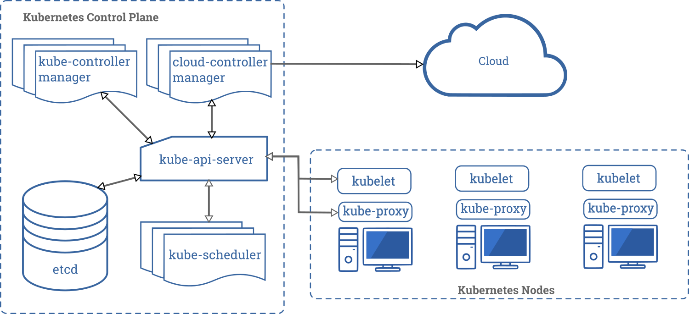

# 官网文档 Documentation-Concepts


# 一、概述（Overview）

[concepts/overview/what-is-kubernetes](https://kubernetes.io/docs/concepts/overview/what-is-kubernetes/)

## 1.1、什么是Kubernetes

这一页是Kubernetes的概述。

- [时光倒流](#1.1.1、时光倒流)
- [为什么需要 Kubernetes？它能做什么？](#1.1.2、为什么需要 Kubernetes？它能做什么？)
- [Kubernetes 不是什么？](#1.1.3、Kubernetes 不是什么？)
- [接下来的内容](#1.1.4、接下来的内容)

### 1.1.1、时光倒流

Kubernetes 是一个可移植的、可扩展的、用于管理容器化工作负载和服务的开源平台，它促进了声明性配置和自动化。它有一个庞大的、快速增长的生态系统。Kubernetes的服务、支持和工具随处可见。

Kubernetes 这个名字来源于希腊语，意思是舵手或飞行员。2014年，谷歌开放了Kubernetes项目的源代码。Kubernetes [基于谷歌在大规模运行生产工作负载方面的15年经验](https://ai.google/research/pubs/pub43438) ，以及来自社区的最佳想法和实践。

让我们通过时间回溯，看看为什么 Kubernetes 是如此有用。


**传统部署时代** ：早期，组织在物理服务器上运行应用程序。无法为物理服务器中的应用程序定义资源边界，这导致了资源分配问题。例如，如果一个物理服务器上运行多个应用程序，那么在某些情况下，一个应用程序可能会占用大部分资源，从而导致其他应用程序性能下降。对此的解决方案是在不同的物理服务器上运行每个应用程序。但是这并没有实现扩展，因为资源没有得到充分利用，并且维护许多物理服务器的成本很高。


**虚拟化部署时代** ：虚拟化作为一种解决方案被引入。它允许您在单个物理服务器的CPU上运行多个虚拟机(VM)。虚拟化允许在 VM 之间隔离应用程序，并提供一定程度的安全性，因为一个应用程序的信息不能被另一个应用程序随意地访问。

虚拟化可以更好地利用物理服务器中的资源，并提供更好的可扩展性，因为可以方便地添加或更新应用程序，从而降低硬件成本，等等。通过虚拟化，您可以将一组物理资源表示为 ***一次性虚拟机集群***（disposable virtual machines）。

每个VM是一个完整的机器，运行所有组件，包括它自己的操作系统，运行在虚拟硬件之上。


**容器部署时代**：容器类似于VM，但是它们具有宽松的隔离属性，以便在应用程序之间共享操作系统(OS)。因此，容器被认为是轻量级的。与VM类似，容器有自己的文件系统、CPU、内存、进程空间等等。由于它们与底层基础设施解耦，因此可以跨 云 和 OS发行版 移植。

容器已经变得很流行，因为它们有额外的好处，比如:

- **敏捷的应用程序创建和部署**：与使用VM镜像相比，增加了容器镜像创建的方便性和效率。

- **持续开发、集成和部署**：提供可靠且频繁的容器镜像构建和部署，具有快速且轻松的回滚(由于镜像不可变性)。
- **开发和操作关注点分离**：在构建/发布时而不是部署时创建应用程序容器镜像，从而将应用程序与基础设施解耦。
- 可观察性不仅能显示操作系统级的信息和度量，还能显示应用程序的健康状况和其他信号。
- **跨开发、测试和生产的环境一致性**：在笔记本电脑上运行与在云中运行相同。
- **云 和 OS分布式 的可移植性**: 可运行在Ubuntu上，RHEL， CoreOS， on-prem，Google Kubernetes Engine，还有其他地方。
- **以应用程序为中心的管理**：将抽象级别从 在虚拟硬件上运行操作系统 提高到 使用逻辑资源在操作系统上运行应用程序。
- **低耦合、分布式、弹性、解放的微服务**：应用程序被分解成更小的独立部分，可以动态地部署和管理——而不是运行在一台大型单用途机器上的单片堆栈。
- **资源隔离**：可预测的应用程序性能。
- **资源利用**：效率高，密度大。


### 1.1.2、为什么需要 Kubernetes？它能做什么？

容器是捆绑和运行应用程序的好方法。在生产环境中，您需要管理运行应用程序的容器，并确保没有停机时间。例如，如果一个容器发生故障，则需要启动另一个容器。如果这个行为由一个系统来处理不是更容易吗?

这就是救星 Kubernetes！Kubernetes为您提供了一个运行有恢复能力的分布式系统的框架。它负责处理应用程序的扩展和故障转移，提供部署模式，等等。例如，Kubernetes可以轻松地管理系统的canary部署。

Kubernetes为您提供：

- **服务发现和负载平衡**

    Kubernetes 可以使用DNS名称或自己的IP地址暴露（expose）容器。如果到容器的通信量很高，Kubernetes能够实现负载均衡并分配网络通信量，从而使部署保持稳定。

- **存储编排**
    Kubernetes 允许您自动挂载自己选择的存储系统，比如本地存储、公有云提供商等等。

- **自动发布和回滚**
    您可以使用 Kubernetes 描述所部署容器的期望状态，并且可以以受控的速率将实际状态更改为期望状态。例如，您可以自动化Kubernetes来为您的部署创建新的容器，删除现有的容器，并将它们的所有资源继承到新的容器中。

- **自动二进制打包**
    您为 Kubernetes 提供了一组集群节点，它可以使用这些节点来运行 容器化的任务。告诉 Kubernetes 每个容器需要多少CPU和内存(RAM)。Kubernetes 可以在您的节点上放置容器，以充分利用您的资源。

- **自愈性**
    Kubernetes 重新启动失败的容器，替换容器，杀死不响应 您的用户定义的健康检查 的容器，并且在它们准备好服务之前不会向客户公开（advertise）它们。

- **秘密和配置管理**
    Kubernetes 允许您存储和管理敏感信息，比如密码、OAuth tokens 和 SSH keys。您可以部署和更新秘密和应用程序配置，而不需要重新构建容器镜像，也不需要在堆栈配置中公开秘密。


### 1.1.3、Kubernetes 不是什么？

Kubernetes 不是一个传统的、包含所有功能的PaaS(平台即服务)系统。由于Kubernetes是在容器级别而不是在硬件级别操作的，所以它提供了一些PaaS产品常见的通用特性，例如部署、扩展、负载平衡、日志记录和监视。但是，Kubernetes 不是单一的，这些默认的解决方案是可选的和可插拔的。Kubernetes 为构建开发人员平台提供了构建块，但是在重要的地方保留了用户的选择和灵活性。

Kubernetes:

- 不限制所支持的应用程序类型。Kubernetes的目标是支持非常多样化的工作负载，包括无状态、有状态和数据处理工作负载。如果一个应用程序可以在容器中运行，那么它应该可以在Kubernetes上运行。
- 不部署源代码，也不构建应用程序。持续集成、交付和部署(CI/CD)工作流由组织文化和偏好以及技术需求决定。
- 不提供应用程序级的服务，如中间件(例如， message buses)、数据处理框架(例如，Spark)、数据库(例如，MySQL)、缓存，也不提供集群存储系统(例如，Ceph)作为内置服务。这些组件可以运行在Kubernetes上，并且/或者可以由运行在Kubernetes上的应用程序通过可移植的机制(如[Open Service Broker](https://openservicebrokerapi.org/))访问。
- 不指定日志记录、监视或警报解决方案。它提供了一些集成作为概念的证明，以及收集和导出指标的机制。
- 不提供也不强制要求配置语言/系统(例如，Jsonnet)。它提供了一个声明性API，可以被任意形式的声明性规范作为目标。
- 不提供也不采用任何全面的机器配置、维护、管理或自修复系统。
- 此外，Kubernetes不仅仅是一个编排系统。事实上，它消除了对编排的需要。编排的技术定义是执行已定义的工作流：首先执行A，然后执行B，然后执行C。相反，Kubernetes包含一组独立的、可组合的控制流程，这些流程不断地将当前状态驱动到所提供的期望状态。你怎么从A点到C点都不重要，也不需要集中控制。这使得系统更容易使用，并且更强大、健壮、有弹性（适应能力强）和易扩展。


### 1.1.4、接下来的内容

- 来看看K8s的组件（[Kubernetes Components](https://kubernetes.io/docs/concepts/overview/components/)）。

- 准备好开始（[Get Started](https://kubernetes.io/docs/setup/)）了么？


## 1.2、k8s组件

[concepts/overview/components/](https://kubernetes.io/docs/concepts/overview/components/)

当您部署Kubernetes时，您将得到一个集群。

Kubernetes 集群由一组称为***节点***的工作机器组成，节点运行容器化的应用程序。每个集群***至少有一个工作节点***。

工作 node(节点) 中管理着作为应用程序组件的 pods。Control Plane 管理集群中的工作节点和 pod。在生产环境中，Control Plane 通常跨多台计算机运行，集群通常运行多个节点，提供容错和高可用性。

本文档概述了拥有一个完整的、可工作的Kubernetes集群所需的各种组件。

下面是Kubernetes集群的关系图，所有组件都联系在一起。




- [控制平面组件（Control Plane Components）](#1.2.1、控制平面组件(Control Plane Components))
- [节点组件（Node Components）](#1.2.2、节点组件（Node Components）)
- [插件（Addons）](#1.2.3、插件（Addons）)
- [接下来是什么](#1.2.4、接下来是什么)


### 1.2.1、控制平面组件（Control Plane Components）

控制平面的组件做出关于集群的全局决策(例如，调度)，以及检测和响应集群事件(例如，当部署的`replicas`字段不满足时启动一个新的pod)。

控制平面组件可以在集群中的任何机器上运行。但是，为了简单起见，启动脚本通常在同一台机器上启动所有控制平面组件，并且不在这台机器上运行用户容器。有关 `multi-master-VM` 设置的示例，请参见 [构建高可用性集群](https://kubernetes.io/docs/admin/high-availability/) 。

#### 1.2.1.1、kube-apiserver

API服务器是公开 Kubernetes API 的 Kubernetes 控制平面的一个组件。API 服务器是 Kubernetes 控制平面的前端。

Kubernetes API 服务器的主要实现是 [kube-apiserver](https://kubernetes.io/docs/reference/generated/kube-apiserver/) 。kube-apiserver 被设计成水平扩展的——也就是说，它通过部署更多实例来扩展。您可以运行 kube-apiserver 的多个实例，并在这些实例之间均衡流量。

#### 1.2.1.2、etcd

具有一致性和高可用性的键值存储，用作 Kubernetes 所有集群的数据备份存储。

如果您的 Kubernetes 集群使用etcd作为其备份存储，请确保对这些数据有 [备份](https://kubernetes.io/docs/tasks/administer-cluster/configure-upgrade-etcd/#backing-up-an-etcd-cluster) 计划。

您可以在 [官方文档](https://etcd.io/docs/) 中找到关于etcd的详细信息。

#### 1.2.1.3、kube-scheduler

kube-scheduler是控制平面的组件，其监视没有指定node的新创建的pods，并为它们选择要运行的node。

调度决策考虑的因素包括：个人和集体资源需求、硬件/软件/策略约束、亲和（affinity）和反亲和（anti-affinity）规范、数据位置、工作负载间的干扰，最后期限。

```
原文：
Factors taken into account for scheduling decisions include: individual and collective resource requirements, hardware/software/policy constraints, affinity and anti-affinity specifications, data locality, inter-workload interference, and deadlines.
```

#### 1.2.1.4、kube-controller-manager

kube-controller-manager 是运行控制器（controller）进程的控制平面组件。

从逻辑上讲，每个控制器（controller）都是一个单独的进程，但是为了降低复杂性，它们都被编译成一个单一的二进制文件，并在一个进程中运行。

这些控制器包括：

节点控制器（Node Controller）：负责 node 宕机时的通知和响应。
复制控制器（Replication Controller）：负责为系统中的每个复制控制器对象维护正确的pod数量。
端点控制器（Endpoints Controller）：填充端点对象(即，连接Services和Pods)。
服务帐户和令牌控制器（Service Account & Token Controllers）：为新的名称空间创建默认帐户和API访问令牌。

#### 1.2.1.5、cloud-controller-manager

[cloud-controller-manager](https://kubernetes.io/docs/tasks/administer-cluster/running-cloud-controller/) 运行与底层云提供商交互的 控制器。cloud-controller-manager binary 是Kubernetes 1.6 版中引入的一个alpha特性。

cloud-controller-manager只运行特定的云提供商提供的控制器循环。您必须在kube-controller-manager中禁用这些控制器循环。在启动kube-controller-manager时，可以通过将 `--cloud-provider` 标签设置为 `external` 来禁用控制器循环。

cloud-controller-manager允许云供应商的代码和Kubernetes代码相互独立地发展。在以前的版本中，Kubernetes核心代码的功能依赖于特定的云供应商的代码。在未来的版本中，特定的云供应商的代码应该由云供应商自己维护，并在运行Kubernetes时链接到cloud-controller-manager。

以下控制器有云提供商依赖：

节点控制器（Node Controller）：用于检查云提供商，以确定一个节点在停止响应后是否已被删除
路由控制器（Route Controller）：用于在底层云基础设施中设置路由
服务控制器（Service Controller）：用于创建、更新和删除云提供商负载平衡器
卷控制器（Volume Controller）：用于创建、附加和挂载卷，以及与云提供商交互来编排卷


### 1.2.2、节点组件（Node Components）

节点组件运行在每个节点上，维护着运行中的pods并给Kubernetes提供运行时环境。

#### 1.2.2.1、kubelet

kubelet 是在集群中的每个节点上运行的代理。它确保 一系列容器（[containers](https://kubernetes.io/docs/concepts/overview/what-is-kubernetes/#why-containers)） 在一个Pod中运行。

kubelet 采用一组通过各种机制提供的PodSpecs，并确保那些PodSpecs中描述的容器运行正常。kubelet不管理不是由Kubernetes创建的容器。

#### 1.2.2.1、kube-proxy

kube-proxy是运行在集群中每个节点上的网络代理，实现Kubernetes服务概念的一部分。

kube-proxy维护节点上的网络规则。这些网络规则允许 来自集群内部或外部的网络会话（network sessions） 与 pod 进行网络通信。

如果有可用的操作系统包过滤层，kube-proxy将使用它。否则，kube-proxy将自己转发流量（traffic）。

#### 1.2.2.3、Container Runtime

Container Runtime 是负责运行容器的软件。

Kubernetes支持多种容器运行时：[Docker](https://docs.docker.com/engine/)， [containerd](https://containerd.io/docs/)， [CRI-O](https://cri-o.io/#what-is-cri-o)，以及 [Kubernetes CRI (Container Runtime Interface)](https://github.com/kubernetes/community/blob/master/contributors/devel/sig-node/container-runtime-interface.md)的任何实现。


### 1.2.3、插件（Addons）

Addons 使用Kubernetes资源(守护进程启动、部署等)来实现集群特性。因为这些Addons提供了集群级别的特性，所以Addons的命名空间资源属于kube-system命名空间。

选择的Addons描述如下；有关可用Addons的扩展列表，请参见[Addons](https://kubernetes.io/docs/concepts/cluster-administration/addons/)。

#### 1.2.3.1、DNS

虽然其他Addons不是严格要求的，但所有Kubernetes集群都应该有 [cluster DNS](https://kubernetes.io/docs/concepts/services-networking/dns-pod-service/)，因为许多示例都依赖于它。

除了您的环境中的其他DNS服务器之外，集群DNS服务器也是一个DNS服务器，它为Kubernetes服务提供DNS记录。

Kubernetes启动的容器会自动将此DNS服务器包含在其DNS搜索中。

#### 1.2.3.2、Web UI (Dashboard)

[Dashboard](https://kubernetes.io/docs/tasks/access-application-cluster/web-ui-dashboard/) 是一个通用的、基于web的Kubernetes集群用户界面。它允许用户管理并且分析解决集群中运行的应用程序以及集群本身的故障。

#### 1.2.3.3、Container Resource Monitoring

[Container Resource Monitoring](https://kubernetes.io/docs/tasks/debug-application-cluster/resource-usage-monitoring/) 记录中央数据库中容器的一般时间序列指标，并提供用于浏览该数据的用户界面（UI）。

#### 1.2.3.4、Cluster-level Logging

一个 [cluster-level logging](https://kubernetes.io/docs/concepts/cluster-administration/logging/) 机制负责将容器日志保存到具有搜索/浏览界面的中央日志存储中。


### 1.2.4、接下来是什么

- 学习 [Nodes](https://kubernetes.io/docs/concepts/architecture/nodes/)
- 学习 [Controllers](https://kubernetes.io/docs/concepts/architecture/controller/)
- 学习 [kube-scheduler](https://kubernetes.io/docs/concepts/scheduling/kube-scheduler/)
- 阅读 etcd 的官方 [documentation](https://etcd.io/docs/)


# 二、集群架构（Cluster Architecture）

[官方文档-集群架构](https://kubernetes.io/docs/concepts/architecture/nodes/)

## 2.1、节点（Nodes）

[concepts/architecture/nodes/](https://kubernetes.io/docs/concepts/architecture/nodes/)

节点是Kubernetes中的工作机器，以前称为 `minion`。根据集群的不同，节点可以是VM或物理机器。每个节点都包含运行 [pods](https://kubernetes.io/docs/concepts/workloads/pods/pod/) 所需的服务，并由主组件管理。节点上的服务包括 [container runtime](https://kubernetes.io/docs/concepts/overview/components/#container-runtime)，kubelet 和 kube-proxy。有关更多细节，请参阅架构设计文档中的 [Kubernetes Node](https://git.k8s.io/community/contributors/design-proposals/architecture/architecture.md#the-kubernetes-node) 部分。

- [Node Status](#2.1.1、Node Status)
- [Management](#2.1.2、Management)
- [Node topology](#2.1.3、Node topology)
- [API Object](#2.1.4、API Object)
- [What's next](#2.1.5、What's next)

### 2.1.1、节点状态（Node Status）

一个节点的状态包含以下信息：

- [Addresses](#2.1.1.1、Addresses)
- [Conditions](#2.1.1.2、Conditions)
- [Capacity and Allocatable](#2.1.1.3、Capacity and Allocatable)
- [Info](#2.1.1.4、Info)

使用以下命令可以显示节点状态和其他有关节点的详细信息：

```shell
kubectl describe node <insert-node-name-here>
```

下面详细描述了每个部分。

#### 2.1.1.1、Addresses

这些字段的用法不同，取决于云提供商或裸机配置。

- HostName： 节点内核报告的主机名。可以通过 `--hostname-override` 参数进行覆盖。
- ExternalIP：通常是可在外部路由到的节点的IP地址（可从集群外部获得）。
- InternalIP：通常是仅在集群内部可路由到的节点的IP地址。

#### 2.1.1.2、Conditions

`conditions`字段描述所有`Running` nodes 的状态。conditions 的例子包括：

| Node Condition     | 描述                                                         |
| ------------------ | :----------------------------------------------------------- |
| Ready              | True：节点健康并准备接受pods。<br>False：节点不健康，不接受pods。<br>Unknown：节点控制器在最后一个节点监视周期（`node-monitor-grace-period`）中没有收到来自节点的消息。(默认为40秒) |
| MemoryPressure     | True：节点内存有压力，即节点内存低；否则为False。            |
| PIDPressure        | True：进程上存在压力，也就是说节点上有太多进程；否则为False。 |
| DiskPressure       | True：磁盘大小上存在压力，也就是说磁盘容量较低；否则为False。 |
| NetworkUnavailable | Treu：节点的网络配置不正确；否则为False。                    |

节点 conditions 表示为 JSON 对象。例如，下面的响应描述了一个健康的节点。

```json
"conditions": [
  {
    "type": "Ready",
    "status": "True",
    "reason": "KubeletReady",
    "message": "kubelet is posting ready status",
    "lastHeartbeatTime": "2019-06-05T18:38:35Z",
    "lastTransitionTime": "2019-06-05T11:41:27Z"
  }
]
```

如果 Ready condition 的 status 保持为 Unknown 或 False 的时间超过`pod-eviction-timeout`，则将向 [kube-controller-manager](https://kubernetes.io/docs/admin/kube-controller-manager/)  传递一个参数，节点控制器将调度节点上的所有pod进行删除。默认的清除超时时间是 **five minutes**（5分钟）。在某些情况下，当节点不可用时，apiserver 无法与节点上的 kubelet 通信。在与 apiserver重新建立通信之前，不能将删除pods的决定传达给kubelet。在此期间，计划删除的pods可能继续运行在其他的分开的节点上。

在 1.5 之前的 Kubernetes 版本中，节点控制器将强制从 apiserver 中删除这些不可到达的pod。但是，在 1.5 或更高版本中，节点控制器不会强制删除pod，直到确认它们已停止在集群中运行。您可以看到可能在一个不可到达的节点上运行的pod处于 `Terminating` 或 `Unknown` 状态。在 Kubernetes 无法从底层基础设施推断出一个节点是否永久离开了一个集群的情况下，集群管理员可能需要手动删除节点对象。从 Kubernetes 中删除节点对象将导致在该节点上运行的所有Pod对象被从apiserver中删除，并释放它们的名称。

节点生命周期控制器自动创建表示条件的 [taints](https://kubernetes.io/docs/concepts/configuration/taint-and-toleration/)。当调度器将一个Pod分配给一个节点时，调度器将考虑节点的taints，除了Pod所允许的 taints 之外。

#### 2.1.1.3、Capacity and Allocatable

描述节点上可用的资源：CPU、内存和可以调度到节点上的pod的最大数量。

capacity块中的字段表示节点拥有的资源总量。allocatable块表示一个节点上可供普通pod使用的资源数量。

您可以阅读到更多关于 capacity 和 allocatable 资源的内容，当学习如何在节点上 [reserve compute resources](https://kubernetes.io/docs/tasks/administer-cluster/reserve-compute-resources/#node-allocatable) 时。

#### 2.1.1.4、Info

描述关于节点的一般信息，如内核版本、Kubernetes版本(kubelet和kube-proxy版本)、Docker版本（如果使用了Docker）和操作系统名称。Kubelet从节点收集这些信息。


### 2.1.2、管理（Management）

与 [pods](https://kubernetes.io/docs/concepts/workloads/pods/pod/) 和 [services](https://kubernetes.io/docs/concepts/services-networking/service/) 不同，$\color{red}{\Large节点不是由 Kubernetes 创建的}$：它是由诸如 Google Compute Engine（谷歌计算引擎）之类的云提供商在外部创建的，或者它存在于物理或虚拟机池中。因此，当 Kubernetes 创建一个节点时，它创建一个表示该节点的对象。创建之后，Kubernetes 检查节点是否有效。例如，如果您尝试从以下内容创建一个节点：

```json
{
  "kind": "Node",
  "apiVersion": "v1",
  "metadata": {
    "name": "10.240.79.157",
    "labels": {
      "name": "my-first-k8s-node"
    }
  }
}
```

Kubernetes在内部创建一个节点对象(表示形式)，并通过基于 `metadata.name` 字段的健康检查来验证节点。如果节点是有效的——也就是说，如果所有必需的服务都运行起来了——那么它就有资格运行pod。否则，对于任何集群活动都将忽略它，直到它变为有效为止。节点对象的名称必须是有效的 [DNS subdomain name（DNS子域名）](https://kubernetes.io/docs/concepts/overview/working-with-objects/names#dns-subdomain-names) 。

> 注意：Kubernetes 保留无效节点的对象，并不断检查它是否有效。必须显式删除节点对象才能停止此过程。

目前，有三个组件与Kubernetes节点接口交互：node controller、kubelet 和 kubectl。

#### 2.1.2.1、节点控制器（Node Controller）

Node Controller 是一个 Kubernetes 主组件，它管理节点的各个方面。

Node Controller 在节点的生命周期中具有多个角色。

第一个角色是在节点注册时为其分配CIDR块（如果打开了CIDR分配）。

第二个角色是使节点控制器的内部节点列表与云提供商的可用机器列表保持同步。在云环境中运行时，当某个节点不健康时，节点控制器就会询问云提供商该节点的VM是否仍然可用。如果该VM不可用，节点控制器将从其节点列表中删除该节点。

第三角色是监控节点的健康状况。节点控制器负责将 NodeStatus 从 NodeReady 状态更新为ConditionUnknown ，当一个节点成为不可达的（即，由于某些原因，例如由于节点被被关机了，节点控制器停止接收心跳）。然后稍晚一些，如果该节点仍然不可达，则将所有的 pods 从该不达节点中清除（使用优雅的 termination ）。（开始报告ConditionUnknown的默认超时时间是40秒，5分钟之后开始清除 pods。）节点控制器每隔 `--node-monitor-period` 秒检查一次每个节点的状态。

##### 心跳（Heartbeats）

Kubernetes节点发送的心跳有助于确定节点的可用性。心跳有两种形式：NodeStatus 和 [Lease object](https://kubernetes.io/docs/reference/generated/kubernetes-api/v1.17/#lease-v1-coordination-k8s-io) 的更新。每个节点在 `kube-node-lease` 的  [namespace](https://kubernetes.io/docs/concepts/overview/working-with-objects/namespaces) 中都有一个关联的Lease object。Lease 是一种轻量级资源，它可以在集群扩展时提高节点心跳的性能。

kubelet 负责创建和更新 NodeStatus 和 一个Lease object。

- 当 NodeStatus 发生更改时，或者在配置的时间间隔内 NodeStatus 没有更新时，kubelet 将更新NodeStatus。NodeStatus更新的默认间隔是5分钟（比不可到达节点的40秒默认超时时间长得多）。
- kubelet 创建 Lease object 然后每隔10秒（默认更新间隔）对其进行更新。Lease 更新独立于 NodeStatus 更新。如果Lease更新失败，kubelet将以指数形式重试，从200毫秒开始，以7秒为上限。

##### 可靠性（Reliability）

在Kubernetes 1.4版本中，我们更新了节点控制器（node controller）的逻辑，以更好地处理大量节点无法到达主节点的情况（例如，因为主节点有网络问题）。从1.4版本开始，当做出关于pod清除的决策时，节点控制器会查看集群中所有节点的状态。

在大多数情况下，node controller将清除率限制为每秒 `--node-eviction-rate` （默认0.1），这意味着它每10秒最多清除掉1个节点中的pods。

当给定的可用区域中的节点变为不健康时，节点清除行为将发生变化。节点控制器同时检查区域中不健康节点的百分比（NodeReady conditions 为 ConditionUnknown 或 ConditionFalse）。如果不健康的节点的比例至少为 `--unhealthy-zone-threshold` （默认0.55）则清除率减少：如果集群很小（即小于或等于 `--large-cluster-size-threshold` 节点默认个数为50）清除就停止，否则清除率降低到 `--secondary-node-eviction-rate`（每秒默认0.01）。每个可用性区域都实现这些策略的原因是，一个可用性区域可能与主区域分隔，而其他可用性区域保持连接。如果您的集群没有跨越多个云提供商的可用性区域，那么就只有一个可用性区域（即整个集群）。

跨可用性区域部署节点的一个关键原因是，当整个区域宕机时，可以将工作负载转移到正常区域。因此，如果一个区域中的所有节点都不健康，那么节点控制器将以正常的 `--node-eviction-rate` 速率清除节点。最坏的情况是所有区域都完全的不健康（即集群中没有健康节点）。在这种情况下，节点控制器（node controller）假设与master 的接存在问题，并停止所有的清除，直到恢复某些连接。

从Kubernetes 1.6开始，NodeController还负责清除在节点上运行的带有`NoExecute` taints的pods，当pods不能容这些taints忍时。另外，NodeController作为一个默认禁用的alpha特性，其负责添加与节点问题（如节点不可到达或还没有准备好）相对应的taints。有关 NoExecute taints 和 alpha特性的详细信息，请参阅 [this documentation](https://kubernetes.io/docs/concepts/configuration/taint-and-toleration/) 。

从版本1.8开始，可以让 node controller 负责创建表示 Node conditions 的 taints。这是1.8版本的一个alpha特性。

#### 2.1.2.2、自注册节点（Self-Registration of Nodes）

当kubelet 的flag `--register-node` 为 true（默认值）时，kubelet将尝试向 API server 注册自己。这是大多数发行版使用的首选模式。

对于自注册，kubelet 启动时有以下选项：

- `--kubeconfig` - Path to credentials to authenticate itself to the apiserver.
- `--cloud-provider` - 如何与云提供商通信，以读取自身的元数据。
- `--register-node` - 自动向 API server 注册。
- `--register-with-taints` - 使用指定的 taints 列表注册节点（逗号分隔`=:`）。如果register-node为，则为No-op。
- `--node-ip` - 节点的 IP 地址。
- `--node-labels` - 在集群中注册节点时要添加的Labels（参见1.13+中 [NodeRestriction admission plugin](https://kubernetes.io/docs/reference/access-authn-authz/admission-controllers/#noderestriction) 实施的强制 label restrictions）。
- `--node-status-update-frequency` - 指定kubelet将节点状态发送给 master 的频率。

当启用[Node authorization mode](https://kubernetes.io/docs/reference/access-authn-authz/node/) and [NodeRestriction admission plugin](https://kubernetes.io/docs/reference/access-authn-authz/admission-controllers/#noderestriction) 时，kubelets只被授权创建/修改自己的节点资源。

##### 手动注册（Manual Node Administration）

集群管理员可以创建和修改节点对象。

如果管理员希望手动创建节点对象，请设置kubelet flag `--register-node=false` 。

管理员可以修改节点资源（忽略 `--register-node` 的设置）。修改包括：设置节点上的 labels 并将其标记为不可调度。

节点上的 labels 可以与节点上的节点选择器结合起来使用来控制调度pod，例如，将一个pod约束为只能在节点的一个子集上运行。

节点上的 labels 可以与 pods 上的节点选择器一起使用，以控制调度。例如，将一个pod约束为只能在节点的一个子集上运行。

将一个节点标记为不可调度将阻止将新pods调度到该节点，但不会影响节点上的任何现有pods。这对于节点重新启动前的准备步骤非常有用。例如，要标记一个节点不可调度，请运行以下命令：

```shell
kubectl cordon $NODENAME
```

> 注意：DaemonSet控制器创建的Pods绕过Kubernetes调度器，不考虑节点上的不可调度性属性。这假设守护进程属于机器，即使它在准备重新启动时正在耗尽应用程序。
>
> 警告：kubectl cordon将一个节点标记为“不可调度的”，其副作用是服务控制器将该节点从它以前有资格获得的任何LoadBalancer节点目标列表中删除，从而有效地从被封锁的节点中删除传入的负载平衡器流量。
>
> 原文：
>
> > **Caution:** `kubectl cordon` marks a node as ‘unschedulable’, which has the side effect of the service controller removing the node from any LoadBalancer node target lists it was previously eligible for, effectively removing incoming load balancer traffic from the cordoned node(s). 

#### 2.1.2.3、节点容量（Node capacity）

节点的容量(cpu的数量和内存的数量)是节点对象的一部分。通常，节点在创建节点对象时注册自己并报告它们的容量（capacity）。如果您正在进行 [manual node administration](https://kubernetes.io/docs/concepts/architecture/nodes/#manual-node-administration) ，则需要在添加节点时设置节点容量。

Kubernetes调度器确保一个节点上的所有pod都有足够的资源。它检查节点上所有容器请求的资源总和不大于节点容量。它包括由kubelet启动的所有容器，但不包括由 [container runtime](https://kubernetes.io/docs/concepts/overview/components/#container-runtime) 直接启动的容器，也不包括在容器外部运行的任何进程（process）。

如果您希望显式地为非pod进程保留资源，请按照这个教程 [reserve resources for system daemons](https://kubernetes.io/docs/tasks/administer-cluster/reserve-compute-resources/#system-reserved)。

### 2.1.3、节点拓扑（Node topology）

**FEATURE STATE:** `Kubernetes v1.17`  alpha版

如果您已经启用了 `TopologyManager` [feature gate](https://kubernetes.io/docs/reference/command-line-tools-reference/feature-gates/) ，那么kubelet在做出资源分配决策时可以使用拓扑提示（topology hints）。

### 2.1.4、API对象（API Object）

Node是Kubernetes REST API中的最上层资源。关于API对象的更多细节可以在 [Node API object](https://kubernetes.io/docs/reference/generated/kubernetes-api/v1.17/#node-v1-core) 中找到。

### 2.1.5、What's next

- 了解节点组件（ [node components](https://kubernetes.io/docs/concepts/overview/components/#node-components)）
- 了解节点级拓扑（about node-level topology）: [Control Topology Management Policies on a node（控制节点上的拓扑管理政策）](https://kubernetes.io/docs/tasks/administer-cluster/topology-manager/)


## 2.2、主节点通信（Master-Node Communication）

[concepts/architecture/master-node-communication/](https://kubernetes.io/docs/concepts/architecture/master-node-communication/)

本文档编目了master服务器（实际上是apiserver）和 Kubernetes 集群之间的通信路径。其目的是允许用户自定义安装以加强网络配置，以便集群可以在不受信任的网络上运行（或在云提供商的完全公共ip上运行）。

- [Cluster to Master](#2.2.1、集群到主服务器（Cluster to Master）)
- [Master to Cluster](#2.2.2、主服务器到集群（Master to Cluster）)

### 2.2.1、集群到主服务器（Cluster to Master）

从集群到master服务器的所有通信路径都终止于apiserver（其他的主组件都不是为了公开远程服务而设计的）。在典型的部署中，apiserver被配置为监听安全HTTPS端口（443）上的远程连接，并且启用了一种或多种形式的客户端身份验证机制。应该启用一种或多种形式的授权（ [authorization](https://kubernetes.io/docs/reference/access-authn-authz/authorization/) ），特别是在允许匿名请求（ [anonymous requests](https://kubernetes.io/docs/reference/access-authn-authz/authentication/#anonymous-requests) ）或服务帐户令牌（ [service account tokens](https://kubernetes.io/docs/reference/access-authn-authz/authentication/#service-account-tokens) ）的情况下。

应该给节点提供集群的公共根证书（public root certificate），以便它们可以安全地连接到apiserver，同时还可以连接到有效的客户端凭证（valid client credentials）。例如，在默认的GKE部署中，以客户端证书（client certificate）的形式向 kubelet 提供客户端凭证（ client credentials）。有关 kubelet 客户端证书的自动提供，请参见 [kubelet TLS bootstrapping](https://kubernetes.io/docs/reference/command-line-tools-reference/kubelet-tls-bootstrapping/) 。

希望连接到apiserver的pod可以利用服务帐户来实现安全连接，以便 Kubernetes 在 pod实例化时自动将公共根证书（public root certificate）和有效的承载令牌（valid bearer token）注入到pod中。kubernetes服务（在所有 namespaces 中）配置了一个虚拟IP地址，该地址（通过kube-proxy）被重定向到apiserver上的HTTPS端点。

主组件（master components）也通过安全端口与集群apiserver通信。

因此，默认情况下，从集群（节点上运行的节点和pod）到主机（master）的连接的默认操作模式是安全的，并且可以在不可信的和/或公共网络上运行。

### 2.2.2、主服务器到集群（Master to Cluster）

从主服务器(apiserver)到集群有两条主要通信路径。第一个是从apiserver到kubelet进程，kubelet进程在集群中的每个节点上运行。第二种是通过apiserver的代理功能从apiserver到任何节点、pod或服务。

#### 2.2.2.1、apiserver to kubelet

从apiserver到kubelet的连接用于：

- 获取pod的日志。
- 连接到（通过kubectl）正在运行的pod。
- 提供kubelet的端口转发功能（port-forwarding functionality）。

这些连接在kubelet的HTTPS端点处终止。默认情况下，apiserver不验证kubelet的服务证书，这使得连接容易受到中间人攻击（man-in-the-middle attacks），并且在不可信的和/或公共网络上运行不安全。

要验证此连接，请使用 `--kubelet-certificate-authority` 为 apiserver 提供一个根证书包（root certificate bundle），用于验证kubelet的服务证书。

如果上述方式不可行，在apiserver和kubelet之间使用 [SSH tunneling](https://kubernetes.io/docs/concepts/architecture/master-node-communication/#ssh-tunnels) （如果需要），以避免通过不可信或公共网络的连接。

最后，应该启用 Kubelet身份验证和/或授权（[Kubelet authentication and/or authorization](https://kubernetes.io/docs/admin/kubelet-authentication-authorization/) ）来保护Kubelet API。

#### 2.2.2.2、apiserver to nodes, pods, and services

从apiserver到node、pod或service的连接默认为纯HTTP连接，因此既不进行身份验证，也不进行加密。他们可以运行在一个安全的HTTPS连接上（通过在API URL中的 node、pod或service的名称前加上前缀 `https:`），但它们不会验证HTTPS端点提供的证书，也不会提供客户端凭证，所以当连接将被加密，它不会提供任何完整性的担保。这些连接**目前在不可信和/或公共网络上运行是不安全的**。

#### 2.2.2.3、SSH Tunnels

Kubernetes支持SSH通道（SSH tunnels）来保护 **master -> cluster** 的通信路径。在这个配置中，apiserver向集群中的每个节点发起一个SSH通道（连接到监听端口22的ssh server），并通过该通道传递所有发送给kubelet、node、pod或service的流量。该通道确保流量不会暴露在节点所在的网络之外。

SSH通道（SSH tunnels）目前是不推荐的，所以除非您知道自己在做什么，否则不应该选择使用它们。正在设计这种通信通道的替代品。


## 2.3、控制器（Controllers）

[concepts/architecture/controller/](https://kubernetes.io/docs/concepts/architecture/controller/)

在机器人学和自动化技术中，控制循环（control loop）是调节系统状态的不终止的循环。

有一个控制回路的例子：房间里的恒温器。

当你设定温度时，它会告诉恒温器你想要的状态（*desired state*）。实际的室温是当前的状态（*current state*）。恒温器的作用是通过打开或关闭设备，使当前的状态更接近于想要的状态。

在Kubernetes中，控制器是监视集群状态的控制循环（control loop），它在需要的地方做出改变或请求改变。每个控制器都试图将当前集群状态变成更接近期望的状态。

- [Controller pattern](#2.3.1、Controller pattern)
- [Desired versus current state](#2.3.2、Desired versus current state)
- [Design](#2.3.3、Design)
- [Ways of running controllers](#2.3.4、Ways of running controllers)
- [What's next](#2.3.5、What's next)

### 2.3.1、控制器模式（Controller pattern）

控制器至少跟踪一个Kubernetes资源类型。这些对象（[objects](https://kubernetes.io/docs/concepts/overview/working-with-objects/kubernetes-objects/#kubernetes-objects)）有一个spec字段，表示期望状态。该资源的控制器负责使当前状态更接近期望状态。

控制器可以自己执行动作，在Kubernetes中更常见的是控制器向API服务器发送消息（该消息具有有用的副作用）。您将在下面看到这样的例子。

#### 2.3.1.1、通过API服务控制（Control via API server）

Job控制器是Kubernetes内置控制器的一个例子。内置控制器通过与集群API服务器交互来管理状态。

Job是Kubernetes的资源，它运行一个或多个Pod来执行一个任务，然后停止。

(一旦[scheduled](https://kubernetes.io/docs/concepts/scheduling/) ，Pod对象将成为kubelet期望状态的一部分)。

当Job控制器看到一个新任务时，它会确保在集群的某个地方的一组节点上的kubelet运行正确数量的pod来完成工作。Job控制器本身不运行任何pod或容器。相反，Job控制器告诉API服务器创建或删除pod。控制平面（[control plane](https://kubernetes.io/docs/reference/glossary/?all=true#term-control-plane) ）中的其他组件对新信息起作用（有新的Pods要调度和运行），最终完成工作。

创建新Job之后，期望状态是完成该Job。Job控制器使该Job的当前状态更接近您期望的状态：创建执行该Job所需工作的pod，以便该Job更接近完成。

控制器还更新它们的对象。例如：一旦某个Job完成，Job控制器就会更新该Job对象，将其标记为 `Finished` 。

(这有点像一些恒温器把灯关掉，以表明你的房间现在处于你设定的温度)。

#### 2.3.1.2、直接控制（Direct control）

与Job不同的是，有些控制器需要更改集群之外的内容。

例如，如果您使用一个控制循环来确保集群中有足够的节点，那么该控制器需要当前集群之外的某些东西来在需要时设置新节点。

与外部状态交互的控制器从API服务器找到它们想要的状态，然后直接与外部系统通信，以使当前状态更加一致。

(在你的集群中的确有一个控制器来水平扩展集群中的节点。请参阅 [Cluster autoscaling](https://kubernetes.io/docs/tasks/administer-cluster/cluster-management/#cluster-autoscaling) )。

### 2.3.2、期望状态与当前状态（Desired versus current state）

Kubernetes拥有系统的本地云视图（cloud-native view of systems），并且能够处理不断的变化。

随着工作的进行和控制循环自动修复故障，您的集群可以在任何时候进行更改。这意味着，您的集群可能永远不会达到稳定状态。

只要集群的控制器在运行，并且能够进行有用的更改，那么总体状态是否稳定并不重要。

### 2.3.3、设计（Design）

Kubernetes的设计原则是使用大量控制器，每个控制器管理集群状态的一个特定方面。最常见的情况是，一个特定的控制循环(控制器)使用一种资源作为其期望状态，并使用另一种资源来实现期望状态。

使用简单的控制器比使用一组相互连接的单片控制循环（monolithic set of control loops that are interlinked）更有用。控制器可能会失败，因此Kubernetes的设计就考虑了这一点。

例如：Job控制器跟踪 Job对象（以发现新工作）和 Pod对象（运行Job，然后查看何时完成工作)。在这种情况下，由某些其他的东西来创建Job，而Job控制器创建pod。

> 注意：
>
> 可以有多个控制器来创建或更新相同类型的对象。在幕后，Kubernetes控制器确保他们只关注与控制资源相关联的资源。
>
> 例如，可以有 **部署** 和 **Jobs** ;这两者都会产生Pods。Job控制器不会删除部署时创建的Pods，因为控制器可以使用信息（[labels](https://kubernetes.io/docs/concepts/overview/working-with-objects/labels)）将这些Pods区分开。

### 2.3.4、控制器运行方式（Ways of running controllers）

Kubernetes有一组内置的控制器，在 [kube-controller-manager](https://kubernetes.io/docs/reference/command-line-tools-reference/kube-controller-manager/) 中运行。这些内置的控制器提供了重要的核心行为（core behaviors）。

部署控制器和Job控制器是Kubernetes本身的一部分（"内置"控制器）。Kubernetes允许您运行一个弹性控制平面，这样，如果任何一个内置控制器发生故障，控制平面的另一部分将接管工作。

您可以找到运行在控制平面之外的控制器，以扩展Kubernetes。或者，如果您愿意，您可以自己编写一个新控制器。您可以将自己的控制器作为一组pod运行，也可以从外部运行到Kubernetes。什么方式最适合将取决于该控制器要做什么。

### 2.3.5、What's next

- 阅读 [Kubernetes control plane](https://kubernetes.io/docs/concepts/#kubernetes-control-plane) 的内容
- 发现一些基本的 [Kubernetes objects](https://kubernetes.io/docs/concepts/#kubernetes-objects)
- 了解更多关于 [Kubernetes API](https://kubernetes.io/docs/concepts/overview/kubernetes-api/) 的内容
- 如果你想写自己的控制器，see [Extension Patterns](https://kubernetes.io/docs/concepts/extend-kubernetes/extend-cluster/#extension-patterns) in Extending Kubernetes。


## 2.4、Concepts Underlying the Cloud Controller Manager

[concepts/architecture/Concepts Underlying the Cloud Controller Manager](https://kubernetes.io/docs/concepts/architecture/cloud-controller/)


