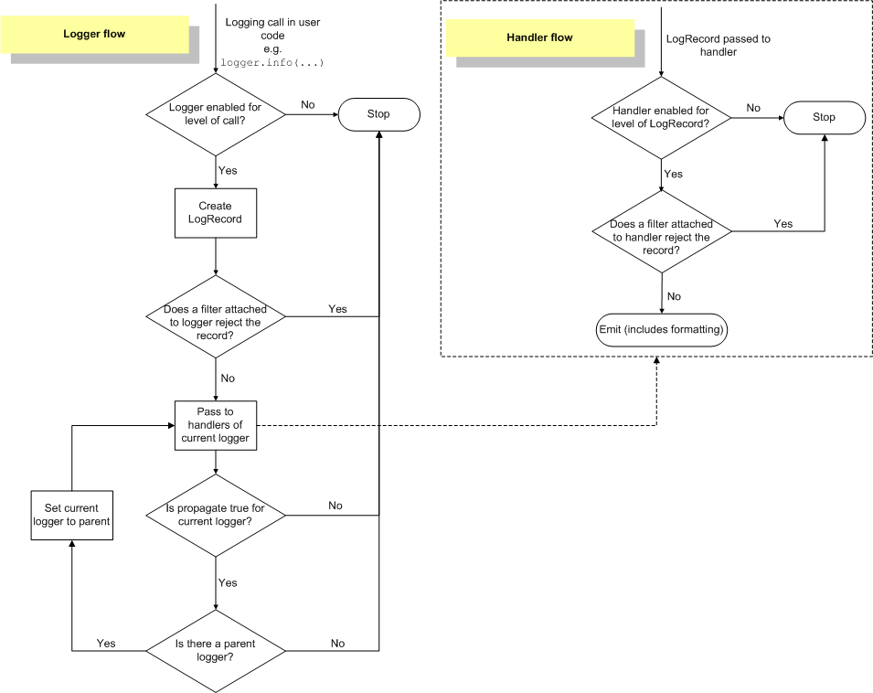
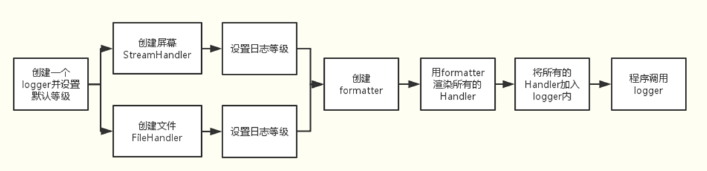

# logging模块


## 一、 基础使用

### 1.1 logging使用场景

日志是什么？这个不用多解释。百分之九十的程序都需要提供日志功能。Python内置的logging模块，为我们提供了现成的高效好用的日志解决方案。但是，不是所有的场景都需要使用logging模块，下面是Python官方推荐的使用方法：

| 任务场景                         | 最佳工具                                                     |
| -------------------------------- | ------------------------------------------------------------ |
| 普通情况下，在控制台显示输出     | `print()`                                                    |
| 报告正常程序操作过程中发生的事件 | `logging.info()`(或者更详细的`logging.debug()`)              |
| 发出有关特定事件的警告           | `warnings.warn()`或者`logging.warning`()                     |
| 报告错误                         | 弹出异常                                                     |
| 在不引发异常的情况下报告错误     | `logging.error()`, `logging.exception()`或者`logging.critical()` |

logging模块定义了下表所示的日志级别，按事件严重程度由低到高排列（注意是全部大写！因为它们是常量。）：

| 级别     | 级别数值 | 使用时机                                           |
| -------- | -------- | -------------------------------------------------- |
| DEBUG    | 10       | 详细信息，常用于调试。                             |
| INFO     | 20       | 程序正常运行过程中产生的一些信息。                 |
| WARNING  | 30       | 警告用户，虽然程序还在正常工作，但有可能发生错误。 |
| ERROR    | 40       | 由于更严重的问题，程序已不能执行一些功能了。       |
| CRITICAL | 50       | 严重错误，程序已不能继续运行。                     |

***默认级别是WARNING***，表示只有WARING和比WARNING更严重的事件才会被记录到日志内，***低级别的信息会被忽略***。因此，默认情况下，DEBUG和INFO会被忽略，WARING、ERROR和CRITICAL会被记录。

有多种方法用来处理被跟踪的事件。最简单的方法就是把它们打印到终端控制台上。或者将它们写入一个磁盘文件内。

### 1.2 简单范例

在什么都不配置和设定的情况下，logging会简单地将日志打印在显示器上，如下例所示：

```python
import logging
logging.warning('Watch out!')  # 消息会被打印到控制台上
logging.info('I told you so')  # 这行不会被打印，因为级别低于默认级别
```

如果，将上面的代码放在一个脚本里并运行，结果是：

```python
WARNING:root:Watch out!
```

默认情况下，打印出来的内容包括日志级别、调用者和具体的日志信息。所有的这些内容都是可以自定义的，在后面我们会细说。

### 1.3 记录到文件内

要把日志输出到文件内，就不能使用上面的方法了，但是logging模块同样给我们提供了一个相对便捷的手段，那就是`logging.basicConfig()`方法。

重新进入解释器环境，执行下面的代码：

```python
import logging
logging.basicConfig(filename='example.log',level=logging.DEBUG)
logging.debug('This message should go to the log file')
logging.info('So should this')
logging.warning('And this, too')
```

然后打开本地的example.log文件，可以看到下面的日志消息：

```
DEBUG:root:This message should go to the log file
INFO:root:So should this
WARNING:root:And this, too
```

我们通过`level=logging.DEBUG`参数，设定了日志记录的门槛。如果想在命令行调用时设置日志级别，可以使用下面的选项：

```
--log=INFO
```

可以通过下面的方法来获取用户输入的日志级别参数：

```python
# assuming loglevel is bound to the string value obtained from the
# command line argument. Convert to upper case to allow the user to
# specify --log=DEBUG or --log=debug
numeric_level = getattr(logging, loglevel.upper(), None)
if not isinstance(numeric_level, int):
    raise ValueError('Invalid log level: %s' % loglevel)
logging.basicConfig(level=numeric_level, ...)
```

对 basicConfig() 的调用应该在 debug()、info() 等的前面。因为它被设计为一次性的配置，只有第一次调用会进行操作，随后的调用不会产生有效操作。

默认情况下，日志会不断的追加到文件的后面。如果你不想保存之前的日志，每次都清空文件，然后写入当前日志，则可以如下设置：

```python
logging.basicConfig(filename='example.log', filemode='w', level=logging.DEBUG)
```

关键是将`filemode`设置为‘w’。

### 1.4 多模块中同时使用日志功能

如果你的程序包含多个文件（模块），下面是个如何在其中组织日志的例子：

```python
# myapp.py
import logging
import mylib

def main():
    logging.basicConfig(filename='myapp.log', level=logging.INFO)
    logging.info('Started')
    mylib.do_something()
    logging.info('Finished')

if __name__ == '__main__':
    main()
```

```python
# mylib.py
import logging

def do_something():
    logging.info('Doing something')
```

运行myapp.py模块，你可以在myapp.log日志文件中看到下面的内容：

```
INFO:root:Started
INFO:root:Doing something
INFO:root:Finished
```

这是你期待看到的。你可以使用 [mylib.py](http://mylib.py/) 中的模式将此概括为多个模块。对于这种简单的使用模式，除了查看事件描述之外，你不能通过查看日志文件来了解应用程序中消息的来源。

### 1.5 日志的变量数据

在logging模块中通过百分符%方式的格式化控制，生成消息字符串，类同于字符串数据类型的格式化输出，但也有不同之处。

```python
import logging
logging.warning('%s before you %s', 'Look', 'leap!')
```

结果：

```python
WARNING:root:Look before you leap!
```

可以看到两个%s分别被‘Look’和‘leap！’替代了。

### 1.6 消息格式

要控制消息格式，获得更多的花样，可以提供format参数：

```python
import logging
logging.basicConfig(format='%(levelname)s:%(message)s', level=logging.DEBUG)
logging.debug('This message should appear on the console')
logging.info('So should this')
logging.warning('And this, too')
```

输出结果：

```
DEBUG:This message should appear on the console
INFO:So should this
WARNING:And this, too
```

对于`%(levelname)s`这种东西，是logging模块内置的，可以被输出到日志中的对象，更多的内容在下面将会列举。

### 1.7 附加时间信息

要在日志内容中附加时间信息，可以在format字符串中添加`%(asctime)s`。

```python
import logging
logging.basicConfig(format='%(asctime)s %(message)s')
logging.warning('is when this event was logged.')
```

输出结果：

```
2010-12-12 11:41:42,612 is when this event was logged.
```

默认情况下，时间的显示使用`ISO8601`格式。如果想做更深入的定制，可以提供`datefmt`参数，如下所示：

```python
import logging
logging.basicConfig(format='%(asctime)s %(message)s', datefmt='%m/%d/%Y %I:%M:%S %p')
logging.warning('is when this event was logged.')
```

输出结果：

```
12/12/2010 11:46:36 AM is when this event was logged.
```

`datefmt` 参数的定制和time模块的 `time.strftime()` 一样！

## 二、 高级用法

如果只是简单地使用 logging，那么使用上面介绍的方法就可以了，如果要深度定制 logging，那么就需要对它有更深入的了解。下面的内容才是基本的 logging模块的使用方法。

logging模块采用了模块化设计，主要包含四种组件：

**Loggers**：记录器，提供应用程序代码能直接使用的接口；

**Handlers**：处理器，将记录器产生的日志发送至目的地；

**Filters**：过滤器，提供更好的粒度控制，决定哪些日志会被输出；

**Formatters**：格式化器，设置日志内容的组成结构和消息字段。

### 2.1 日志流程图

日志事件信息在 loggers 和 handlers 中的逻辑流程如下图所示：



下面是同时向屏幕和文件进行日志输出的流程：



### 2.2 Loggers记录器

logging模块的日志功能是基于Logger类实现的。我们可以通过下面的方法获取一个Logger类的实例（建议以模块名命名logger实例）。

```python
logger = logging.getLogger(__name__)
```

Logger是一个树形层级结构，在使用debug()，info()，warn()，error()，critical()等方法之前必须先创建一个Logger的实例，即创建一个记录器，如果没有显式的进行创建，则默认创建一个`root logger`，并应用默认的日志级别(WARN)，默认的处理器Handler(StreamHandler，即将日志信息打印在标准输出上)，和默认的格式化器Formatter，就像我们在前面举的那些例子一样。

logger对象有三重功能。首先，提供应用程序调用的接口；其次，决定日志记录的级别；最后，将日志内容传递到相关联的handlers中。

总结logger对象的用法，可以分成两类：配置和消息发送。

下面是最常用的配置方法：

`Logger.setLevel()`：设置日志记录级别

`Logger.addHandler()` 和 `Logger.removeHandler()`：为logger对象添加或删除handler处理器对象。

`Logger.addFilter()` 和  `Logger.removeFilter()`：为为logger对象添加或删除filter过滤器对象。

配置好logger对象后，就可以使用下面的方法创建日志消息了：

`Logger.debug()` ,  `Logger.info()`, `Logger.warning()`, `Logger.error()`, `and Logger.critical()`：创建对应级别的日志，但不一定会被记录。

`Logger.exception()`：创建一个类似 `Logger.error()` 的日志消息。不同的是 `Logger.exception()` 保存有一个追踪栈。该方法只能在异常handler中调用。

`Logger.log()`：显式的创建一条日志，是前面几种方法的通用方法。

注意，`getLogger()` 方法返回一个logger对象的引用，并以你提供的name参数命名，如果未提供名字，那么默认为‘root’。使用同样的name参数，多次调用 `getLogger()` ，将返回同样的logger对象。

### 2.3 Handlers处理器

Handlers对象是日志信息的处理器、分发器。它们将日志分发到不同的目的地。比如有时候我们希望将所有的日志都记录在本地文件内，将error及其以上级别的日志发送到标准输出stdout，将critical级别的日志以邮件的方法发送给管理员。这就需要同时有三个独立的handler，分别负责一个方向的日志处理。

logging模块使用较多的handlers有两个，`StreamHandler`和`FileHandler`。

**StreamHandler**

标准输出stdout（如显示器）分发器。

创建方法: `sh = logging.StreamHandler(stream=None)`

**FileHandler**

将日志保存到磁盘文件的处理器。

创建方法: `fh = logging.FileHandler(filename, mode='a', encoding=None, delay=False)`

handlers对象有下面的方法：

`setLevel()`：和logger对象的一样，设置日志记录级别。那为什么要设置两层日志级别呢？logger对象的日志级别是全局性的，对所有handler都有效，相当于默认等级。而handlers的日志级别只对自己接收到的logger传来的日志有效，进行了更深一层的过滤。

`setFormatter()`：设置当前handler对象使用的消息格式。

`addFilter()` 和 `removeFilter()`：配置或删除一个filter过滤对象

logging模块内置了下面的handler处理器，从字面上你就能看出它们的大概用途：

- StreamHandler
- FileHandler
- BaseRotatingHandler
- RotatingFileHandler
- TimedRotatingFileHandler
- SocketHandler
- DatagramHandler
- SMTPHandler
- SysLogHandler
- NTEventLogHandler
- HTTPHandler
- WatchedFileHandler
- QueueHandler
- NullHandler

### 2.4 Formatters

Formatter对象用来最终设置日志信息的顺序、结构和内容。其构造方法为：

```python
# 构造函数有三个可选参数 - 消息格式字符串、日期格式字符串和样式指示符。
ft = logging.Formatter.__init__(fmt=None, datefmt=None, style=’%’)
```

如果不指定datefmt，那么它默认是`%Y-%m-%d %H:%M:%S`样式的。

style参数默认为百分符%，这表示前面的fmt参数应该是一个`%()s`格式的字符串，而可以使用的logging内置的keys，如下表所示：

| 属性        | 格式            | 描述                                                       |
| ----------- | --------------- | ---------------------------------------------------------- |
| asctime     | %(asctime)s     | 日志产生的时间，默认格式为`2003-07-08 16:49:45,896`        |
| created     | %(created)f     | time.time()生成的日志创建时间戳                            |
| filename    | %(filename)s    | 生成日志的程序名                                           |
| funcName    | %(funcName)s    | 调用日志的函数名                                           |
| levelname   | %(levelname)s   | 日志级别 ('DEBUG', 'INFO', 'WARNING', 'ERROR', 'CRITICAL') |
| levelno     | %(levelno)s     | 日志级别对应的数值                                         |
| lineno      | %(lineno)d      | 日志所针对的代码行号（如果可用的话）                       |
| module      | %(module)s      | 生成日志的模块名                                           |
| msecs       | %(msecs)d       | 日志生成时间的毫秒部分                                     |
| message     | %(message)s     | 具体的日志信息                                             |
| name        | %(name)s        | 日志调用者                                                 |
| pathname    | %(pathname)s    | 生成日志的文件的完整路径                                   |
| process     | %(process)d     | 生成日志的进程ID（如果可用）                               |
| processName | %(processName)s | 进程名（如果可用）                                         |
| thread      | %(thread)d      | 生成日志的线程ID（如果可用）                               |
| threadName  | %(threadName)s  | 线程名（如果可用）                                         |

### 2.5 Filter过滤器

Handlers 和 Loggers 可以使用 Filters 来完成比日志级别更复杂的过滤。比如我们定义了 `filter = logging.Filter('a.b.c')`，并将这个Filter添加到了一个 Handler 上，则使用该 Handler 的 Logger 中只有名字带`a.b.c`前缀的 Logger 才能输出其日志。

创建方法: `filter = logging.Filter(name='')`

例如：

```
filter = logging.Filter('mylogger.child1.child2')  
fh.addFilter(filter)
```

则只会输出下面格式的日志，注意其用户名：

```
2017-09-27 16:27:46,227 - mylogger.child1.child2 - DEBUG - logger1 debug message
2017-09-27 16:27:46,227 - mylogger.child1.child2 - DEBUG - logger1 debug message
2017-09-27 16:27:46,227 - mylogger.child1.child2 - DEBUG - logger1 debug message
2017-09-27 16:27:46,227 - mylogger.child1.child2 - DEBUG - logger1 debug message
```

### 2.6 配置日志模块

有三种配置logging的方法：

- 创建loggers、handlers和formatters，然后使用Python的代码调用上面介绍过的配置函数。
- 创建一个logging配置文件，然后使用`fileConfig()`方法读取它。
- 创建一个配置信息字典然后将它传递给`dictConfig()`方法。

#### 2.6.1、第一种方法

举例：

```python
#simple_logging_module.py

import logging

# 创建logger记录器
logger = logging.getLogger('simple_example')
logger.setLevel(logging.DEBUG)

# 创建一个控制台处理器，并将日志级别设置为debug。
ch = logging.StreamHandler()
ch.setLevel(logging.DEBUG)

# 创建formatter格式化器
formatter = logging.Formatter('%(asctime)s - %(name)s - %(levelname)s - %(message)s')

# 将formatter添加到ch处理器
ch.setFormatter(formatter)

# 将ch添加到logger
logger.addHandler(ch)

# 然后就可以开始使用了！
logger.debug('debug message')
logger.info('info message')
logger.warning('warn message')
logger.error('error message')
logger.critical('critical message')
```

在命令行中运行上面的代码，输出结果如下：

```
$ python simple_logging_module.py
2005-03-19 15:10:26,618 - simple_example - DEBUG - debug message
2005-03-19 15:10:26,620 - simple_example - INFO - info message
2005-03-19 15:10:26,695 - simple_example - WARNING - warn message
2005-03-19 15:10:26,697 - simple_example - ERROR - error message
2005-03-19 15:10:26,773 - simple_example - CRITICAL - critical message
```

#### 2.6.2、第二种方法

logging配置文件的方式：

```python
# simple_logging_config.py

import logging
import logging.config

logging.config.fileConfig('logging.conf') # 读取config文件

# 创建logger记录器
logger = logging.getLogger('simpleExample')

# 使用日志功能
logger.debug('debug message')
logger.info('info message')
logger.warn('warn message')
logger.error('error message')
logger.critical('critical message')
```

其中的logging.conf配置文件内容如下：

```
[loggers]
keys=root,simpleExample

[handlers]
keys=consoleHandler

[formatters]
keys=simpleFormatter

[logger_root]
level=DEBUG
handlers=consoleHandler

[logger_simpleExample]
level=DEBUG
handlers=consoleHandler
qualname=simpleExample
propagate=0

[handler_consoleHandler]
class=StreamHandler
level=DEBUG
formatter=simpleFormatter
args=(sys.stdout,)

[formatter_simpleFormatter]
format=%(asctime)s - %(name)s - %(levelname)s - %(message)s
datefmt=
```

在命令行中执行代码，结果如下：

```
$ python simple_logging_config.py
2005-03-19 15:38:55,977 - simpleExample - DEBUG - debug message
2005-03-19 15:38:55,979 - simpleExample - INFO - info message
2005-03-19 15:38:56,054 - simpleExample - WARNING - warn message
2005-03-19 15:38:56,055 - simpleExample - ERROR - error message
2005-03-19 15:38:56,130 - simpleExample - CRITICAL - critical message
```

#### 2.6.3、第三种方法

Python官方更推荐第三种新的配置方法，类字典形式的配置信息，因为Python的字典运用形式多样，操作灵活。比如，你可以通过JSON格式保存字典，或者YAML格式保存信息，然后读取成字典。当然，你也可以直接在Python代码里编写传统的带有配置信息的字典。一切都是基于键值对形式的就OK。

下面的例子就是基于YAML配置文件的日志。`logging.conf.yaml`配置文件内容如下：

```yml
version: 1
formatters:
  simple:
    format: '%(asctime)s - %(name)s - %(levelname)s - %(message)s'
handlers:
  console:
    class: logging.StreamHandler
    level: DEBUG
    formatter: simple
    stream: ext://sys.stdout
loggers:
  simpleExample:
    level: DEBUG
    handlers: [console]
    propagate: no
root:
  level: DEBUG
  handlers: [console]
```

这里要先通过pip安装yaml模块：

```
pip install pyyaml
```

yaml模块的使用很简单，使用open()方法打开一个yaml文件对象，然后使用yaml的load()方法将文件内容读成一个Python的字典对象。最后我们根据这个字典对象，使用logging.conf的dictConfig()方法，获取配置信息。如下代码所示：

```python
import logging
import logging.config
import yaml

# 通过yaml文件配置logging
f = open("logging.conf.yaml")
dic = yaml.load(f, Loader=yaml.FullLoader)
f.close()
logging.config.dictConfig(dic)

# 创建logger
logger = logging.getLogger('simpleExample')

# 输出日志
logger.debug('debug message')
logger.info('info message')
logger.warn('warn message')
logger.error('error message')
logger.critical('critical message')
```

输出结果：

```
2017-09-27 17:41:09,241 - simpleExample - DEBUG - debug message
2017-09-27 17:41:09,242 - simpleExample - INFO - info message
2017-09-27 17:41:09,242 - simpleExample - WARNING - warn message
2017-09-27 17:41:09,242 - simpleExample - ERROR - error message
2017-09-27 17:41:09,242 - simpleExample - CRITICAL - critical message
```